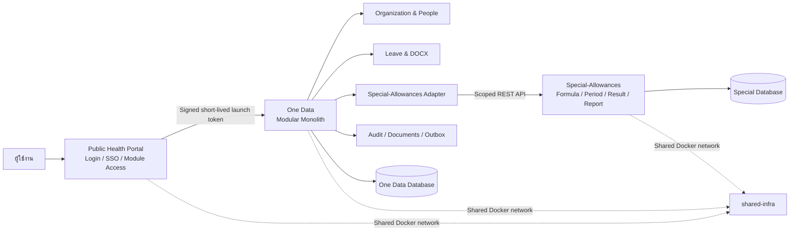
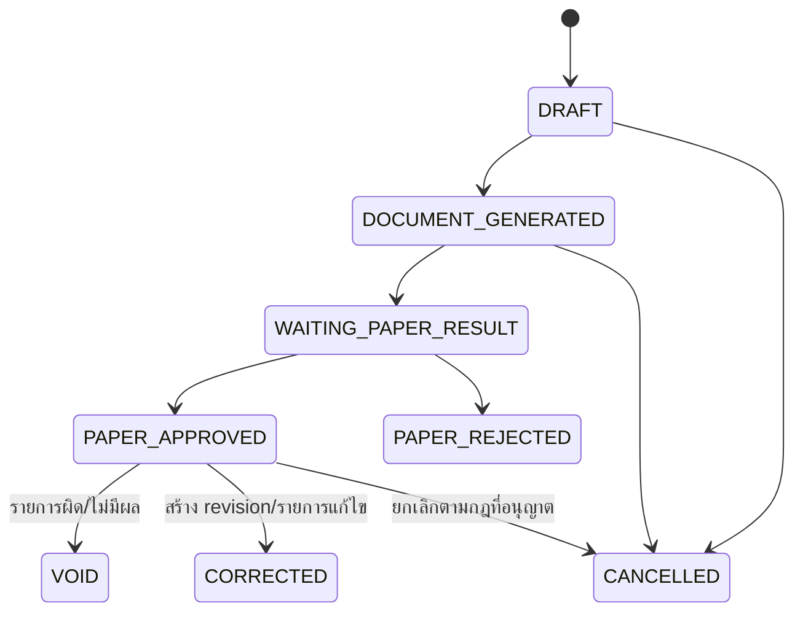

# One Data System — Architecture Baseline

เอกสารคำแนะนำด้านสถาปัตยกรรมก่อนเริ่มพัฒนาระบบ One Data System สำหรับองค์การบริหารส่วนจังหวัดยะลา

- สถานะ: Proposed baseline — รออนุมัติก่อนเริ่ม implementation
- วันที่จัดทำ: 29 สิงหาคม 2569 (2026)
- ขอบเขตรุ่นแรก: Organization & People Core, ระบบลาแบบสร้าง Word/ลงนามภายนอก และเชื่อมระบบ Special-Allowances เดิม
- ระบบที่เกี่ยวข้อง: `yala-pao-public-health-portal`, `Special-Allowances`, `shared-infra` และ `carbooking-yala-pao`

เอกสารนี้ใช้ประกอบกับ `One Data System - Reimplementation Blueprint.md` โดยมุ่งตอบคำถามว่า One Data ควรสร้างและเชื่อมกับระบบที่มีอยู่ด้วยสถาปัตยกรรมแบบใด ไม่ได้แทนที่ business requirements ใน Blueprint

## 1. Architecture Decision

One Data ควรเริ่มเป็น **Modular Monolith แบบ API-first** ไม่เริ่มด้วย Microservices

- One Data เป็น application และ deployment เดียวในรุ่นแรก แต่แบ่งขอบเขตโมดูลภายในอย่างชัดเจน
- Portal, One Data และ Special-Allowances ยังคงเป็นคนละ deployable และถือครองฐานข้อมูลของตนเอง
- ระบบเชื่อมกันด้วย versioned API และ signed launch token ไม่อ่านหรือเขียนฐานข้อมูลข้ามระบบ
- ใช้ synchronous REST สำหรับ integration รุ่นแรก และเตรียม transactional outbox ไว้สำหรับ retry และ event consumers ในอนาคต
- เพิ่มโมดูลใหม่ใน One Data ได้ทีละส่วนโดยไม่ต้องสร้างระบบทั้งหมดก่อนเปิดใช้งานจริง

แนวทางนี้เหมาะกับทีมพัฒนา 2 คนที่ใช้ AI เป็นเครื่องมือหลัก เพราะลดภาระ deployment, distributed transaction, observability และ contract coordination เมื่อเทียบกับ Microservices ขณะเดียวกันยังรักษา module boundary เพื่อให้แยก worker หรือ service ภายหลังได้เมื่อมีเหตุผลจริง

## 2. System Context



## 3. System Ownership

| System | Owns | Must not own or mutate directly |
| --- | --- | --- |
| `yala-pao-public-health-portal` | บัญชีผู้ใช้, Login/SSO, account recovery, module access และ launch token | ข้อมูลบุคลากร ประวัติการทำงาน ใบลา หรือผล ฉ.10/11 |
| One Data | หน่วยงาน บุคลากร ประวัติการทำงาน การลา เอกสารลา และ identity mapping | สูตร รอบคำนวณ ผลลัพธ์ หรือรายงาน ฉ.10/11 |
| `Special-Allowances` | สูตร ฉ.10/11 ตัวแปรที่ไม่ใช่การลา รอบคำนวณ lock/adjustment ผลลัพธ์ และรายงาน | ใบลาต้นฉบับหรือข้อมูลบุคลากรหลักใน One Data |
| `shared-infra` | Reverse proxy, shared Docker network, MySQL host และ backup foundation | Business data ownership ของ application ใด application หนึ่ง |
| `carbooking-yala-pao` | ระบบจองรถและ workflow ที่ใช้งานอยู่ในช่วงเปลี่ยนผ่าน | ข้อมูลของ One Data โดยการเข้าฐานข้อมูลโดยตรง |

แม้ทุกระบบอยู่บน Server เดียวกัน ต้องแยก database, database user, secret, application session และ backup/restore boundary ของแต่ละระบบ

## 4. Recommended Technology Stack

### 4.1 One Data Application

| Layer | Recommendation |
| --- | --- |
| Backend | Laravel 11 / PHP 8.2+ |
| Frontend | Vue 3 + TypeScript + Inertia |
| Styling | Tailwind CSS |
| Database | MySQL 8 |
| Queue รุ่นแรก | Laravel Database Queue |
| Document generation | Template-based DOCX ผ่าน PHPWord หรือ library ที่ผ่าน golden-file test |
| File storage รุ่นแรก | Private application storage พร้อม abstraction สำหรับ S3-compatible object storage |
| API | REST ภายใต้ `/api/v1` และ `/internal/api/v1` |
| Testing | PHPUnit, integration tests, tenant-isolation tests, API contract tests และ DOCX golden tests |
| Deployment | Docker บน network และ reverse proxy ของ `shared-infra` |

Laravel + Inertia ทำให้ backend และ frontend อยู่ใน repository/deployment เดียว แต่ยังสร้าง responsive application ที่มี interactive forms, tables และ dashboards ได้ ลดภาระของทีมเมื่อเทียบกับการแยก SPA frontend และ API backend ตั้งแต่รุ่นแรก

### 4.2 สิ่งที่ยังไม่จำเป็นในรุ่นแรก

- ไม่ต้องมี Kafka หรือ RabbitMQ จนกว่าจะมีหลาย consumer หรือปริมาณงานที่ต้องใช้ message broker จริง
- ไม่ต้องมี Redis หาก database queue และ application cache ตอบโจทย์การใช้งานเริ่มต้น
- ไม่ต้องมี search cluster สำหรับข้อมูลระดับ 38 รพ.สต. และบุคลากรประมาณ 267 คน
- ไม่ต้องแยก frontend และ backend เป็นคนละ repository/deployment
- ไม่ต้องแยกแต่ละ business module เป็น Microservice

## 5. Internal Module Boundaries

```text
One Data
├── Platform
│   ├── Portal SSO Adapter
│   ├── Session and Authorization
│   ├── Tenant Scope
│   ├── Audit Log
│   ├── File Storage
│   └── Outbox and Jobs
├── Organization
├── People
├── Leave
├── Documents
└── Integrations
    └── SpecialAllowances
```

| Module | Owns | Important boundary |
| --- | --- | --- |
| Platform | external identities, sessions, memberships, roles, permissions, audit, files, outbox | ไม่เป็นเจ้าของ HR profile หรือ business workflow |
| Organization | affiliation, tenant, workgroup และโครงสร้างองค์กร | การเปลี่ยนโครงสร้างต้องมี effective date/history |
| People | person, employee profile, employment และ job history | onboarding ต้อง atomic; ห้ามจับ identity ด้วยชื่อหรือ PII อย่างเดียว |
| Leave | leave policy, balance/entitlement, leave request, paper result และ cancellation/void | รุ่นแรกไม่มี online approval; เฉพาะ `PAPER_APPROVED` ที่ยังมีผลจึงส่งต่อได้ |
| Documents | template version, document run, snapshot, artifact และ checksum | เอกสารที่ออกแล้วต้องสร้างซ้ำได้จาก snapshot เดิม |
| SpecialAllowances Integration | external ID mapping, export batch, delivery, reconciliation และ external result/report references | ไม่สร้างสูตรหรือแก้ period/result ของ Special โดยตรง |

แต่ละโมดูลควรมี domain model, application use cases, persistence boundary, authorization policy, HTTP interface และ tests ของตนเอง Controller ไม่ควรบรรจุ business logic และโมดูลหนึ่งไม่ควรแก้ตารางของอีกโมดูลโดยหลีกเลี่ยง use case ที่กำหนดไว้

## 6. Multi-Tenancy and Organization Model

รุ่นแรกมี 1 อบจ., 38 รพ.สต. และบุคลากรประมาณ 267 คน จึงควรใช้ **shared database/shared schema** ภายในฐานข้อมูลของ One Data โดยบังคับ tenant scope ทุกชั้น ไม่ต้องแยกฐานข้อมูลต่อ รพ.สต.

หลักการสำคัญ:

- Business rows มี `affiliation_id` และ/หรือ `tenant_id` ตามเจ้าของข้อมูล
- Authorized scope มาจาก local session และ membership ไม่เชื่อ `tenant_id` ที่ browser ส่งมาเพียงอย่างเดียว
- Query/repository policy เติม scope predicate โดยอัตโนมัติ
- Unique constraints รวม tenant scope เช่น `(tenant_id, code)`
- Integration tests ต้องพยายามเข้าถึงข้อมูลข้าม tenant และยืนยันว่าถูกปฏิเสธ
- Report projection ต้องรักษา scope lineage และ aggregate เฉพาะหน่วยงานที่ผู้ใช้มีสิทธิ์

ไม่ควรเก็บสังกัดปัจจุบันไว้เพียง `employees.tenant_id` ที่แก้ทับค่าเดิม ควรมี effective-dated membership/history เพื่อรองรับการย้าย ช่วยราชการ รักษาการ หรือหลายบทบาทในอนาคต

## 7. Portal SSO Integration

Portal เป็นผู้ยืนยันตัวตนและอนุญาตให้เข้าถึงโมดูล ส่วน One Data ยังคงสร้าง local session และบังคับ authorization ของตนเอง

ลำดับการทำงาน:

1. ผู้ใช้ Login ที่ Portal
2. Portal ตรวจ module access
3. Portal สร้าง signed launch token อายุสั้นพร้อม `iss`, `aud`, `sub`, `exp`, organization context และ `return_to`
4. One Data ตรวจ signature, issuer, audience, expiration และ replay
5. One Data map `portal_user_id`/`sub` กับ local identity และ employee/person
6. One Data สร้าง local secure session และประเมิน tenant/role/permission ทุก request

ข้อกำหนดด้านความปลอดภัย:

- Launch token ไม่ใช้เป็น long-lived API token
- มี replay protection หรือ one-time token identifier
- ใช้ immutable external ID ในการจับคู่บัญชี
- ไม่จับคู่ด้วยชื่อ เบอร์โทรศัพท์ หรือเลขประจำตัวประชาชนเพียงอย่างเดียว
- Role จาก Portal ไม่ถูกใช้แทน permission ภายใน One Data โดยอัตโนมัติ ต้องมี explicit mapping
- One Data ใช้ deny-by-default และตรวจ permission ฝั่ง Server

## 8. Leave Workflow for the First Release

รุ่นแรกใช้ Word-first workflow: ผู้ใช้กรอกใบลาในระบบ สร้าง DOCX พิมพ์และลงนามภายนอก จากนั้นเจ้าหน้าที่ผู้มีสิทธิ์บันทึกผลเอกสารกลับเข้าระบบ

สถานะเป้าหมายเบื้องต้น:



กฎสำคัญ:

- การสร้าง DOCX ไม่เท่ากับการอนุมัติลา
- การบันทึกผลกระดาษต้องเก็บผู้บันทึก เวลา เลขที่/วันที่เอกสาร ผู้ลงนาม และหลักฐานขั้นต่ำที่ฝ่ายบุคคลกำหนด
- เอกสารที่แก้ไขหลังออกแล้วต้องมี revision ใหม่ ไม่เขียนทับ artifact เดิม
- เก็บ template version, source snapshot และ checksum ของทุกเอกสารทางการ
- ใบลาที่เข้าสู่ workflow แล้วใช้ cancel/void/correction แทน hard delete
- เฉพาะใบลาสถานะ `PAPER_APPROVED` ที่ยังมีผลเท่านั้นเป็น input ของ Special-Allowances

## 9. Special-Allowances Integration

One Data ไม่คำนวณ ฉ.10/11 ซ้ำ แต่มี anti-corruption layer หรือ adapter เพื่อแปลงข้อมูลของ One Data ให้เป็น contract ของ Special-Allowances

ความรับผิดชอบของ adapter:

- จับคู่ immutable `person_id` ของ One Data กับ employee ID ใน Special-Allowances
- แปลงประเภทลาและช่วงวันที่เป็น attendance fields ที่ contract รองรับ
- ส่งข้อมูลลาเป็นราย period/month
- รองรับการส่งซ้ำแบบ idempotent โดยไม่สร้างข้อมูลซ้ำ
- รายงาน unmapped persons, invalid mappings และ changed/cancelled leave
- เปรียบเทียบ row count และ checksum เพื่อ reconciliation
- อ่าน period status, result summary และ report artifacts มาแสดงผ่าน One Data

ข้อกำหนด API:

- ใช้ versioned endpoint เช่น `/internal/api/v1`
- ใช้ service account แบบ least privilege และ audience-scoped credential
- รองรับ `Idempotency-Key` และ correlation ID
- บันทึก audit ทั้งผู้ส่งและผู้รับ
- มี OpenAPI specification และ automated contract tests
- ไม่มีการแชร์ browser cookie, root database credential หรือ application secret

Period protocol:

- `OPEN`: sync ซ้ำได้ และผลต้องสอดคล้องกับ snapshot ล่าสุดที่ยืนยัน
- ก่อน lock: ต้อง reconcile mapping, row count, checksum และรายการที่เปลี่ยน/ยกเลิก
- `LOCKED` หรือ `PAID`: ห้าม overwrite ผลเดิม ใช้ adjustment/correction flow ของ Special-Allowances
- การ reopen ต้องเป็น controlled action ที่มี permission และ audit ชัดเจน

## 10. Data and Transaction Principles

- ใช้ database transaction สำหรับ use case ที่ต้องสำเร็จหรือย้อนกลับพร้อมกัน เช่น employee onboarding
- ใช้ fixed decimal สำหรับจำนวนเงิน อัตรา และค่าที่ใช้ในรายงาน ห้ามใช้ binary floating point
- ใช้ immutable history หรือ effective-dated record สำหรับข้อมูลบุคลากรและกฎที่มีผลตามเวลา
- ใช้ state transition ที่ตรวจสอบได้แทน boolean หลายตัว
- ใช้ optimistic locking/version สำหรับรายการที่อาจแก้พร้อมกัน
- ใช้ archive, void, reversal และ correction แทน hard delete สำหรับข้อมูลราชการและข้อมูลที่มีรายการต่อเนื่อง
- เก็บ audit log แยกจาก application log และห้ามบันทึก secret หรือ PII ที่ไม่จำเป็นใน log
- Integration command และ worker ทุกตัวต้อง idempotent และ retry ได้อย่างปลอดภัย

## 11. Documents and File Storage

- เอกสาร DOCX เก็บใน private storage และดาวน์โหลดผ่าน authorization ของ application
- ห้ามใช้ public URL ถาวรสำหรับเอกสารที่มีข้อมูลส่วนบุคคล
- เก็บ `template_version`, `source_snapshot`, `generated_at`, `generated_by`, checksum และ storage reference
- สร้าง golden documents จากกรณีทดสอบที่ฝ่ายบุคคลรับรอง แล้วเปรียบเทียบเนื้อหาและ layout ใน CI/UAT
- กำหนด retention, archival, legal hold และสิทธิ์ดาวน์โหลดก่อน production
- ออกแบบ storage abstraction ให้เปลี่ยนจาก local private disk ไป S3-compatible object storage ได้โดยไม่กระทบ domain

## 12. Queue, Outbox and Events

รุ่นแรกใช้ REST และ database-backed jobs เป็นหลัก

- งานสร้างเอกสารขนาดใหญ่ import/export และ retry integration ทำผ่าน queue เมื่อจำเป็น
- Transactional outbox ถูกเขียนใน transaction เดียวกับ business change
- Worker อ่าน outbox และส่งต่อแบบ idempotent
- ยังไม่ติดตั้ง message broker จนกว่าจะมีหลาย consumer ปริมาณงาน หรือ reliability requirement ที่ database queue รองรับไม่ได้
- Event payload ส่งเฉพาะ ID, scope, version และข้อมูลขั้นต่ำ หลีกเลี่ยง PII

## 13. Deployment Topology

```text
Internet
└── Reverse Proxy / TLS
    ├── Portal container
    ├── One Data web container
    ├── One Data worker container
    └── Special-Allowances frontend/backend containers

Shared private Docker network
├── MySQL host
│   ├── portal database + portal DB user
│   ├── one_data database + one_data DB user
│   └── special_allowances database + special DB user
└── Backup service
```

หลักการ deployment:

- แต่ละ application มี image, environment file, secret และ health/readiness endpoint ของตน
- One Data web และ worker ใช้ image เดียวกันแต่รันคนละ process
- Database migration ทำผ่าน controlled deployment step
- Backup ต้องทดสอบ restore แยกราย application และมีสำเนานอกเครื่องตามนโยบาย production
- แยก development, test/UAT, staging และ production credentials/data
- ใช้ synthetic หรือ de-identified data ใน UAT

## 14. Incremental Release Plan

### Release 0 — Foundation

- Project skeleton และ module boundaries
- Portal manifest/launch-token integration
- Organization hierarchy และ seed 1 อบจ./38 รพ.สต.
- Tenant scope, local session, role/permission และ audit foundation
- CI, migration, health checks, backup/restore baseline และ test fixtures

### Release 1 — People and Leave

- People Core และ effective-dated employment/membership history
- Import/reconciliation บุคลากรประมาณ 267 คน
- Leave policy profiles ที่ฝ่ายบุคคลรับรอง
- Leave request, DOCX revision และ paper-result workflow
- Cancel/void/correction, audit และ tenant-isolation tests

### Release 2 — Special-Allowances Integration

- Immutable person mapping
- Versioned attendance/leave API contract
- Monthly export/sync, idempotency และ reconciliation
- Period status/result/report access ผ่าน One Data
- Contract, failure/retry และ locked-period adjustment tests

### Release 3 — Pilot and Rollout

- Pilot 3 รพ.สต. ที่มีขนาด/รูปแบบงานต่างกัน
- ปรับจาก feedback และแก้ข้อมูล migration
- ขยายเป็น 10 รพ.สต.
- ขยายครบ 38 แห่งเมื่อผ่าน exit criteria

ไม่ต้องสร้าง Stock, Assets, Vehicles และ Finance ให้เสร็จก่อนเปิดใช้ Release 1–2 โมดูลเหล่านั้นเพิ่มภายหลังได้โดยใช้ platform และ module conventions ชุดเดียวกัน

## 15. Car Booking Transition

ช่วงแรกให้ `carbooking-yala-pao` ทำงานแยกต่อไป และเชื่อมการเข้าใช้งานผ่าน Portal ตามความพร้อม ไม่คัดลอก source หรือ database เข้ามาใน One Data ระหว่างพัฒนา Leave และ Special-Allowances integration

เมื่อถึง phase ของ Vehicles ให้ประเมินสองทาง:

1. รักษาระบบรถเดิมเป็นเจ้าของ workflow แล้วเชื่อมผ่าน Portal/API/BFF
2. สร้าง Vehicles module ใหม่ภายใน One Data แล้ว migrate ข้อมูลและผู้ใช้เป็นขั้นตอน

การตัดสินใจต้องอิง gap analysis ของ Form 3, รถว่าง, การจองซ้อน, ผู้อนุมัติ, คนขับ, Form 4–6 และประวัติรถ ห้ามใช้การเข้าฐานข้อมูลเดิมโดยตรงเป็น integration ระยะยาว

## 16. Quality and Security Gates

ก่อน Pilot ต้องมีอย่างน้อย:

- Automated tenant-isolation tests
- Permission matrix tests และ deny-by-default
- Atomic onboarding and rollback tests
- Leave state-transition tests
- Fixed-decimal regression tests
- DOCX golden tests
- Portal launch-token validation/replay tests
- Special-Allowances contract and reconciliation tests
- Audit completeness tests
- Backup restore drill
- Migration dry run และ reconciliation report
- Security review สำหรับ PII, session, file access, logs และ service credentials

## 17. Decisions Required Before Implementation

Architecture สามารถตั้งโครงและทำ test doubles ได้ แต่ต้องปิดรายการต่อไปนี้ก่อนพัฒนา domain/integration สำหรับ production:

1. การจับคู่บัญชี Portal กับบุคลากรประมาณ 267 คน
2. กฎการมีหลายหน่วยงาน ช่วยราชการ รักษาการ และการย้ายกลางงวด
3. Permission matrix ระดับตนเอง รพ.สต. และ อบจ.
4. ผู้มีสิทธิ์บันทึกผลเอกสารกระดาษ และกฎ Segregation of Duties/break-glass
5. Leave Rulebook สำหรับข้าราชการและสถานะการจ้างแต่ละกลุ่ม
6. แบบ Word ฉบับจริง field mapping และ golden samples
7. Mapping จาก `PAPER_APPROVED` leave ไป Special-Allowances รวมกรณีข้ามเดือนและยกเลิกย้อนหลัง
8. Exact Special period statuses, lock/paid/adjustment API และสิทธิ์ reopen
9. Report access, retention และ checksum contract ของ ฉ.10/11
10. แหล่งข้อมูลบุคลากร/หน่วยงาน วิธี import duplicate policy และ migration cutoff

## 18. Architecture Decision Records to Approve

ก่อนเริ่ม implementation ควรอนุมัติ ADR อย่างน้อยชุดต่อไปนี้:

| ADR | Decision |
| --- | --- |
| ADR-001 | One Data ใช้ Modular Monolith ไม่เริ่มด้วย Microservices |
| ADR-002 | Laravel 11 + Vue 3/TypeScript/Inertia เป็น application stack |
| ADR-003 | MySQL 8 แบบ shared schema พร้อม enforced tenant scope |
| ADR-004 | Portal เป็น identity/module-entry; One Data มี local session และ authorization |
| ADR-005 | Special-Allowances เป็นเจ้าของ formula/period/result/report และเชื่อมผ่าน REST API |
| ADR-006 | แต่ละ application แยก database, user, secret และ backup boundary |
| ADR-007 | Leave รุ่นแรกเป็น Word-first/paper-result workflow |
| ADR-008 | REST + database queue/outbox ก่อน message broker |
| ADR-009 | Official records ใช้ revision/void/reversal/history แทน destructive update/delete |
| ADR-010 | Rollout แบบ incremental และ pilot 3 → 10 → 38 รพ.สต. |

## 19. Final Recommendation

สถาปัตยกรรมเริ่มต้นที่แนะนำคือ **Laravel Modular Monolith + Vue/Inertia, API-first integration, database ownership แยกตามระบบ และ incremental rollout**

One Data เป็นเจ้าของ People/Organization และ Leave ขณะที่ Portal เป็นเจ้าของ Login/SSO และ Special-Allowances เป็นเจ้าของเครื่องคำนวณกับรายงาน ฉ.10/11 การแบ่งเช่นนี้ทำให้เริ่มใช้จริงได้ตั้งแต่มีเพียง People, Leave และการเชื่อม ฉ.10/11 แล้วค่อยเพิ่ม Stock, Vehicles, Assets, Finance และโมดูลใหม่โดยไม่ต้องรื้อสถาปัตยกรรมหลัก
