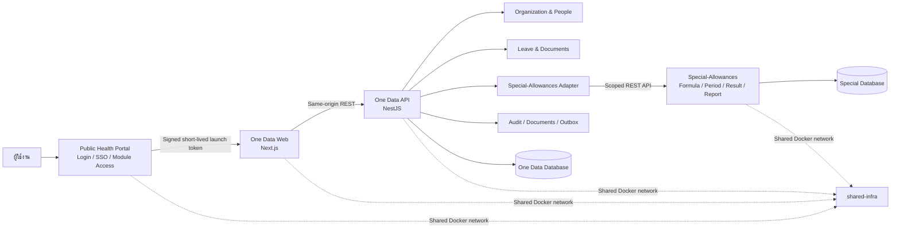
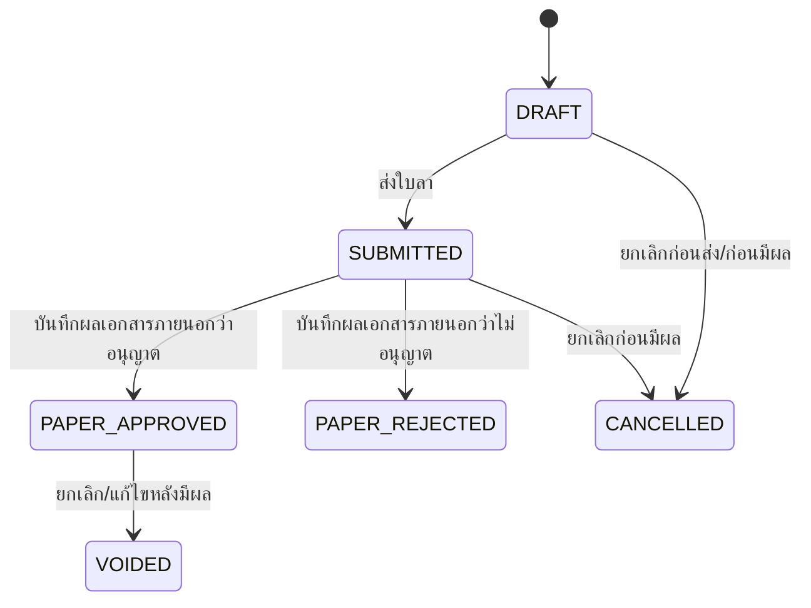

# One Data System — Architecture Baseline

เอกสารคำแนะนำด้านสถาปัตยกรรมก่อนเริ่มพัฒนาระบบ One Data System สำหรับองค์การบริหารส่วนจังหวัดยะลา

- สถานะ: Target architecture baseline — NestJS/Next.js foundation implemented in coexistence; current Laravel/Vue implementation remains the migration baseline
- วันที่จัดทำ: 29 สิงหาคม 2569 (2026)
- ขอบเขตรุ่นแรก: Organization & People Core, ระบบลาขั้นพื้นฐาน และเชื่อมระบบ Special-Allowances เดิม; Word/document module เป็นระยะถัดไป
- ระบบที่เกี่ยวข้อง: `yala-pao-public-health-portal`, `Special-Allowances`, `shared-infra` และ `carbooking-yala-pao`

เอกสารนี้ใช้ประกอบกับ `One Data System - Reimplementation Blueprint.md` โดยมุ่งตอบคำถามว่า One Data ควรสร้างและเชื่อมกับระบบที่มีอยู่ด้วยสถาปัตยกรรมแบบใด ไม่ได้แทนที่ business requirements ใน Blueprint. แผนย้ายจาก current stack อยู่ที่ [docs/MIGRATION_LARAVEL_VUE_TO_NESTJS_NEXTJS.md](docs/MIGRATION_LARAVEL_VUE_TO_NESTJS_NEXTJS.md)

## Implementation checkpoint — 29 สิงหาคม 2569

การลงมือรอบแรกสร้าง target workspace แบบ coexistence แล้ว โดยไม่ย้ายหรือเขียนทับ Laravel/Vue เดิม:

- `apps/api`: NestJS foundation, versioned API prefix, health/readiness, request-id, problem-details, Portal HS256 launch-token exchange, hashed local session/session guard และ Special master-data projection service
- `apps/web`: Next.js App Router dashboard shell, Paper-first leave page/server actions, Portal launch bridge ที่ `/auth/portal/launch`, และการอ่าน current user จาก API ตอน runtime
- `packages/contracts`: shared TypeScript contract v1.4, capability permissions, leave snapshot reconciliation/schedule summaries และ fixture ที่ห้ามส่ง `CONFIRMED`
- `docker-compose.target.yml`: API/web แยกจาก compose เดิมบนพอร์ต `3100/3101`
- worker command ใน API image: database lock, retry due delivery และ optional monthly prepare/deliver; target Compose เปิดผ่าน profile `worker` และปิดงานด้วย `ONEDATA_WORKER_ENABLED=false` เป็นค่าเริ่มต้น
- production guard foundation: fail-fast environment validation, idle session timeout, secure cookie requirement, mutation origin check, API security headers และ in-memory rate limit; distributed replay/session revocation และ edge/shared rate limiting ยังต้องทำก่อนหลาย replica
- automated checks: contracts/API/web typecheck, API unit/e2e smoke tests, target production build และ legacy Vite build

สิ่งที่ยังไม่เปิดใช้จริงใน checkpoint นี้คือ staging/production migration baseline approval, backup/restore rehearsal, production real-data reconciliation, permission scope matrix แบบละเอียดครบทุกโมดูล/owner sign-off และ production schedule approval. มี initial Prisma migration, production Compose template และ [deployment runbook](docs/DEPLOYMENT_RUNBOOK.md) แล้ว และตรวจ deploy/status กับ MySQL ชั่วคราวแล้ว แต่ยังไม่ถือเป็น production sign-off. Special-Allowances leave adapter และ worker รุ่นแรกมีแล้วในระดับ local integration foundation: prepare complete snapshot ที่มี employee rows ครบ scope, เก็บ immutable batch, ส่งผ่าน service token, idempotency/source hash, delivery history, reconciliation summary, retry metadata, database lock, schedule approval gate และ optional monthly orchestration; ค่า worker และ monthly delivery ยังปิดเป็นค่าเริ่มต้นและยังไม่ทำ real-data cutover. Local session exchange, session guard, Portal-to-One Data capability mapping, operation scope matrix รุ่นแรก (`self`/`tenant`/`affiliation`), delegated approver assignment foundation, route permission guard และ master-data projection boundary มีแล้วในระดับ development/integration foundation; local real-data shadow import ผ่านกับ 38 หน่วยงาน/267 บุคลากร/43 users แล้ว พร้อม source-user projection และ mapping reconciliation report แต่ยังไม่มี user-to-employee mapping ที่ยืนยันจาก source และยังไม่มี production acceptance.

## 1. Architecture Decision

One Data ควรเริ่มเป็น **Modular Monolith แบบ API-first** ไม่เริ่มด้วย Microservices โดย target application แยกเป็น Next.js web และ NestJS API/worker คนละ process แต่ยังอยู่ใน product/repository boundary เดียวกัน

- One Data เป็น product เดียวและแบ่งขอบเขตโมดูลภายในอย่างชัดเจน; web, API และ worker เป็น deployable process ที่แยก health check และ rollback ได้
- Portal, One Data และ Special-Allowances ยังคงเป็นคนละ deployable และถือครองฐานข้อมูลของตนเอง
- One Data web ใช้ Next.js และ One Data API ใช้ NestJS; ทั้งคู่สื่อสารผ่าน versioned API แม้จะ deploy จาก repository เดียวกัน
- ระบบเชื่อมกันด้วย versioned API และ signed launch token ไม่อ่านหรือเขียนฐานข้อมูลข้ามระบบ
- ใช้ synchronous REST สำหรับ integration รุ่นแรก และเตรียม transactional outbox ไว้สำหรับ retry และ event consumers ในอนาคต
- เพิ่มโมดูลใหม่ใน One Data ได้ทีละส่วนโดยไม่ต้องสร้างระบบทั้งหมดก่อนเปิดใช้งานจริง

แนวทางนี้เหมาะกับทีมพัฒนา 2 คนที่ใช้ AI เป็นเครื่องมือหลัก เพราะลดภาระ deployment, distributed transaction, observability และ contract coordination เมื่อเทียบกับ Microservices ขณะเดียวกันยังรักษา module boundary เพื่อให้แยก worker หรือ service ภายหลังได้เมื่อมีเหตุผลจริง

## 2. System Context



## 3. System Ownership

| System | Owns | Must not own or mutate directly |
| --- | --- | --- |
| `yala-pao-public-health-portal` | บัญชีผู้ใช้, Login/SSO, account recovery, module access และ launch token | ข้อมูลบุคลากร ประวัติการทำงาน ใบลา หรือผล ฉ.10/11 |
| One Data | หน่วยงาน บุคลากร ประวัติการทำงาน การลา เอกสารลา และ identity mapping | สูตร รอบคำนวณ ผลลัพธ์ หรือรายงาน ฉ.10/11 |
| `Special-Allowances` | สูตร ฉ.10/11 ตัวแปรที่ไม่ใช่การลา รอบคำนวณ lock/adjustment ผลลัพธ์ และรายงาน | ใบลาต้นฉบับหรือข้อมูลบุคลากรหลักใน One Data |
| `shared-infra` | Reverse proxy, shared Docker network, MySQL host และ backup foundation | Business data ownership ของ application ใด application หนึ่ง |
| `carbooking-yala-pao` | ระบบจองรถและ workflow ที่ใช้งานอยู่ในช่วงเปลี่ยนผ่าน | ข้อมูลของ One Data โดยการเข้าฐานข้อมูลโดยตรง |

แม้ทุกระบบอยู่บน Server เดียวกัน ต้องแยก database, database user, secret, application session และ backup/restore boundary ของแต่ละระบบ

## 4. Recommended Technology Stack

### 4.1 One Data Application

| Layer | Recommendation |
| --- | --- |
| Backend/API | NestJS + TypeScript on Node.js LTS |
| Frontend | Next.js + TypeScript + App Router |
| Styling | Tailwind CSS |
| Database | MySQL 8 |
| ORM/data access | Prisma เป็น default; parameterized SQL/read model สำหรับรายงานที่เหมาะสม |
| Queue รุ่นแรก | Database-backed outbox/job; เพิ่ม BullMQ/Redis เมื่อมี workload/retry requirement จริง |
| Document generation | Dedicated document worker และ template-based DOCX/PDF เมื่อแบบฟอร์มจริงพร้อม; ต้องผ่าน golden-file test |
| File storage รุ่นแรก | Private application storage พร้อม abstraction สำหรับ S3-compatible object storage |
| API | REST ภายใต้ `/api/v1` และ `/internal/api/v1` |
| Testing | Jest/Supertest, Playwright, tenant-isolation tests, API contract tests และ DOCX golden tests |
| Deployment | Docker บน network และ reverse proxy ของ `shared-infra` |

NestJS + Next.js แยก API/domain จาก presentation อย่างชัดเจน ทำให้เพิ่มโมดูลและ consumer ภายหลังได้ง่าย ขณะที่ยังคงความเรียบง่ายของ modular monolith สำหรับทีม 2 คน. Current Laravel + Vue/Inertia ยังเก็บไว้เป็น migration baseline และจะไม่ถูกถือเป็น target contract.

### 4.2 สิ่งที่ยังไม่จำเป็นในรุ่นแรก

- ไม่ต้องมี Kafka หรือ RabbitMQ จนกว่าจะมีหลาย consumer หรือปริมาณงานที่ต้องใช้ message broker จริง
- ไม่ต้องมี Redis หาก database queue และ application cache ตอบโจทย์การใช้งานเริ่มต้น
- ไม่ต้องมี search cluster สำหรับข้อมูลระดับ 38 รพ.สต. และบุคลากรประมาณ 267 คน
- ไม่ต้องแยก business module เป็น microservice; web/API แยก process ได้ แต่ไม่จำเป็นต้องแยก repository ในช่วงแรก
- ไม่ต้องแยกแต่ละ business module เป็น Microservice

## 5. Internal Module Boundaries

```text
One Data
├── Platform
│   ├── Portal SSO Adapter
│   ├── Session and Authorization
│   ├── Tenant Scope
│   ├── Audit Log
│   ├── File Storage
│   └── Outbox and Jobs
├── Organization
├── People
├── Leave
├── Documents
└── Integrations
    └── SpecialAllowances
```

| Module | Owns | Important boundary |
| --- | --- | --- |
| Platform | external identities, sessions, memberships, roles, permissions, audit, files, outbox | ไม่เป็นเจ้าของ HR profile หรือ business workflow |
| Organization | affiliation, tenant, workgroup และโครงสร้างองค์กร | การเปลี่ยนโครงสร้างต้องมี effective date/history |
| People | person, employee profile, employment และ job history | onboarding ต้อง atomic; ห้ามจับ identity ด้วยชื่อหรือ PII อย่างเดียว |
| Leave | leave request, revision, status, cancellation/void และ monthly snapshot source | รุ่นแรกใช้ Paper-first ไม่ทำ online approval; เฉพาะ `PAPER_APPROVED` ที่ยังมีผลจึงส่งต่อได้ |
| Documents | template version, document run, snapshot, artifact และ checksum | เอกสารที่ออกแล้วต้องสร้างซ้ำได้จาก snapshot เดิม |
| SpecialAllowances Integration | external ID mapping, export batch, delivery, reconciliation และ external result/report references | ไม่สร้างสูตรหรือแก้ period/result ของ Special โดยตรง |

แต่ละโมดูลควรมี domain model, application use cases, persistence boundary, authorization policy, HTTP interface และ tests ของตนเอง Controller ไม่ควรบรรจุ business logic และโมดูลหนึ่งไม่ควรแก้ตารางของอีกโมดูลโดยหลีกเลี่ยง use case ที่กำหนดไว้

## 6. Multi-Tenancy and Organization Model

รุ่นแรกมี 1 อบจ., 38 รพ.สต. และบุคลากรประมาณ 267 คน จึงควรใช้ **shared database/shared schema** ภายในฐานข้อมูลของ One Data โดยบังคับ tenant scope ทุกชั้น ไม่ต้องแยกฐานข้อมูลต่อ รพ.สต.

หลักการสำคัญ:

- Business rows มี `affiliation_id` และ/หรือ `tenant_id` ตามเจ้าของข้อมูล
- Authorized scope มาจาก local session และ membership ไม่เชื่อ `tenant_id` ที่ browser ส่งมาเพียงอย่างเดียว
- Query/repository policy เติม scope predicate โดยอัตโนมัติ
- Unique constraints รวม tenant scope เช่น `(tenant_id, code)`
- Integration tests ต้องพยายามเข้าถึงข้อมูลข้าม tenant และยืนยันว่าถูกปฏิเสธ
- Report projection ต้องรักษา scope lineage และ aggregate เฉพาะหน่วยงานที่ผู้ใช้มีสิทธิ์

ไม่ควรเก็บสังกัดปัจจุบันไว้เพียง `employees.tenant_id` ที่แก้ทับค่าเดิม ควรมี effective-dated membership/history เพื่อรองรับการย้าย ช่วยราชการ รักษาการ หรือหลายบทบาทในอนาคต

## 7. Portal SSO Integration

Portal เป็นผู้ยืนยันตัวตนและอนุญาตให้เข้าถึงโมดูล ส่วน One Data ยังคงสร้าง local session และบังคับ authorization ของตนเอง

ลำดับการทำงาน:

1. ผู้ใช้ Login ที่ Portal
2. Portal ตรวจ module access
3. Portal สร้าง signed launch token อายุสั้นพร้อม `iss`, `aud`, `sub`, `exp`, organization context และ `return_to`
4. One Data ตรวจ signature, issuer, audience, expiration และ replay
5. One Data map `portal_user_id`/`sub` กับ local identity และ employee/person
6. One Data สร้าง local secure session และประเมิน tenant/role/permission ทุก request

ข้อกำหนดด้านความปลอดภัย:

- Launch token ไม่ใช้เป็น long-lived API token
- มี replay protection หรือ one-time token identifier
- ใช้ immutable external ID ในการจับคู่บัญชี
- ไม่จับคู่ด้วยชื่อ เบอร์โทรศัพท์ หรือเลขประจำตัวประชาชนเพียงอย่างเดียว
- Role จาก Portal ไม่ถูกใช้แทน permission ภายใน One Data โดยอัตโนมัติ ต้องมี explicit mapping
- One Data ใช้ deny-by-default และตรวจ permission ฝั่ง Server
- Cookie-authenticated mutation ต้องผ่าน allowed `Origin`/`Referer` ใน production; Next.js server actions ส่ง public web origin ให้ API เพื่อให้ same-origin server-to-server flow ผ่าน policy
- API ใส่ baseline security headers และจำกัด auth/mutation request rate; in-memory limiter เป็น defense-in-depth ของแต่ละ process ไม่ใช่ตัวแทน distributed gateway/WAF

## 8. Leave Workflow for the First Release

รุ่นแรกเน้นการเก็บข้อมูลการลาให้ใช้งานง่าย ผู้ใช้กรอกและส่งข้อมูลใน One Data แล้วดำเนินการพิมพ์/ลงนามภายนอกตามวิธีปฏิบัติงาน ส่วน DOCX/document module ยังไม่บังคับใน release นี้ และจะทำหลังจากได้แบบฟอร์มจริงกับกฎที่ฝ่ายบุคคลรับรอง

สถานะที่ใช้ใน MVP:



กฎสำคัญ:

- การบันทึกใหม่เริ่มที่ `DRAFT` และไม่ถูกส่งไปคำนวณ
- `SUBMITTED` หมายถึงส่งข้อมูลเพื่อดำเนินการตามเอกสารภายนอก แต่ยังไม่มีผล
- `PAPER_APPROVED` คือสถานะเดียวที่มีผลและเป็น input ของ Special-Allowances; `PAPER_REJECTED` ไม่มีผล
- `CANCELLED` และ `VOIDED` ไม่ถูกส่งใน snapshot ใหม่; complete snapshot จะทำให้ปลายทางสะท้อนรายการที่มีผลล่าสุด
- ใช้ revision, cancel และ void แทน hard delete เพื่อรักษาประวัติ
- รุ่นแรกไม่ทำ online approval; ผู้ยื่นห้ามบันทึกผลกระดาษของรายการตนเอง และระบบต้องเก็บผู้บันทึก/เวลา/เหตุผลเพื่อ audit

## 9. Special-Allowances Integration

One Data ไม่คำนวณ ฉ.10/11 ซ้ำ แต่มี anti-corruption layer หรือ adapter เพื่อแปลงข้อมูลของ One Data ให้เป็น contract ของ Special-Allowances

ความรับผิดชอบของ adapter:

- จับคู่ immutable `person_id` ของ One Data กับ employee ID ใน Special-Allowances
- แปลงประเภทลาและช่วงวันที่เป็น attendance fields ที่ contract รองรับ
- ส่งข้อมูลลาเป็น complete snapshot ราย period/month จาก One Data ไป Special
- รองรับการส่งซ้ำแบบ idempotent โดยไม่สร้างข้อมูลซ้ำ
- รายงาน unmapped persons, invalid mappings และ changed/cancelled leave
- ส่ง employee rows ครบ scope (คนไม่มีลาใช้ `leave_entries: []`) เพื่อให้ `processedEmployees` ของ Special เทียบกับจำนวนที่เตรียมได้อย่างมีความหมาย
- เปรียบเทียบ period, snapshot version, employee/leave-entry count และ source hash ฝั่ง One Data; hash ของปลายทางจะถือว่า “ยังไม่ถูกส่งกลับ” จนกว่า Special จะเพิ่ม field ใน contract
- แสดง reconciliation ผ่าน target API/UI โดยไม่เปิด payload เต็มในหน้าจอ monitor ทั่วไป
- อ่าน period status, result summary และ report artifacts มาแสดงผ่าน One Data ในระยะถัดไป

contract รุ่นแรกที่ implement แล้ว:

- `GET /internal/api/v1/master-data/health-centers`
- `GET /internal/api/v1/master-data/employees`
- `GET /internal/api/v1/master-data/users`
- `POST /internal/api/v1/periods/{YYYY-MM}/leave-snapshot`
- ใช้ `Authorization: Bearer <ONEDATA_INTEGRATION_TOKEN>` สำหรับ service-to-service call
- snapshot มี `contract_version`, `snapshot_version`, `idempotency_key`, `source_hash`, `source_cutoff` และรายการลาแยกบุคลากร
- One Data มี `POST /api/v1/integrations/special/leave-snapshots/prepare`, `POST /api/v1/integrations/special/leave-snapshots/:id/deliver` และ `GET /api/v1/integrations/special/leave-snapshots/:id` สำหรับเตรียม/ส่ง/ตรวจ batch
- batch และ delivery ถูกเก็บแยกกัน; failure ที่เป็น network/HTTP 408/429/5xx จะถูกทำเครื่องหมาย retryable พร้อม exponential backoff สูงสุด 5 ครั้ง ส่วน configuration/validation failure จะหยุดเพื่อให้ผู้ดูแลแก้ไขก่อน
- adapter รองรับ compatibility mode กับ source code ปัจจุบันของ Special ซึ่ง DTO ยังรับ `contract_version=1.0` และยังไม่รับ field metadata `status`/`paper_decision_recorded_at`; เมื่อประสาน upstream เป็น v1.1 แล้วจึงเปิด field additive เหล่านี้ผ่าน configuration

ทิศทาง sync ที่เลือกคือ One Data เป็นผู้ส่ง leave snapshot รายเดือน และ Special เป็นเจ้าของการรับข้อมูล/คำนวณ/รายงาน ส่วน master data เป็นการดึงจาก Special เข้ามา One Data ผ่าน API; export/import จะใช้เป็น fallback หรือเครื่องมือ migration เท่านั้น

ข้อกำหนด API:

- ใช้ versioned endpoint เช่น `/internal/api/v1`
- ใช้ service account แบบ least privilege และ audience-scoped credential
- รองรับ `Idempotency-Key` และ correlation ID
- บันทึก audit ทั้งผู้ส่งและผู้รับ
- มี OpenAPI specification และ automated contract tests
- ไม่มีการแชร์ browser cookie, root database credential หรือ application secret

Period protocol:

- `OPEN`: sync ซ้ำได้ และผลต้องสอดคล้องกับ snapshot ล่าสุดที่ยืนยัน
- ก่อน lock: ต้อง reconcile mapping, row count, checksum และรายการที่เปลี่ยน/ยกเลิก
- `LOCKED` หรือ `PAID`: ห้าม overwrite ผลเดิม ใช้ adjustment/correction flow ของ Special-Allowances
- การ reopen ต้องเป็น controlled action ที่มี permission และ audit ชัดเจน

## 10. Data and Transaction Principles

- ใช้ database transaction สำหรับ use case ที่ต้องสำเร็จหรือย้อนกลับพร้อมกัน เช่น employee onboarding
- ใช้ fixed decimal สำหรับจำนวนเงิน อัตรา และค่าที่ใช้ในรายงาน ห้ามใช้ binary floating point
- ใช้ immutable history หรือ effective-dated record สำหรับข้อมูลบุคลากรและกฎที่มีผลตามเวลา
- Leave Rulebook ใช้ `LeavePolicyProfile` แบบ versioned/effective-dated และ `LeavePolicyRule` ต่อประเภทการลา; profile ต้องถูก publish พร้อม legal basis/ผู้รับรองก่อนจึงนำไปคำนวณ. `DRAFT` ใช้เตรียมข้อมูลเท่านั้น และ production ห้ามใช้ provisional rule.
- ใช้ state transition ที่ตรวจสอบได้แทน boolean หลายตัว
- ใช้ optimistic locking/version สำหรับรายการที่อาจแก้พร้อมกัน
- ใช้ archive, void, reversal และ correction แทน hard delete สำหรับข้อมูลราชการและข้อมูลที่มีรายการต่อเนื่อง
- เก็บ audit log แยกจาก application log และห้ามบันทึก secret หรือ PII ที่ไม่จำเป็นใน log
- Integration command และ worker ทุกตัวต้อง idempotent และ retry ได้อย่างปลอดภัย

## 11. Documents and File Storage

- เอกสาร DOCX เก็บใน private storage และดาวน์โหลดผ่าน authorization ของ application
- ห้ามใช้ public URL ถาวรสำหรับเอกสารที่มีข้อมูลส่วนบุคคล
- เก็บ `template_version`, `source_snapshot`, `generated_at`, `generated_by`, checksum และ storage reference
- สร้าง golden documents จากกรณีทดสอบที่ฝ่ายบุคคลรับรอง แล้วเปรียบเทียบเนื้อหาและ layout ใน CI/UAT
- กำหนด retention, archival, legal hold และสิทธิ์ดาวน์โหลดก่อน production
- ออกแบบ storage abstraction ให้เปลี่ยนจาก local private disk ไป S3-compatible object storage ได้โดยไม่กระทบ domain

## 12. Queue, Outbox and Events

รุ่นแรกใช้ REST และ database-backed jobs เป็นหลัก

- งานสร้างเอกสารขนาดใหญ่ import/export และ retry integration ทำผ่าน queue เมื่อจำเป็น
- Transactional outbox ถูกเขียนใน transaction เดียวกับ business change
- Worker อ่าน outbox และส่งต่อแบบ idempotent
- Leave snapshot worker รุ่นแรกใช้ database named lock ของ MySQL กันหลาย instance, query เฉพาะ delivery ที่ถึง `nextAttemptAt`, และ monthly mode จะส่งเฉพาะ affiliation ที่มี schedule `APPROVED`, contract version ตรง และไม่สร้าง monthly batch ซ้ำเมื่อ period นั้นมี batch แล้ว
- ยังไม่ติดตั้ง message broker จนกว่าจะมีหลาย consumer ปริมาณงาน หรือ reliability requirement ที่ database queue รองรับไม่ได้
- Event payload ส่งเฉพาะ ID, scope, version และข้อมูลขั้นต่ำ หลีกเลี่ยง PII

## 13. Deployment Topology

```text
Internet
└── Reverse Proxy / TLS
    ├── Portal container
    ├── One Data web container (Next.js)
    ├── One Data API container (NestJS)
    ├── One Data worker container (NestJS)
    └── Special-Allowances frontend/backend containers

Shared private Docker network
├── MySQL host
│   ├── portal database + portal DB user
│   ├── one_data database + one_data DB user
│   └── special_allowances database + special DB user
└── Backup service
```

หลักการ deployment:

- แต่ละ application มี image, environment file, secret และ health/readiness endpoint ของตน
- One Data web ใช้ Next.js image, API ใช้ NestJS image และ worker ใช้ API image/worker image ตาม operational choice; ทุก process มี release tag และ health check ของตน
- Database migration ทำผ่าน controlled deployment step
- ห้ามใช้ `prisma db push` ใน production; initial/forward-only migrations, baseline และ rollback ต้องทำตาม [deployment runbook](docs/DEPLOYMENT_RUNBOOK.md)
- Backup ต้องทดสอบ restore แยกราย application และมีสำเนานอกเครื่องตามนโยบาย production
- แยก development, test/UAT, staging และ production credentials/data
- ใช้ synthetic หรือ de-identified data ใน UAT

## 14. Incremental Release Plan

### Release 0 — Foundation

- Project skeleton และ module boundaries
- Portal manifest/launch-token integration (One Data route ถูกเตรียมไว้ใน Portal seeder)
- Organization hierarchy, tenant scope, local session, role/permission และ audit foundation
- NestJS/Next.js workspace, Docker Compose, health checks และ test fixtures; Laravel/Vue อยู่ร่วมเป็นระบบเดิมระหว่าง migration

### Release 1 — People and Leave (target implementation)

- People Core และ effective-dated employment/membership history
- Import/reconciliation บุคลากรประมาณ 267 คน
- Leave request, revision, `DRAFT → SUBMITTED → PAPER_APPROVED/PAPER_REJECTED`, audit และ outbox บน NestJS API/Next.js UI
- รองรับการบันทึกผลเอกสารภายนอกและการ `CANCELLED/VOIDED`; DOCX/document module ทำภายหลังเมื่อมีแบบฟอร์มและกฎที่ฝ่ายบุคคลรับรอง

### Release 2 — Special-Allowances Integration (โครงสร้างเริ่มต้นทำแล้ว)

- Immutable person mapping
- Versioned attendance/leave API contract
- Monthly complete snapshot/sync, idempotency, source hash และ delivery history
- Period status/result/report access ผ่าน One Data
- Contract, failure/retry และ locked-period adjustment tests

### Release 3 — Pilot and Rollout

- ใช้ [UAT/Pilot/Cutover Plan](docs/UAT_PILOT_CUTOVER_PLAN.md) เป็น gate เดียวสำหรับ staging, shadow run, pilot และ rollout
- Pilot 3 รพ.สต. ที่มีขนาด/รูปแบบงานต่างกัน
- ปรับจาก feedback และแก้ข้อมูล migration
- ขยายเป็น 10 รพ.สต.
- ขยายครบ 38 แห่งเมื่อผ่าน exit criteria

ไม่ต้องสร้าง Stock, Assets, Vehicles และ Finance ให้เสร็จก่อนเปิดใช้ Release 1–2 โมดูลเหล่านั้นเพิ่มภายหลังได้โดยใช้ platform และ module conventions ชุดเดียวกัน

## 15. Car Booking Transition

ช่วงแรกให้ `carbooking-yala-pao` ทำงานแยกต่อไป และเชื่อมการเข้าใช้งานผ่าน Portal ตามความพร้อม ไม่คัดลอก source หรือ database เข้ามาใน One Data ระหว่างพัฒนา Leave และ Special-Allowances integration

เมื่อถึง phase ของ Vehicles ให้ประเมินสองทาง:

1. รักษาระบบรถเดิมเป็นเจ้าของ workflow แล้วเชื่อมผ่าน Portal/API/BFF
2. สร้าง Vehicles module ใหม่ภายใน One Data แล้ว migrate ข้อมูลและผู้ใช้เป็นขั้นตอน

การตัดสินใจต้องอิง gap analysis ของ Form 3, รถว่าง, การจองซ้อน, ผู้อนุมัติ, คนขับ, Form 4–6 และประวัติรถ ห้ามใช้การเข้าฐานข้อมูลเดิมโดยตรงเป็น integration ระยะยาว

## 16. Quality and Security Gates

ก่อน Pilot ต้องมีอย่างน้อย:

- Automated tenant-isolation tests
- Permission matrix tests และ deny-by-default
- Atomic onboarding and rollback tests
- Leave state-transition tests
- Fixed-decimal regression tests
- DOCX golden tests
- Portal launch-token validation/replay tests
- Special-Allowances contract and reconciliation tests
- Audit completeness tests
- Backup restore drill
- Migration dry run และ reconciliation report
- Security review สำหรับ PII, session, file access, logs และ service credentials

## 17. Decisions Required Before Production Integration

สำหรับ MVP ได้ล็อก decision ที่จำเป็นต่อการเริ่มพัฒนาแล้ว:

1. master data บุคลากร/หน่วยงานดึงจาก Special-Allowances ผ่าน API; export/import เป็น fallback
2. ใบลา `PAPER_APPROVED` เท่านั้นที่มีผลและถูกส่งไปคำนวณ; `DRAFT`, `SUBMITTED` และ `PAPER_REJECTED` ไม่ถูกส่ง
3. One Data เป็นผู้ส่ง complete leave snapshot รายเดือน และ Special เป็นผู้รับ/คำนวณ/รายงาน
4. รุ่นแรกใช้ role baseline และ local session/Portal SSO โดยไม่ทำ online approval; ใช้เพียง basic requester–paper-result-recorder separation และยังไม่ทำ workflow SoD ที่ซับซ้อน
5. การย้าย/ช่วยราชการเก็บเป็น effective-dated membership; รายละเอียด edge case จะทดสอบกับข้อมูลจริงก่อน production

สิ่งที่เลื่อนไปก่อน production เต็มรูปแบบ:

- การจับคู่ Portal user กับ person ให้ครบทุกบัญชี และ mapping organization code จริง
- Leave Rulebook ที่ฝ่ายบุคคลรับรอง, แบบ Word จริง และ golden samples
- locked-period adjustment, report read-through และ reconciliation/alerting ของ Special
- การย้ายกลางงวด/หลายสังกัดที่ซับซ้อนและการทดสอบ aggregate ครบ 38 แห่ง

## 18. Architecture Decision Records to Approve

ก่อนเริ่ม implementation ควรอนุมัติ ADR อย่างน้อยชุดต่อไปนี้:

| ADR | Decision |
| --- | --- |
| ADR-001 | One Data ใช้ Modular Monolith ไม่เริ่มด้วย Microservices |
| ADR-002 | NestJS + Next.js + TypeScript เป็น target application stack; Laravel/Vue เป็น current migration baseline |
| ADR-003 | MySQL 8 แบบ shared schema พร้อม enforced tenant scope |
| ADR-004 | Portal เป็น identity/module-entry; One Data มี local session และ authorization |
| ADR-005 | Special-Allowances เป็นเจ้าของ formula/period/result/report และเชื่อมผ่าน REST API |
| ADR-006 | แต่ละ application แยก database, user, secret และ backup boundary |
| ADR-007 | Leave รุ่นแรกใช้ `DRAFT → SUBMITTED → PAPER_APPROVED/PAPER_REJECTED → CANCELLED/VOIDED`; ไม่มี online approval และ DOCX เป็นระยะถัดไป |
| ADR-008 | REST + database queue/outbox ก่อน message broker |
| ADR-009 | Official records ใช้ revision/void/reversal/history แทน destructive update/delete |
| ADR-010 | Rollout แบบ incremental และ pilot 3 → 10 → 38 รพ.สต. |

## 19. Final Recommendation

สถาปัตยกรรม target ที่แนะนำคือ **NestJS Modular Monolith API + Next.js Web, API-first integration, database ownership แยกตามระบบ และ incremental rollout**. ให้ web/API/worker อยู่ใน repository เดียวได้ แต่แยก process, contract, health check และ deployment boundary.

One Data เป็นเจ้าของ People/Organization และ Leave ขณะที่ Portal เป็นเจ้าของ Login/SSO และ Special-Allowances เป็นเจ้าของเครื่องคำนวณกับรายงาน ฉ.10/11 การแบ่งเช่นนี้ทำให้เริ่มใช้จริงได้ตั้งแต่มีเพียง People, Leave และการเชื่อม ฉ.10/11 แล้วค่อยเพิ่ม Stock, Vehicles, Assets, Finance และโมดูลใหม่โดยไม่ต้องรื้อสถาปัตยกรรมหลัก
