# One Data System — Reimplementation Blueprint

เอกสารวิเคราะห์ระบบเพื่อการสร้างใหม่แบบ Clean-Room

- เวอร์ชันเอกสาร: 1.5 — Leave-first Integration Baseline Revision
- แก้ไขล่าสุด: 29 สิงหาคม 2569 (2026)
- วันที่สำรวจ: 10–11 สิงหาคม 2569 (2026)
- ขอบเขตที่สำรวจ: หน่วยงาน รพ.สต. 1 แห่ง และสังกัดระดับองค์การบริหารส่วนจังหวัดที่เชื่อมกัน
- บัญชีที่ใช้สำรวจ: บัญชีผู้ดูแลระบบซึ่งมองเห็นทั้งขอบเขต “หน่วยงาน” และ “สังกัด”
- วิธีสำรวจ: ใช้งานหน้าจอตามปกติใน Chrome ทั้ง read-only discovery และ end-to-end mutation ด้วยข้อมูลสังเคราะห์ในระบบทดลองที่เจ้าของอนุญาต ครอบคลุม create/edit/approve/reject/cancel/delete/activate/lock-toggle ตาม workflow ที่เข้าถึงได้
- ข้อจำกัดความปลอดภัย: ใช้ข้อมูลสังเคราะห์ที่มี tag เฉพาะ, ไม่แก้ระเบียนจริงที่มีอยู่ก่อน, คืนค่าการตั้งค่า/วงรอบและล้างระเบียนทดสอบที่ลบได้, ไม่ตรวจ cookie/token/local storage และไม่นำข้อมูลส่วนบุคคลมาใส่ในเอกสาร; ใบลาทดสอบสถานะ `ยกเลิก` และ `ไม่อนุมัติ` คงอยู่ 2 รายการเพราะระบบเก็บเป็นประวัติ audit โดยไม่มีคำสั่งลบ

## Revision History

| Version | วันที่       | การเปลี่ยนแปลง                                                                                                                                                                                                                                                                   |
| ------- | ------------ | -------------------------------------------------------------------------------------------------------------------------------------------------------------------------------------------------------------------------------------------------------------------------------- |
| 1.0     | 10 ส.ค. 2569 | Clean-room discovery, screen/API inventory และ reimplementation blueprint ฉบับแรก                                                                                                                                                                                                |
| 1.1     | 10 ส.ค. 2569 | เพิ่มข้อมูลเป้าหมาย: อบจ.ยะลา, รพ.สต. 38 แห่ง และบุคลากร 267 คน                                                                                                                                                                                                                  |
| 1.2     | 10 ส.ค. 2569 | ปรับลำดับพัฒนาเป็น People/Organization Core → Leave → ฉ.10/11 → Excel/Report และเพิ่ม Calculation Run/Snapshot/Pilot rollout                                                                                                                                                     |
| 1.3     | 10 ส.ค. 2569 | ทดสอบซ้ำแบบไม่เปลี่ยนข้อมูล: ยืนยันโครงสร้างประวัติการทำงานที่ใช้กับ ฉ.11, control การพิจารณาใบลา, วงจรไปราชการ และ parameters ของรายงาน ฉ.11; ระบุช่องว่างว่าไม่พบ ฉ.10 ใน catalog ระบบอ้างอิง                                                                                  |
| 1.4     | 11 ส.ค. 2569 | ทดสอบ mutation แบบ end-to-end ด้วยข้อมูลสังเคราะห์ใน People, Leave/Duty, Schedule, Inventory, Assets, Vehicles, Finance gate, Settings และ Announcement; เพิ่มกฎที่ยืนยันจริง, defect/anti-requirement register, transactional/SoD/decimal/reversal guardrails และบันทึก cleanup |
| 1.5     | 29 ส.ค. 2569 | ปิดทิศทาง MVP เป็น People Core + ระบบลาแบบ Word-first/ลงนามกระดาษ + เชื่อมระบบ Special-Allowances เดิมผ่าน API; เพิ่มฐานประกาศการลา อบจ. พ.ศ. 2569, paper-result verification, SSO Portal boundary, cutoff/lock/adjustment policy และตัดการสร้าง calculation engine ซ้ำใน One Data |

## วิธีอ่านระดับความมั่นใจ

- **[CONFIRMED]** เห็นจากหน้าจอ ฟอร์ม ข้อความกำกับ เส้นทาง หรือทรัพยากรที่เบราว์เซอร์เรียกโดยตรง
- **[INFERRED]** อนุมานจากโครงสร้าง UI ชื่อรายงาน ความสัมพันธ์ระหว่างหน้าจอ หรือรูปแบบธุรกิจที่สอดคล้องกัน แต่ยังไม่ได้ยืนยันด้วยการทำรายการจริง
- **[UNKNOWN]** หลักฐานไม่พอ ต้องยืนยันกับเจ้าของระบบ ผู้ใช้ปลายทาง หรือการทดสอบในสภาพแวดล้อมที่ได้รับอนุญาต

### แหล่งที่มาของข้อกำหนด

- **[OBSERVED]** พบจาก One Data System ตามวิธีสำรวจด้านบน; ใช้คู่กับระดับความมั่นใจเดิม `CONFIRMED/INFERRED/UNKNOWN`.
- **[MUTATION-VERIFIED]** ยืนยันด้วยการทำรายการสังเคราะห์จนเห็นผลลัพธ์/สถานะ/ยอดที่เปลี่ยนจริง แล้วล้างหรือคืนค่าตามที่ระบุใน Appendix B.
- **[OWNER-CONFIRMED]** เจ้าของโครงการยืนยันให้ใช้เป็นบริบทหรือข้อกำหนดของระบบใหม่.
- **[LEGAL-SOURCE]** ตรวจจากประกาศ/แบบฟอร์มของหน่วยงานรัฐที่มีผลกับขอบเขตบุคลากรเป้าหมาย; ต้องเก็บเลขที่ ฉบับ และวันมีผลใน Rulebook.
- **[CODEBASE-VERIFIED]** ตรวจจาก source code/เอกสารของระบบที่เจ้าของโครงการอนุญาต เช่น Special-Allowances, SSO Portal และ shared-infra; ไม่ใช่หลักฐานของระบบอ้างอิง GMTech.
- **[PROPOSED]** ข้อเสนอด้านผลิตภัณฑ์ สถาปัตยกรรม หรือกระบวนการพัฒนา; ต้องผ่านการอนุมัติก่อนถือเป็น requirement.
- **[OPEN]** Decision item ที่ยังต้องมีเจ้าของคำตอบ หลักฐาน และสถานะอนุมัติ.

> เอกสารนี้สกัด “ความต้องการทางธุรกิจ” จากระบบอ้างอิง ไม่ใช่คำสั่งให้คัดลอกหน้าจอ โค้ด เทคโนโลยี หรือข้อจำกัดของระบบเดิมแบบ 1:1

## Target Product Baseline

| รายการ                 | Baseline สำหรับระบบใหม่                                                              | สถานะ                               |
| ---------------------- | ------------------------------------------------------------------------------------ | ----------------------------------- |
| สังกัดระดับบน          | องค์การบริหารส่วนจังหวัดยะลา 1 แห่ง                                                  | [OWNER-CONFIRMED]                   |
| หน่วยงานปฏิบัติการ     | รพ.สต. 38 แห่ง                                                                       | [OWNER-CONFIRMED]                   |
| บุคลากร                | 267 คน ณ วันที่ 10 สิงหาคม 2569 และมีแนวโน้มเพิ่ม                                    | [OWNER-CONFIRMED]                   |
| กลุ่มเป้าหมาย          | เจ้าหน้าที่ทุกคนของ รพ.สต. ที่สังกัด อบจ.ยะลา                                        | [OWNER-CONFIRMED]                   |
| กลุ่มเปิดใช้ Leave แรก | ข้าราชการ อบจ. ที่ฝ่ายบุคคลยืนยันว่าอยู่ใต้ประกาศ ก.จ. พ.ศ. 2569; สถานะอื่นเปิดตาม policy profile ที่รับรองแล้ว | [OWNER-CONFIRMED + LEGAL GUARDRAIL] |
| โครงสร้างรุ่นแรก       | `อบจ.ยะลา → รพ.สต. → บุคลากร`                                                        | [OWNER-CONFIRMED]                   |
| First production scope | People/Organization Core, ระบบลาแบบสร้าง Word/ลงนามภายนอก และเชื่อมระบบ ฉ.10/11 เดิมผ่าน API | [OWNER-CONFIRMED]                    |
| ระบบคำนวณ ฉ.10/11      | ใช้ `Special-Allowances` ที่พัฒนาเสร็จแล้วเป็นเจ้าของสูตร รอบคำนวณ ผลลัพธ์ และรายงาน; One Data ส่งข้อมูลลาเท่านั้น | [OWNER-CONFIRMED + CODEBASE-VERIFIED] |
| จุดเข้าใช้งาน/SSO       | เชื่อม `yala-pao-public-health-portal` ด้วย launch-token contract; ไม่สร้างบัญชี/รหัสผ่านข้ามระบบซ้ำ | [OWNER-CONFIRMED + CODEBASE-VERIFIED] |
| การขยายระบบ            | เพิ่ม รพ.สต./บุคลากรและต่อโมดูลอื่นแบบ incremental                                   | [OWNER-CONFIRMED]                   |
| Clinical/patient data  | ยังไม่ยืนยันว่าอยู่ในขอบเขต; baseline นี้ถือเฉพาะงานบริหารหลังบ้านจนกว่าจะมีคำตัดสิน | [OPEN]                              |

> ตัวเลข 247 คนที่ปรากฏในบทสนทนาวางแผนก่อนหน้าเป็นข้อมูลเดิม; เอกสารฉบับนี้ใช้ 267 คนเป็น baseline ล่าสุด **[OWNER-CONFIRMED]**

---

## 1. Executive Summary

One Data System ที่สำรวจเป็นระบบบริหารงานหลังบ้านสำหรับหน่วยบริการสุขภาพขนาดเล็กถึงกลางภายใต้สังกัดเดียวกัน โดยรวมข้อมูลบุคลากร เวร การลา/ไปราชการ เอกสารราชการ วัสดุ ครุภัณฑ์ ยานพาหนะ และการเงินไว้ในพื้นที่ทำงานเดียว **[OBSERVED: CONFIRMED]** ระบบใหม่มีเป้าหมายเริ่มต้นชัดเจนที่ อบจ.ยะลา 1 แห่ง รพ.สต. 38 แห่ง และบุคลากร 267 คน **[OWNER-CONFIRMED]**

ผู้ใช้หลักที่อนุมานได้มี 4 กลุ่มทางธุรกิจ:

1. เจ้าหน้าที่หน่วยงาน — ดูหรือบันทึกข้อมูลตามงานของตน เช่น เวร การลา การใช้รถ และรายการรับจ่าย **[INFERRED; สิทธิ์จริงยัง UNKNOWN]**
2. ผู้ดูแลหน่วยงาน — จัดการบุคลากร ข้อมูลหลัก เอกสาร สต็อก ทรัพย์สิน ยานพาหนะ และการตั้งค่าหน่วยงาน **[CONFIRMED ว่าบัญชีที่สำรวจเห็นความสามารถเหล่านี้]**
3. ผู้ดูแลสังกัด — ดูภาพรวมทุกหน่วยงาน จัดการวงรอบแผนการเงิน ข้อมูลรายรับ การย้ายบุคลากร กะทำงาน และประกาศ **[CONFIRMED]**
4. บทบาทผู้ลงนาม/ผู้อนุมัติตามหน้าที่ — ผู้อำนวยการ ผู้ตรวจ ผู้อนุมัติ เจ้าหน้าที่พัสดุ ผู้จ่ายเงิน และผู้อนุมัติใช้รถ ซึ่งเป็น “บทบาททางเอกสารและกระบวนงาน” ไม่จำเป็นต้องเท่ากับ role สำหรับเข้าสู่ระบบ **[CONFIRMED ว่ากำหนดบุคคลในหน้าตั้งค่าได้; ขอบเขตอำนาจจริง UNKNOWN]**

ปัญหาที่ระบบแก้คือการลดข้อมูลแยกส่วนและงานเอกสารซ้ำซ้อน โดยใช้ข้อมูลบุคลากร หน่วยงาน ตารางเวร ลา พัสดุ ทรัพย์สิน และการเงินร่วมกันเพื่อสร้างรายงานและแบบราชการหลายชนิด **[INFERRED จากการเชื่อมโยงหน้าจอและรายงาน]** ระบบยังช่วยให้สังกัดมองภาพรวมและกำกับการเปิด/ปิดแผนของหน่วยงานย่อยได้ **[CONFIRMED]**

การทดสอบ mutation รอบ 11 สิงหาคมยืนยันว่า workflow หลายส่วนทำงานจริง แต่ยังพบพฤติกรรมที่ **ห้ามตีความเป็น requirement ของระบบใหม่** ได้แก่ การสร้างบุคลากรที่ commit เพียงบาง aggregate แม้หน้าจอแจ้งล้มเหลว, ผู้ใช้เดียวกันยื่นและอนุมัติใบลาของตนเองได้, การลบข้อมูลวงจรชีวิตบางชนิดแบบ cascade, ค่าเสื่อมแสดง floating-point artifact และข้อมูลสรุประดับสังกัดบางจุดไม่สอดคล้องกันชั่วคราว **[MUTATION-VERIFIED]**. ระบบใหม่จึงต้องใช้ atomic command, segregation of duties, immutable history/reversal, fixed decimal และ consistency/reconciliation test เป็น acceptance gate ไม่ใช่ลอกพฤติกรรมระบบอ้างอิงตามตรง.

ข้อสรุปสำหรับการสร้างใหม่:

- ออกแบบเป็นแพลตฟอร์ม multi-organization ที่มีสองขอบเขตชัดเจน: `affiliation` และ `tenant/unit` **[CONFIRMED]**
- ให้ `affiliation = อบจ.ยะลา` และ `tenant/unit = รพ.สต.` ในรุ่นแรก แต่ไม่ hard-code จำนวน 38 แห่งหรือสังกัดเดียวใน schema **[OWNER-CONFIRMED + PROPOSED]**
- สร้าง People/Organization Core ให้ถูกต้องก่อน โดยแยกบุคคล โปรไฟล์ บัญชี การสังกัด และประวัติการจ้างออกจากกัน **[PROPOSED]**
- ใช้ People Core และระบบลาแบบ Word-first เป็นความสามารถใหม่ของ One Data; ใช้ `Special-Allowances` เดิมเป็นเจ้าของการคำนวณ ฉ.10/11 และเชื่อมด้วย API แบบ versioned **[OWNER-CONFIRMED + CODEBASE-VERIFIED]**
- รุ่นแรกไม่ทำ online approval สำหรับใบลา: ผู้ใช้สร้าง DOCX ตามแบบราชการ พิมพ์และลงนามภายนอก แล้วเจ้าหน้าที่ผู้รับผิดชอบบันทึกผลเอกสารกลับเข้าระบบ **[OWNER-CONFIRMED]**
- ส่งให้ Special-Allowances เฉพาะวันลาที่บันทึกผลว่าได้รับอนุญาตจากเอกสารภายนอกแล้ว; Draft/ออกเอกสารแล้ว/ไม่อนุญาต/ยกเลิกไม่เป็น input การคำนวณ **[OWNER-CONFIRMED]**
- แยก “สิทธิ์เข้าใช้ระบบ” ออกจาก “ตำแหน่ง/หน้าที่/ผู้ลงนามในเอกสาร” ตั้งแต่ต้น
- ใช้ข้อมูลหลักร่วมกันและสร้างเอกสารจากข้อมูลที่มีโครงสร้าง แทนการกรอกซ้ำ
- กำหนด workflow, state transition, audit trail และกติกาล็อกข้อมูลให้เป็นข้อกำหนดส่วนกลาง
- ให้การเงิน พัสดุ ทรัพย์สิน และยานพาหนะเชื่อมกันผ่านรหัสอ้างอิง แต่ไม่บังคับให้ทุกโมดูล deploy พร้อมกัน
- หลีกเลี่ยงการนำข้อจำกัด UI เดิม เช่น สิทธิ์เพียงสองชื่อหรือการค้นหาที่ไม่สม่ำเสมอ มาเป็นข้อจำกัดของระบบใหม่

---

## 2. System Context

### 2.1 ตำแหน่งของระบบใน ecosystem

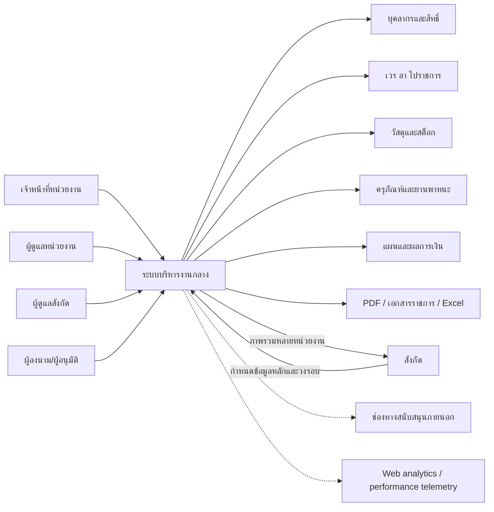

- ผู้ใช้หนึ่งคนสามารถสลับระหว่างขอบเขตหน่วยงานและสังกัดได้จากตัวเลือกองค์กร **[CONFIRMED]**
- หน่วยงานย่อยสืบทอดข้อมูลหรือการกำกับบางส่วนจากสังกัด เช่น ประเภทรายรับ กะทำงาน การเปิด/ปิดแผน และประกาศ **[CONFIRMED]**
- สังกัดอ่านข้อมูลข้ามหน่วยงาน เช่น จำนวนบุคลากร รายงาน ฉ.5/การลา และภาพรวมแผนการเงิน **[CONFIRMED]**
- ระบบสร้างเอกสาร PDF/งานพิมพ์จำนวนมาก และมีการส่งออก Excel ในหน้าการเงินบางหน้า **[CONFIRMED]**
- พบช่องทางช่วยเหลือผ่าน Line OA และแบบฟอร์มภายนอก รวมถึงบริการ web analytics/rum ภายนอก **[CONFIRMED]**
- ไม่พบหน้าตั้งค่า API key, webhook, SSO หรือการ sync กับระบบราชการอื่น **[CONFIRMED ว่าไม่พบใน navigation ที่สำรวจ; การมีอยู่เบื้องหลัง UNKNOWN]**

#### 2.1.1 Target ecosystem ที่ตัดสินใจแล้วสำหรับรุ่นแรก

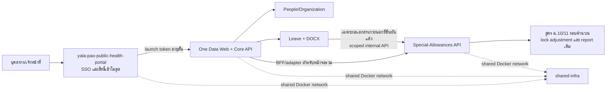

- Portal เป็นเจ้าของ login, account recovery, module access และ launch token; One Data สร้าง session ของตนหลังตรวจ token และใช้ `portal_user_id`/`sub` เป็น external identity mapping **[CODEBASE-VERIFIED + PROPOSED ADOPTION]**.
- One Data เป็นเจ้าของ People/Organization และ Leave; `Special-Allowances` เป็นเจ้าของสูตร ตัวแปรที่ไม่ใช่การลา รอบคำนวณ lock/adjustment ผลลัพธ์ และรายงาน ฉ.10/11 **[OWNER-CONFIRMED + CODEBASE-VERIFIED]**.
- ระบบอยู่บน server/network เดียวกันได้ แต่ต้องแยก database/schema credential และ service account ตามขอบเขต; ห้าม query หรือเขียนฐานข้อมูลของอีกระบบโดยตรง.
- หน้าจอ One Data สามารถแสดง/สั่งงานข้อมูล ฉ.10/11 ผ่าน BFF/adapter ได้ แต่ business command ต้องไปจบที่ Special-Allowances API และใช้ permission/audit ของระบบเจ้าของข้อมูล.
- ระยะ MVP ใช้ synchronous REST สำหรับการ sync รายเดือนและการอ่านผล; transactional outbox/event เป็นกลไกเพิ่มภายหลังเมื่อมี consumer หรือปริมาณงานที่คุ้มกับความซับซ้อน.

### 2.2 ขอบเขตองค์กร

| ระดับ                    | หน้าที่หลัก                                                | ข้อมูลที่เป็นเจ้าของ                                             | ความสัมพันธ์                                                   |
| ------------------------ | ---------------------------------------------------------- | ---------------------------------------------------------------- | -------------------------------------------------------------- |
| สังกัด (`affiliation`)   | กำกับหน่วยงานย่อย ข้อมูลหลักร่วม วงรอบการเงิน รายงานรวม    | รายการรายรับ, กะ, ประกาศ, การจัดลำดับหน่วยงาน, สิทธิ์ระดับสังกัด | มีหลายหน่วยงาน **[CONFIRMED]**                                 |
| หน่วยงาน (`tenant/unit`) | ปฏิบัติงานประจำวันและเก็บรายการธุรกรรม                     | บุคลากร, เวร, ลา, สต็อก, ทรัพย์สิน, รถ, แผน/ผลการเงิน            | อยู่ใต้สังกัดหนึ่งแห่งในตัวอย่าง **[CONFIRMED]**               |
| บุคคล (`employee/user`)  | เป็นทั้งข้อมูลบุคลากร ผู้ใช้ ผู้ขอ ผู้อนุมัติ หรือผู้ลงนาม | โปรไฟล์ การจ้าง ใบอนุญาต บทบาทการเข้าถึง                         | บุคคลเดียวอาจได้รับสิทธิ์ทั้งหน่วยงานและสังกัด **[CONFIRMED]** |

Target deployment รุ่นแรก **[OWNER-CONFIRMED]**:

```text
องค์การบริหารส่วนจังหวัดยะลา (1 affiliation)
└── รพ.สต. 38 แห่ง (38 tenants)
    └── บุคลากรรวม 267 คน ณ 10 ส.ค. 2569
```

ข้อมูลนี้ยืนยัน topology เชิงธุรกิจของรุ่นแรก แต่ไม่ยืนยันว่าบุคลากรหนึ่งคนมี membership พร้อมกันหลาย รพ.สต. ได้หรือไม่ หรือเจ้าหน้าที่กองสาธารณสุขของ อบจ. ต้องอยู่ในทะเบียนบุคลากรชุดเดียวกัน **[OPEN]**

Environment อ้างอิงที่ทดสอบรอบนี้มีเพียง 1 tenant ใต้สังกัดและ baseline บุคลากร 12 คน **[MUTATION-VERIFIED]** จึงยังยืนยันไม่ได้ว่า aggregate dashboard, transfer และ report จะถูกต้องเมื่อครบ 38 รพ.สต./267 คน; การทดสอบ scale/cross-tenant ต้องใช้ seed สังเคราะห์แยกต่างหากก่อน pilot.

### 2.3 ขอบเขตที่ไม่ควรสมมติ

- รุ่นแรกยืนยันหนึ่งสังกัด (อบจ.ยะลา) กับ รพ.สต. 38 แห่ง **[OWNER-CONFIRMED]**; การรองรับหลาย อบจ. หรือสังกัดซ้อนชั้นเป็น future capability ที่ยัง **[OPEN]** และ schema ไม่ควรปิดทางไว้.
- การย้าย รพ.สต., ช่วยราชการ, รักษาการ หรือมีหลาย membership พร้อมกันยัง **[OPEN]**; ห้ามออกแบบเป็น `employees.tenant_id` ที่แก้ทับประวัติ.
- มีข้อความว่าข้อมูลพื้นฐานบางอย่างเปลี่ยนได้โดย “ผู้ดูแลระบบสูงสุด” แต่บัญชีที่สำรวจเห็น role ใน UI เพียง “เจ้าหน้าที่/ผู้ดูแล” **[CONFIRMED ข้อความ; โครงสร้าง role ขั้นสูง UNKNOWN]**
- ไม่ทราบว่าระบบเชื่อม HR, บัญชี, e-Saraban, SSO ภาครัฐ หรือระบบคลังภายนอกอยู่แล้วหรือไม่ **[UNKNOWN]**
- ไม่ควรสมมติว่าข้อมูลผู้ป่วย/เวชระเบียน/HDC อยู่ในขอบเขตของรุ่นแรกจนกว่าเจ้าของโครงการจะยืนยัน **[OPEN]**

---

## 3. Module Map

```text
One Data System
├── ขอบเขตหน่วยงาน
│   ├── ภาพรวม
│   │   └── Dashboard หน่วยงาน
│   ├── บุคลากรและงานประจำ
│   │   ├── ตารางเวร / ตารางการปฏิบัติงาน
│   │   ├── พนักงาน / ผังองค์กร
│   │   ├── วันหยุดราชการ
│   │   ├── ลา / ไปราชการ / โควตา / ปฏิทิน
│   │   └── เอกสารและรายงาน
│   ├── วัสดุ
│   │   ├── คลังวัสดุ
│   │   ├── รับเข้า
│   │   ├── เบิกจ่าย
│   │   ├── แผนเบิกประจำปี
│   │   └── ร้านค้า/บริษัท
│   ├── ทรัพย์สิน
│   │   ├── ครุภัณฑ์ (พ.ด.2)
│   │   ├── ที่ดินและสิ่งก่อสร้าง (พ.ด.1)
│   │   └── ค่าเสื่อม/จำหน่าย/ประโยชน์/ผู้รับผิดชอบ/ซ่อม
│   ├── ยานพาหนะ
│   │   ├── ทะเบียนรถ
│   │   ├── ผู้มีสิทธิ์ใช้รถ
│   │   ├── คำขอใช้รถ (แบบ 3)
│   │   ├── บันทึกการใช้ (แบบ 4)
│   │   ├── อุบัติเหตุ (แบบ 5)
│   │   ├── ซ่อมบำรุง (แบบ 6)
│   │   └── เชื่อมทะเบียนครุภัณฑ์
│   ├── การเงิน
│   │   ├── แผนใช้จ่ายเงินบำรุง
│   │   └── รายรับ-รายจ่ายรายเดือน / เทียบแผน
│   └── ตั้งค่าหน่วยงาน / ผู้ลงนาม / ลายเซ็น
└── ขอบเขตสังกัด
    ├── Dashboard สังกัด
    ├── รายงานรวมหลายหน่วยงาน
    ├── หน่วยงานและลำดับการแสดงผล
    ├── บุคลากรทุกหน่วยงาน
    ├── ย้ายบุคลากรโดยตรง
    ├── คำขอย้ายบุคลากร
    ├── การเงินรวม
    │   ├── Dashboard การเงิน
    │   ├── วงรอบ/ชนิดแผนและการล็อก
    │   └── ข้อมูลหลักรายการรายรับ
    ├── ผู้ใช้งานระดับสังกัด
    ├── ประเภทกะ
    ├── ประกาศ
    └── ตั้งค่าสังกัด / ผู้ลงนาม
```

ทุกกิ่งหลักในแผนผังพบจากเมนูหรือหน้าที่เปิดได้ **[CONFIRMED]** การจัดกลุ่มเป็น bounded context สำหรับสร้างใหม่เป็นข้อเสนอ **[INFERRED/RECOMMENDED]**

---

## 4. Screen Inventory

### 4.1 ขอบเขตหน่วยงาน

| Route ที่พบ                           | หน้าจอ                              | องค์ประกอบ/การกระทำสำคัญ                                                         | สถานะ       |
| ------------------------------------- | ----------------------------------- | -------------------------------------------------------------------------------- | ----------- |
| `/tenant-dashboard`                   | Dashboard หน่วยงาน                  | KPI บุคลากร สถานะวันนี้ ขนาดองค์กร อัตรากำลังตามกลุ่ม/ตำแหน่ง สรุปการเงิน        | [CONFIRMED] |
| `/schedule`                           | ตารางเวร                            | เดือน/ปี, ตารางบุคลากร×วัน, แท็บเวร/การปฏิบัติงาน, รวมชั่วโมง/ค่าตอบแทน, ผู้ตรวจ | [CONFIRMED] |
| `/employees`                          | บุคลากร                             | KPI, ผังองค์กร/รายการ, ค้นหา, สถานะ, เพิ่ม/จัดการ                                | [CONFIRMED] |
| `/employees/new`                      | เพิ่มบุคลากร                        | ข้อมูลบุคคล การจ้าง ที่อยู่ ใบอนุญาต ประวัติการจ้าง บัญชีและ role                | [CONFIRMED] |
| `/employees/{id}/edit`                | แก้ไขบุคลากร                        | active, ข้อมูลบุคคล/การจ้าง, ประวัติการทำงานสำหรับ ฉ.11, บัญชีและ role           | [CONFIRMED] |
| `/holidays`                           | วันหยุด                             | เลือกปีและแสดงวันหยุดราชการรายเดือน                                              | [CONFIRMED] |
| `/leaves`                             | ลา/ไปราชการ                         | โควตา ปฏิทิน ประวัติ ตัวกรอง ขอ/พิมพ์เอกสาร                                      | [CONFIRMED] |
| `/reports`                            | เอกสาร/รายงาน                       | ตัวกรองเดือน/ปี เลขหนังสือ วันที่ ผู้ลงนาม และรายงาน 17 แบบ                      | [CONFIRMED] |
| `/reports/duty-table`                 | รายงานตารางเวร                      | ตัวอย่างหน้ารายงาน/พิมพ์จากเดือน ปี ผู้อนุมัติ                                   | [CONFIRMED] |
| `/reports/ch11-compensation-request`  | ใบขอรับเงินค่าตอบแทน ฉ.11           | เดือน ปี ผู้ลงนาม                                                                | [CONFIRMED] |
| `/reports/ch11-disbursement-memo`     | บันทึกขออนุมัติเบิกจ่าย ฉ.11        | เดือน ปี ผู้ลงนาม วันที่ และเลขที่หนังสือแยกกลุ่มการจ้าง                         | [CONFIRMED] |
| `/reports/ch11-disbursement-evidence` | หลักฐานการจ่ายเงิน ฉ.11             | เดือน ปี หัวหน้าผู้ควบคุม                                                        | [CONFIRMED] |
| `/reports/ch11-payment-claim-summary` | สรุปคำขอรับเงินรายเดือน ฉ.11        | เดือน ปี ผู้รับรอง                                                               | [CONFIRMED] |
| `/reports/ch11-annual-summary`        | ตารางสรุปทั้งปี ฉ.11                | เดือน ปี ผู้รับรอง                                                               | [CONFIRMED] |
| `/reports/ch11-annual-request`        | แบบคำขอรับเงินค่าตอบแทน ฉ.11 ทั้งปี | ผู้ลงนาม วันที่ เดือนคิดอายุงาน ช่วงคำขอ และข้อมูลประชุมคณะกรรมการ               | [CONFIRMED] |
| `/supplies`                           | คลังวัสดุ                           | ค้นหา เรียง ตารางรหัส/หมวด/ชนิด/หน่วย/min/max/คงเหลือ/มูลค่า เพิ่มวัสดุ          | [CONFIRMED] |
| `/stock-in`                           | รายการรับเข้า                       | ค้นหาและตารางเลขรับ/ใบส่งของ/ผู้ขาย/วันที่/มูลค่า/จำนวนรายการ                    | [CONFIRMED] |
| `/stock-in/new`                       | สร้างรับเข้า                        | ผู้ขาย ผู้ทำรายการ ใบส่งของ วันที่ รายการวัสดุ จำนวน ราคาต่อหน่วย ยอดรวม         | [CONFIRMED] |
| `/stock-out`                          | รายการเบิก                          | ค้นหาและตารางใบเบิก/กลุ่มงาน/วันที่/มูลค่า/จำนวนรายการ                           | [CONFIRMED] |
| `/stock-out/new`                      | สร้างเบิก                           | วันที่ กลุ่มงาน ผู้ทำรายการ หมายเหตุ ค้นวัสดุ จำนวน ยอดรวม                       | [CONFIRMED] |
| `/annual-plan`                        | แผนเบิกประจำปี                      | ค้นหา ตารางเลขแผน ปีงบ กลุ่มงาน จำนวน/ยอดเบิก สถานะตรวจสอบ                       | [CONFIRMED] |
| `/annual-plan/new`                    | สร้างแผนเบิก                        | ปีงบ กลุ่มงาน หมายเหตุ วัสดุและจำนวน; บันทึกแล้วล็อก                             | [CONFIRMED] |
| `/stores`                             | ร้านค้า/บริษัท                      | ค้นหา ตารางข้อมูลติดต่อ เพิ่ม/จัดการ                                             | [CONFIRMED] |
| `/durable-assets`                     | ทะเบียนทรัพย์สิน                    | แท็บครุภัณฑ์/ที่ดินและสิ่งก่อสร้าง KPI ค้นหา ชนิด สถานะ pagination               | [CONFIRMED] |
| `/durable-assets/new?form=KRUPAN`     | เพิ่มครุภัณฑ์                       | ข้อมูลหลัก รายละเอียด ค่าเสื่อม จำหน่าย ประโยชน์ ผู้รับผิดชอบ ซ่อม               | [CONFIRMED] |
| `/durable-assets/new?form=LAND`       | เพิ่มที่ดิน/สิ่งก่อสร้าง            | ที่ตั้ง เนื้อที่ เอกสารสิทธิ์ โครงสร้าง ขนาด การได้มา ราคา และแท็บวงจรชีวิต      | [CONFIRMED] |
| `/vehicles`                           | ทะเบียนยานพาหนะ                     | KPI/ตาราง/ปฏิทิน ค้นหา พิมพ์แบบทะเบียน/รายเดือน เพิ่มรถ                          | [CONFIRMED] |
| `/vehicles/{id}`                      | รายละเอียดยานพาหนะ                  | ข้อมูลรถ ผู้มีสิทธิ์ คำขอใช้ บันทึกใช้ อุบัติเหตุ ซ่อมบำรุง เชื่อมครุภัณฑ์       | [CONFIRMED] |
| `/finance`                            | แผนการเงินหน่วยงาน                  | ปีงบ รุ่นแผน รายได้คาดการณ์ ยอดยกมา รายจ่ายแต่ละแหล่ง คงเหลือ/ยกไป               | [CONFIRMED] |
| `/finance/monthly`                    | รายรับ-รายจ่ายรายเดือน              | ภาพรวม รายรับ รายจ่าย เทียบแผน กราฟ Oct–Sep พิมพ์/Excel                          | [CONFIRMED] |
| `/tenant-settings`                    | ตั้งค่าหน่วยงาน                     | โลโก้ ข้อมูลหนังสือ ที่อยู่ CUP/ขนาดองค์กร ผู้ลงนาม/ผู้ปฏิบัติ                   | [CONFIRMED] |

### 4.2 ขอบเขตสังกัด

| Route ที่พบ                     | หน้าจอ               | องค์ประกอบ/การกระทำสำคัญ                                                        | สถานะ                               |
| ------------------------------- | -------------------- | ------------------------------------------------------------------------------- | ----------------------------------- |
| `/affiliation-dashboard`        | Dashboard สังกัด     | จำนวนหน่วยงาน/บุคลากร ค่าเฉลี่ย กลุ่มตำแหน่ง สถานะอัตรากำลัง ค้นหา/เจาะหน่วยงาน | [CONFIRMED]                         |
| `/affiliation-reports`          | รายงานรวม            | ฉ.5 และสรุปการลาเดือน/ปี พร้อม preview PDF/พิมพ์                                | [CONFIRMED]                         |
| `/affiliation-tenants`          | หน่วยงาน             | กลุ่มตามอำเภอและ drag เพื่อเรียงลำดับในเอกสารรวม                                | [CONFIRMED]                         |
| `/affiliation-tenant-employees` | บุคลากรทุกหน่วยงาน   | ค้นหาชื่อ/เลขประจำตัว กรองหน่วยงาน/สถานะ แสดงกลุ่มตามหน่วยงาน                   | [CONFIRMED]                         |
| `/employee-transfer`            | ย้ายบุคลากร          | ขั้นที่ 1 เลือกบุคคล → ขั้นที่ 2 หน่วยงานปลายทาง → ขั้นที่ 3 ยืนยัน             | [CONFIRMED]                         |
| `/employee-transfer-requests`   | คำขอย้าย             | กรอง pending/approved/rejected/canceled; อนุมัติ/ปฏิเสธ                         | [CONFIRMED UI; ไม่มีข้อมูลตัวอย่าง] |
| `/finance/dashboard`            | Dashboard การเงินรวม | ผลรวมทุกหน่วยงาน แผน/จริง สถานะการบันทึก การใช้จ่าย                             | [CONFIRMED]                         |
| `/finance/cycle`                | วงรอบแผน             | เปิด/ปิดแผนปกติ/เพิ่มเติม/เปลี่ยนแปลง ล็อกสถานะ ติดตามหน่วยงาน รายงานรวม        | [CONFIRMED]                         |
| `/finance/revenue-items`        | รายการรายรับหลัก     | ปีงบ เพิ่ม คัดลอกจากปีอื่น เรียง เปิด/ปิดรายการ และ flag ประเภท                 | [CONFIRMED]                         |
| `/affiliation-settings`         | ตั้งค่าสังกัด        | โลโก้ ข้อมูลพื้นฐานแบบ read-only ผู้ลงนาม ข้อความท้ายเอกสาร                     | [CONFIRMED]                         |
| `/affiliation-employees`        | ผู้ใช้ระดับสังกัด    | สร้างบุคลากรใหม่หรือให้สิทธิ์บุคลากรหน่วยงานเดิม เลือก role และถอนสิทธิ์        | [CONFIRMED]                         |
| `/affiliation-shift-types`      | ประเภทกะ             | รหัส ชื่อ เวลา ชั่วโมง ฐานค่าตอบแทน เพิ่ม/แก้ไข                                 | [CONFIRMED]                         |
| `/affiliation-announcements`    | ประกาศ               | ข้อความ ผู้สร้าง วันที่ สถานะ active เพิ่ม/จัดการ                               | [CONFIRMED]                         |

### 4.3 Surface ที่ไม่พบ

- หน้า login, ลืมรหัสผ่าน, เชิญผู้ใช้ และจัดการ session — เริ่มสำรวจจากสถานะที่ login แล้ว **[UNKNOWN]**
- หน้าจัดการ role/permission matrix แบบละเอียด — ไม่พบในเมนู **[CONFIRMED ว่าไม่พบ; อาจอยู่ระดับสูงกว่า UNKNOWN]**
- audit log ส่วนกลาง — ไม่พบ แม้หลายตารางมี “แก้ไขล่าสุดโดย/เวลา” **[CONFIRMED]**
- bulk import wizard หรือ template CSV/Excel — ไม่พบ **[CONFIRMED ในหน้าที่สำรวจ]**
- notification inbox/email configuration — ไม่พบ; เมนูบัญชีมีเพียง diagnostics สำหรับ push ซึ่งรายงานว่าเบราว์เซอร์ปัจจุบันไม่รองรับ **[CONFIRMED]**
- รายงาน/route ชื่อ ฉ.10 — ไม่พบใน catalog 17 แบบ; มีหมวด `พตส.` จำนวน 0 ซึ่งยัง mapping ไม่ได้ **[CONFIRMED ว่าไม่พบ/OPEN ความสัมพันธ์]**

---

## 5. Feature Inventory

### 5.1 Dashboard และโครงสร้างองค์กร

- Dashboard หน่วยงานแสดงจำนวนบุคลากร สถานะมาปฏิบัติงาน/ลา/ไปราชการ กลุ่มตำแหน่ง ขนาดองค์กร อัตรากำลัง และการเงิน **[CONFIRMED]**
- Dashboard สังกัดรวมจำนวนหน่วยงาน บุคลากร ค่าเฉลี่ย ตำแหน่ง และความครบ/ขาด/เกินของอัตรากำลัง **[CONFIRMED]**
- หน่วยงานถูกจัดกลุ่มตามอำเภอและเรียงลำดับแบบ drag-and-drop; ลำดับนี้ถูกใช้ในเอกสารสรุป **[CONFIRMED]**
- มีตัวสลับ scope ในบัญชีเดียวและแสดง role ของแต่ละ scope **[CONFIRMED]**
- เกณฑ์จัดขนาดองค์กรและสูตรอัตรากำลังจริงไม่ปรากฏใน UI **[UNKNOWN]**

### 5.2 บุคลากรและสิทธิ์

- โปรไฟล์บุคลากรรวมข้อมูลตัวตน การเกิด เพศ ที่อยู่ การจ้าง กลุ่มงาน ตำแหน่ง ใบประกอบวิชาชีพ และประวัติการจ้าง **[CONFIRMED]**
- วันที่เริ่มงานใช้คำนวณอายุงาน; ส่วนประวัติการทำงานมีข้อความชัดว่า “ใช้ในการคำนวณ ฉ11” และเก็บชื่อสถานที่ทำงาน ระดับพื้นที่ สถานะทำงานปัจจุบัน flag “นำไปคิด ฉ11” วันเริ่ม และวันสิ้นสุด **[CONFIRMED จากข้อความฟอร์ม]**
- ระดับพื้นที่ในประวัติการทำงานมี 7 ค่า: พื้นที่เฉพาะระดับ 1/2, พื้นที่ชุมชนเมือง, พื้นที่ปกติระดับ 1/2/3 และไม่ระบุ **[CONFIRMED]**; ความหมาย อัตรา และ effective-date rule ของแต่ละค่ายัง **[UNKNOWN]**
- สามารถตั้งสถานะ active/inactive และค้น/กรองบุคลากร **[CONFIRMED]**
- ช่องทางเข้าระบบประกอบด้วยอีเมลแบบไม่บังคับ โทรศัพท์บังคับ และ role บังคับ **[CONFIRMED]**
- role ที่พบในตัวเลือกมี “เจ้าหน้าที่” และ “ผู้ดูแล” เท่านั้น **[CONFIRMED]**
- ระดับสังกัดสามารถสร้างบุคลากรใหม่หรือให้สิทธิ์แก่บุคลากรหน่วยงานเดิมโดยไม่ทำสำเนาข้อมูล **[CONFIRMED จากข้อความ UI]**
- รายการข้ามหน่วยงานรองรับการค้นชื่อ/เลขประจำตัวและกรองหน่วยงาน/สถานะ **[CONFIRMED]**
- มีทั้งการย้ายโดยผู้ดูแลแบบ 3 ขั้น และคำขอย้ายที่อนุมัติ/ปฏิเสธได้ **[CONFIRMED]**

### 5.3 ตารางเวร วันหยุด ลา และไปราชการ

- ตารางเวรรายเดือนเป็น matrix บุคลากร×วัน มีการแก้เวรในแต่ละ cell สรุปชั่วโมงและค่าตอบแทน **[CONFIRMED]**
- ประเภทกะส่วนกลางมีรหัส ชื่อ เวลาเริ่ม/สิ้นสุด จำนวนชั่วโมง และฐานค่าตอบแทน “ต่อกะ/ต่อชั่วโมง” **[CONFIRMED]**
- กะตัวอย่าง: เช้า 08:30–12:00 (3.5 ชม.), เที่ยง 12:00–13:00 (1 ชม.), บ่าย 13:00–16:30 (3.5 ชม.) **[CONFIRMED]**
- หน้าตารางแสดงวันหยุดและบันทึกผู้แก้ไขล่าสุด **[CONFIRMED]**
- หน้าวันหยุดเลือกปีและแสดงวันหยุดราชการ; ไม่พบการเพิ่ม/แก้ในขอบเขตที่สำรวจ **[CONFIRMED]**
- หน้าลาแสดงโควตา ปฏิทิน ประวัติ สถานะ และปุ่มพิมพ์เอกสาร **[CONFIRMED]**
- ประเภทลาที่พบ 11 ประเภท พร้อมเพดาน: ป่วย 60 วัน/ปี, คลอดบุตร 90 วัน/ครั้ง, กิจส่วนตัว 30 วัน/ปี, พักผ่อน 20 วัน/ปีและสะสม 10 วัน, อุปสมบท/ฮัจย์ 120 วัน/ครั้ง, ช่วยเหลือภริยาคลอดบุตร 15 วัน/ครั้ง, ฟื้นฟูสมรรถภาพอาชีพ 240 วัน/ครั้ง; อีก 4 กลุ่มแสดงเป็นไม่จำกัด **[CONFIRMED ตาม UI; กฎอายุงานและข้อยกเว้น UNKNOWN]**
- แบบขอลามีประเภท วันที่เริ่ม วันที่สิ้นสุด และบันทึก **[CONFIRMED]**
- แบบไปราชการมีประเภท (`ไปอบรม`, `ไปราชการ`), เรื่อง, วันที่เริ่ม/สิ้นสุด, ยานพาหนะ และผู้ร่วมเดินทางแบบไม่บังคับ **[CONFIRMED]**
- ตัวกรองสถานะใบลามี `รออนุมัติ`, `อนุมัติแล้ว`, `ไม่อนุมัติ`, `ยกเลิก`; รายการ pending เปิดแผงรายละเอียดได้ และบัญชีผู้ดูแลหน่วยงานเห็นปุ่ม `อนุมัติ`, `ไม่อนุมัติ`, `ยกเลิกการลา` และพิมพ์ใบลา **[CONFIRMED UI; ไม่ได้กด action]**
- ข้อความสถานะเดียวกันแสดงต่างกันระหว่างตาราง (`รออนุมัติ`) กับแผงรายละเอียด (`รอดำเนินการ`) **[CONFIRMED]**; ระบบใหม่ควรมี canonical status และแยก display label.
- รายการไปราชการตัวอย่างไม่แสดงสถานะอนุมัติ; แผงรายละเอียดมี `แก้ไขคำขอ`, `ลบคำขอไปราชการ` และพิมพ์เอกสาร **[CONFIRMED UI; ไม่ได้กด action]** จึงห้ามนำ state machine ของใบลาไปใช้กับไปราชการโดยอัตโนมัติ.
- ผู้อนุมัติที่ถูกต้อง ลำดับ/การมอบหมายอำนาจ วิธีนับวันลา วันหยุด/วันทับซ้อน การแก้ย้อนหลัง และเงื่อนไขยกเลิกหลังอนุมัติยัง **[UNKNOWN]**

### 5.4 เอกสารและรายงานหน่วยงาน

พบรายงาน 17 แบบ **[CONFIRMED]**:

1. ตารางเวร 1 แบบ
2. กลุ่ม OT 4 แบบ: ใบลงชื่อ, ใบสำคัญรับเงิน, สรุป, ขออนุมัติ
3. กลุ่ม ฉ.11 จำนวน 6 แบบ: ใบขอรับเงินค่าตอบแทน, บันทึกขออนุมัติเบิกจ่าย, หลักฐานการจ่ายเงิน, ตารางสรุปคำขอรับเงินรายเดือน, ตารางสรุปทั้งปี, แบบคำขอรับเงินค่าตอบแทนทั้งปี
4. สรุปการลา 1 แบบ
5. กลุ่มวัสดุ 4 แบบ: คงเหลือ, บัญชีรับ-จ่าย-คงเหลือ, สรุปมูลค่ารายเดือน, รายละเอียดคงเหลือปีงบประมาณ
6. ทะเบียนฝึกอบรม 1 แบบ

รองรับตัวกรองเดือน/ปี เลขหนังสือ วันที่ การกำหนดผู้จัดทำ/ผู้ตรวจ/ผู้อนุมัติ และ PDF/พิมพ์ **[CONFIRMED]** สำหรับ ฉ.11 พบ parameter เฉพาะรายงานเพิ่ม ได้แก่ ผู้ลงนาม/ผู้รับรอง/หัวหน้าผู้ควบคุม เลขที่หนังสือแยกกลุ่มการจ้าง เดือนคิดอายุงาน ช่วงเดือนคำขอ และเลขที่/วันที่ประชุมคณะกรรมการ **[CONFIRMED]** สูตรและ layout ทางราชการฉบับสุดท้ายยัง **[UNKNOWN]**

ใน catalog ที่สำรวจพบ `ฉ11` 6 รายงาน แต่ไม่พบรายงานหรือหมวดชื่อ `ฉ10`; พบหมวด `พตส.` แสดงจำนวน 0 เท่านั้น **[CONFIRMED]** การที่ ฉ.10 กับ พตส. เป็นเรื่องเดียวกัน คนละชื่อ หรือคนละแบบฟอร์มยัง **[OPEN]** และห้ามสรุปจาก UI นี้.

### 5.5 วัสดุและสต็อก

- ข้อมูลวัสดุ: รหัส หมวด ประเภท ชื่อ หน่วย ที่เก็บ min/max คงเหลือ มูลค่า และ audit ล่าสุด **[CONFIRMED]**
- ประเภทวัสดุ 19 กลุ่ม ครอบคลุมสำนักงาน การแพทย์ วิทยาศาสตร์ คอมพิวเตอร์ ยานพาหนะ เชื้อเพลิง ไฟฟ้า งานบ้าน ก่อสร้าง ฯลฯ **[CONFIRMED]**
- การเลือกบางประเภทเติมหมวดอัตโนมัติ เช่น วัสดุสำนักงาน → วัสดุคงคลัง **[CONFIRMED ตัวอย่างหนึ่ง; mapping ทั้งหมด UNKNOWN]**
- รับเข้าบันทึกใบส่งของ วันที่ ผู้ขาย ผู้ทำรายการ รายการวัสดุ จำนวน ราคาต่อหน่วย และยอดรวม **[CONFIRMED]**
- เบิกจ่ายบันทึกวันที่ กลุ่มงาน ผู้ทำรายการ หมายเหตุ วัสดุ จำนวน และยอดรวม **[CONFIRMED]**
- กลุ่มงานของผู้ทำรายการถูกเติมอัตโนมัติในใบเบิก **[CONFIRMED]**
- แผนเบิกประจำปีระบุปีงบ กลุ่มงาน วัสดุและจำนวน; เมื่อบันทึกจะล็อกและหากต้องเปลี่ยนต้องลบแผน **[CONFIRMED จากข้อความ UI]**
- ข้อมูลร้านค้า/บริษัทมีชื่อ ที่อยู่ ผู้ติดต่อ โทรศัพท์ และหมายเหตุ/เงื่อนไขจัดส่ง **[CONFIRMED]**
- ผลกระทบสต็อกของรับเข้า/เบิกจ่ายและรายงาน ledger **[INFERRED อย่างมีเหตุผล]**
- วิธีตีราคาคงเหลือ (FIFO/เฉลี่ย/ราคาล่าสุด), การกันสต็อกติดลบ, lot/expiry, approval และการย้อนรายการ **[UNKNOWN]**

### 5.6 ครุภัณฑ์ ที่ดิน และสิ่งก่อสร้าง

- แยกทะเบียน พ.ด.2 (ครุภัณฑ์) กับ พ.ด.1 (ที่ดิน/สิ่งก่อสร้าง) **[CONFIRMED]**
- รหัสครุภัณฑ์ตามข้อความ UI: ประเภท 3 หลัก + ปี พ.ศ. 2 หลัก + running 4 หลัก **[CONFIRMED]**
- ครุภัณฑ์เก็บรูป ชื่อ รายละเอียด รหัส ประเภท สถานะ ยี่ห้อ/รุ่น serial เครื่อง/ตัวถัง ทะเบียน สี หน่วย ใบส่งของ วิธีได้มา ผู้ขาย/ผู้ให้ วันที่ได้มา ราคา แหล่งเงิน หนังสืออนุมัติ ประกัน และหมายเหตุ **[CONFIRMED]**
- ที่ดิน/สิ่งก่อสร้างเพิ่มที่ตั้ง ไร่/งาน/ตารางวา ประเภท/เลขโฉนด ประเภทอาคาร โครงสร้าง ชั้น และขนาด **[CONFIRMED]**
- วงจรชีวิตแยกแท็บค่าเสื่อม จำหน่าย ประโยชน์ ผู้รับผิดชอบ และซ่อม **[CONFIRMED]**
- ค่าเสื่อมเริ่มต้นเป็นเส้นตรง 5 ปีจากราคาทุน และแก้ค่าหลังบันทึก/สำรวจประจำปีได้ **[CONFIRMED จากข้อความ UI]**
- การจำหน่ายมีวันที่ วิธี หนังสืออนุมัติ มูลค่าขาย และคำนวณกำไร/ขาดทุนเทียบราคาทุน; วิธีได้แก่ ขาย แลกเปลี่ยน โอน แปรสภาพ ทำลาย **[CONFIRMED]**
- ประโยชน์รายปีเก็บปี พ.ศ. วิธี/รายละเอียด จำนวนเงิน และหลักการรับรายเดือน/รายปี **[CONFIRMED]**
- ผู้รับผิดชอบรายปีเก็บส่วนงาน ผู้ใช้ทรัพย์สิน และหัวหน้าส่วนงาน **[CONFIRMED]**
- ประวัติซ่อมเก็บครั้งที่ เลขหนังสือ วันที่ รายการปรับปรุง จำนวนเงิน ผู้ซ่อม/บริษัท และหมายเหตุ **[CONFIRMED]**

### 5.7 ยานพาหนะ

- ทะเบียนรถมีรูป ชื่อ รุ่น ปีผลิต ความจุเครื่อง ทะเบียน ราคา รูปแบบถือครอง วันที่ได้มา เลขไมล์เริ่มต้น และหมายเหตุ **[CONFIRMED]**
- มุมมองรองรับ card/table/calendar, ค้นหา, พิมพ์ทะเบียนรถแบบ 2 และรายงานรายเดือน **[CONFIRMED]**
- รถหนึ่งคันมีรายชื่อผู้มีสิทธิ์ใช้รถ; UI ระบุว่ามีเฉพาะผู้ได้รับอนุญาตที่ขอใช้ได้ **[CONFIRMED]**
- คำขอใช้รถ (แบบ 3) มีผู้ขอ ปลายทาง วัตถุประสงค์ เริ่ม/สิ้นสุด จำนวนผู้โดยสาร และพิมพ์เอกสาร **[CONFIRMED]**
- บันทึกใช้รถ (แบบ 4) มีผู้ใช้ สถานที่ เวลา/เลขไมล์ออก เวลา/เลขไมล์กลับ ระยะทางรวม และคนขับ **[CONFIRMED]**
- อุบัติเหตุ (แบบ 5) เก็บวันเวลา ความเร็ว สถานที่ ต้นทาง/ปลายทาง ความเสียหาย ข้อมูลคู่กรณี ผู้บาดเจ็บ พยาน ผู้สอบสวน สถานีและผลคดี **[CONFIRMED]**
- ซ่อมบำรุง (แบบ 6) เก็บเลขไมล์ รายการซ่อม จำนวนเงิน วันที่รับรถ สถานที่ซ่อม และหมายเหตุ **[CONFIRMED]**
- รถสามารถสร้างหรือเชื่อมกับครุภัณฑ์ประเภทยานพาหนะ **[CONFIRMED]** ตัวอย่างที่เห็นยังไม่ได้เชื่อม แม้มีครุภัณฑ์ลักษณะรถอีกระเบียนหนึ่ง จึงมีความเสี่ยงข้อมูลซ้ำ **[CONFIRMED สภาพตัวอย่าง; สาเหตุ UNKNOWN]**
- state machine คำขอรถและผู้อนุมัติจริงยังไม่ชัด; พบตัวอย่างสถานะ “ยกเลิก” **[UNKNOWN/CONFIRMED เฉพาะสถานะ]**

### 5.8 การเงินหน่วยงาน

- แผนแยกปีงบประมาณและรุ่นแผน **[CONFIRMED]**
- แสดงรายได้คาดการณ์ ยอดยกมา รายจ่ายเงินบำรุง รายจ่ายงบ อปท. ยอดรวม คงเหลือ และยกไป **[CONFIRMED]**
- หากสังกัดไม่เปิดวงรอบแผนปกติ ปุ่มสร้างรุ่นแผนถูกปิด **[CONFIRMED]**
- รายรับ/รายจ่ายจริงบันทึกรายเดือนแบบ inline edit และวางเดือน ต.ค.–ก.ย. **[CONFIRMED]**
- หน้ารายเดือนมีภาพรวม กราฟ รายรับ รายจ่าย และแผนเทียบจริง พร้อมพิมพ์/Excel **[CONFIRMED]**
- กราฟรายรับรายเดือนไม่นับยอดยกมา ขณะที่ยอดคงเหลือต้องใช้อ้างอิงยอดยกมา **[CONFIRMED จากข้อความ UI]**
- รายจ่ายมี 11 หมวดหลัก: ยา/เวชภัณฑ์, วัสดุ, ค่าตอบแทนทางการแพทย์, บริการทางการแพทย์, ครุภัณฑ์/ที่ดิน/สิ่งก่อสร้าง, ค่าใช้สอย, สาธารณูปโภค, ค่าจ้างลูกจ้างชั่วคราว, OT, ไปราชการ และสาธารณสุขอื่น **[CONFIRMED]**
- แสดงผลรวมแผน ผลจริง และผลต่าง (+/−) **[CONFIRMED]** แต่ทิศทางสูตรผลต่างและกติกาแก้ย้อนหลัง **[UNKNOWN]**

### 5.9 การเงินและข้อมูลหลักระดับสังกัด

- Dashboard รวมจำนวนหน่วยงาน ยอดยกมา รายได้คาดการณ์ รายจ่ายตามแหล่ง เงินยกไป อัตราใช้แผน จำนวนแผนล็อก และความครบถ้วนการบันทึก **[CONFIRMED]**
- วงรอบแผนมี 3 ชนิด: ปกติ (`BASE`), เพิ่มเติม และเปลี่ยนแปลง **[CONFIRMED]**
- สังกัดเปิด/ปิดวงรอบแต่ละชนิด; การปิดมีผลล็อกแผนชนิดนั้น **[CONFIRMED]**
- สังกัดติดตามรุ่น/สถานะของทุกหน่วยงานและออกรายงานรวมหลายมิติ รวมบุคลากร/ผู้รับจ้าง ครุภัณฑ์ แหล่งรายรับ และหมวดรายจ่าย **[CONFIRMED]**
- รายการรายรับกำหนดโดยสังกัด หน่วยงานกรอกเฉพาะจำนวนเงิน; รองรับคัดลอกจากปีอื่น เรียงลำดับ และ flag ยอดยกมา/งบ อปท. **[CONFIRMED]**
- ประเภทรายรับ 8 กลุ่ม: เงินคงเหลือ, เงินหมุนเวียนตามระเบียบ, ค่ารักษาพยาบาล, รายได้จาก อปท., รายได้ทรัพย์สิน, เงินจัดสรร, ดอกผลกองทุน และรายได้อื่น/บริจาค **[CONFIRMED]**

### 5.10 ตั้งค่า ประกาศ และการสนับสนุน

- ตั้งค่าหน่วยงานเก็บโลโก้ ชื่อ/ชื่อย่อ รหัสหน่วยบริการ ขนาด CUP เลขหนังสือ ที่อยู่ และผู้ทำหน้าที่/ผู้ลงนามหลายประเภท **[CONFIRMED]**
- ชื่อ ชื่อย่อ รหัสหน่วยบริการ ขนาด และ CUP เป็น read-only ในบัญชีที่สำรวจ **[CONFIRMED]**
- ตั้งค่าสังกัดมีข้อมูลพื้นฐาน read-only พร้อมข้อความว่าผู้ดูแลระบบสูงสุดเท่านั้นที่แก้ได้ และมีผู้ลงนาม/ข้อความท้ายเอกสารที่แก้ได้ **[CONFIRMED]**
- ลายเซ็นผู้ใช้รองรับพิมพ์ชื่อ อัปโหลดภาพ หรือวาด **[CONFIRMED]**
- โลโก้รองรับ PNG/JPG สูงสุด 2 MB **[CONFIRMED]**
- ประกาศมีข้อความ ผู้สร้าง วันที่ active; การเปิดประกาศใหม่ทันทีจะปิดประกาศอื่นทั้งหมด **[CONFIRMED จากข้อความฟอร์ม]**
- ช่องทางแจ้งปัญหาเปิด Line OA และฟอร์มภายนอก **[CONFIRMED]**

---

## 6. Roles & Permissions

### 6.1 แบบจำลองสิทธิ์ที่สังเกตได้

ระบบแสดง role สำหรับการเข้าถึงเพียง 2 ชื่อ คือ `เจ้าหน้าที่` และ `ผู้ดูแล` และผูก role แยกตาม scope หน่วยงาน/สังกัด **[CONFIRMED]** บุคคลเดียวสามารถมีสิทธิ์ระดับสังกัดโดยอ้างอิงข้อมูลบุคลากรเดิมจากหน่วยงาน ไม่ต้องสร้างข้อมูลซ้ำ **[CONFIRMED]**

อย่างไรก็ตาม มีข้อความถึง “ผู้ดูแลระบบสูงสุด” สำหรับแก้ข้อมูลพื้นฐานบางส่วน **[CONFIRMED]** จึงควรตีความว่า role ที่แสดงใน UI อาจเป็นเพียง simplified label ไม่ใช่ permission model ทั้งหมด **[INFERRED]**

```text
Identity
└── Person / Employee
    ├── Tenant membership(s)
    │   └── access role: STAFF | ADMIN
    ├── Affiliation membership(s)
    │   └── access role: STAFF | ADMIN
    └── Functional assignments
        ├── Director / Acting director
        ├── Document issuer / checker / approver
        ├── Procurement roles
        ├── Payer
        ├── Vehicle approver
        └── Affiliation signatories
```

ส่วน `Functional assignments` พบจากหน้าตั้งค่าและใช้เติมเอกสาร/กระบวนงาน **[CONFIRMED]** แต่ยังไม่ยืนยันว่ามอบสิทธิ์ทำรายการด้วย **[UNKNOWN]**

### 6.2 Role matrix จากสิ่งที่มองเห็น

ตารางนี้บันทึก “UI ที่บัญชีผู้ดูแลเห็น” ไม่ใช่ผลทดสอบ authorization ฝั่ง server เพราะไม่ทำรายการจริง และไม่มีบัญชีเจ้าหน้าที่สำหรับเปรียบเทียบ

| Capability                  |                                                        ผู้ดูแลหน่วยงาน |                       เจ้าหน้าที่หน่วยงาน |                                 ผู้ดูแลสังกัด |        เจ้าหน้าที่สังกัด |
| --------------------------- | ---------------------------------------------------------------------: | ----------------------------------------: | --------------------------------------------: | -----------------------: |
| ดู dashboard ของ scope      |                                                   เห็น **[CONFIRMED]** |                                 [UNKNOWN] |                          เห็น **[CONFIRMED]** |                [UNKNOWN] |
| ดู/จัดการบุคลากร            |                                   ปุ่มเพิ่ม/จัดการเห็น **[CONFIRMED]** |                                 [UNKNOWN] | directory + access grant เห็น **[CONFIRMED]** |                [UNKNOWN] |
| จัดตารางเวร                 |                                         cell แก้ไขเห็น **[CONFIRMED]** |                                 [UNKNOWN] |               กำหนดชนิดกะเห็น **[CONFIRMED]** |                [UNKNOWN] |
| ขอวันลา/ไปราชการ            |                                             ปุ่มขอเห็น **[CONFIRMED]** |                   น่าจะได้ **[INFERRED]** |                 รายงานรวมเห็น **[CONFIRMED]** |                [UNKNOWN] |
| พิจารณา/ยกเลิกใบลา          | แผงรายละเอียด pending แสดงอนุมัติ/ไม่อนุมัติ/ยกเลิก **[CONFIRMED UI]** |                                 [UNKNOWN] |                                     [UNKNOWN] |                [UNKNOWN] |
| แก้ไข/ลบไปราชการ            |                           แผงรายละเอียดแสดงแก้ไข/ลบ **[CONFIRMED UI]** |                                 [UNKNOWN] |                                     [UNKNOWN] |                [UNKNOWN] |
| สร้าง/แก้คลังและรายการสต็อก |                                   ปุ่มเพิ่ม/จัดการเห็น **[CONFIRMED]** |                                 [UNKNOWN] |                             ไม่พบโมดูลธุรกรรม |        ไม่พบโมดูลธุรกรรม |
| จัดการครุภัณฑ์/รถ           |                                ปุ่มเพิ่ม/แก้/ลบเห็น **[CONFIRMED UI]** |                                 [UNKNOWN] |           รายงานแผนรวมบางส่วน **[CONFIRMED]** |                [UNKNOWN] |
| ขอใช้รถ                     |                                          ปุ่มฟอร์มเห็น **[CONFIRMED]** | เฉพาะผู้ได้รับอนุญาต **[CONFIRMED rule]** |                                     [UNKNOWN] |                [UNKNOWN] |
| จัดทำแผนการเงินหน่วยงาน     |                                   เห็น แต่ขึ้นกับวงรอบ **[CONFIRMED]** |                                 [UNKNOWN] |            เปิด/ปิด/ติดตามได้ **[CONFIRMED]** |                [UNKNOWN] |
| บันทึกผลรายเดือน            |                                       inline edit เห็น **[CONFIRMED]** |                                 [UNKNOWN] |                  ดู aggregate **[CONFIRMED]** |                [UNKNOWN] |
| จัดการรายการรายรับหลัก      |                                                         ไม่พบใน tenant |                                     ไม่พบ | เพิ่ม/คัดลอก/เรียง/จัดการเห็น **[CONFIRMED]** |                [UNKNOWN] |
| ย้ายบุคลากรโดยตรง           |                                                                  ไม่พบ |                                     ไม่พบ |           workflow 3 ขั้นเห็น **[CONFIRMED]** |                [UNKNOWN] |
| อนุมัติคำขอย้าย             |                                                                  ไม่พบ |                                     ไม่พบ |         UI ระบุอนุมัติ/ปฏิเสธ **[CONFIRMED]** |                [UNKNOWN] |
| ตั้งค่าองค์กร/ผู้ลงนาม      |                                         แก้ได้บางฟิลด์ **[CONFIRMED]** |                                 [UNKNOWN] |                แก้ได้บางฟิลด์ **[CONFIRMED]** |                [UNKNOWN] |
| แก้ข้อมูลพื้นฐานที่ล็อก     |                                ข้อมูลบางส่วน read-only **[CONFIRMED]** |                  ไม่ควรได้ **[INFERRED]** |        ระบุว่าต้อง superadmin **[CONFIRMED]** | ไม่ควรได้ **[INFERRED]** |
| Export PDF/Excel            |                                เห็นในหน้าที่เกี่ยวข้อง **[CONFIRMED]** |                                 [UNKNOWN] |       เห็นในหน้าที่เกี่ยวข้อง **[CONFIRMED]** |                [UNKNOWN] |
| ดู audit log ส่วนกลาง       |                                                                  ไม่พบ |                                     ไม่พบ |                                         ไม่พบ |                    ไม่พบ |

### 6.3 Permission model ที่แนะนำ

ห้ามสร้างระบบใหม่ด้วย `if role == admin` เพียงอย่างเดียว ควรใช้ RBAC + scope + resource policy:

- Permission รูปแบบ `module.resource.action` เช่น `employee.profile.read`, `leave.document.issue`, `leave.paper-decision.record`, `leave.request.void`, `integration.special.sync`, `finance.cycle.close`.
- Scope รูปแบบ `self`, `workgroup`, `tenant`, `affiliation`, `platform`.
- Functional assignment มีผลเฉพาะการเลือกชื่อ/ลงนาม หรือเป็น policy condition ที่ระบุชัด ไม่ควรให้สิทธิ์โดยปริยาย.
- Action เสี่ยงสูง ได้แก่ ปิดวงรอบ ล็อกแผน ย้ายบุคลากร จำหน่ายทรัพย์สิน ลบระเบียน และแก้รายรับย้อนหลัง ต้องใช้ permission เฉพาะพร้อม audit.
- ผู้ดูแลสังกัดไม่ควรเห็น PII เกินจำเป็น; directory ข้ามหน่วยงานควรมี masking และเหตุผลการเข้าถึง.
- ทุก API ต้องบังคับ scope ฝั่ง server แม้ UI จะซ่อนปุ่มแล้ว.

สำหรับ MVP ผู้ใช้ทั่วไปมี `leave.request.self.create/read/cancel` และดาวน์โหลด DOCX ของตน; HR/เจ้าหน้าที่ที่มอบหมายมี `leave.paper-decision.record` ตาม tenant/affiliation; auditor อ่านประวัติได้แต่แก้ไม่ได้. Permission ที่พบในระบบอ้างอิงสำหรับ `leave.request.approve/reject` เป็นเพียง observed evidence และไม่ถูกนำมาใช้ใน target workflow รุ่นแรก.

---

## 7. Business Workflows

### 7.1 ลาและไปราชการ

#### 7.1.1 Workflow ของระบบอ้างอิง

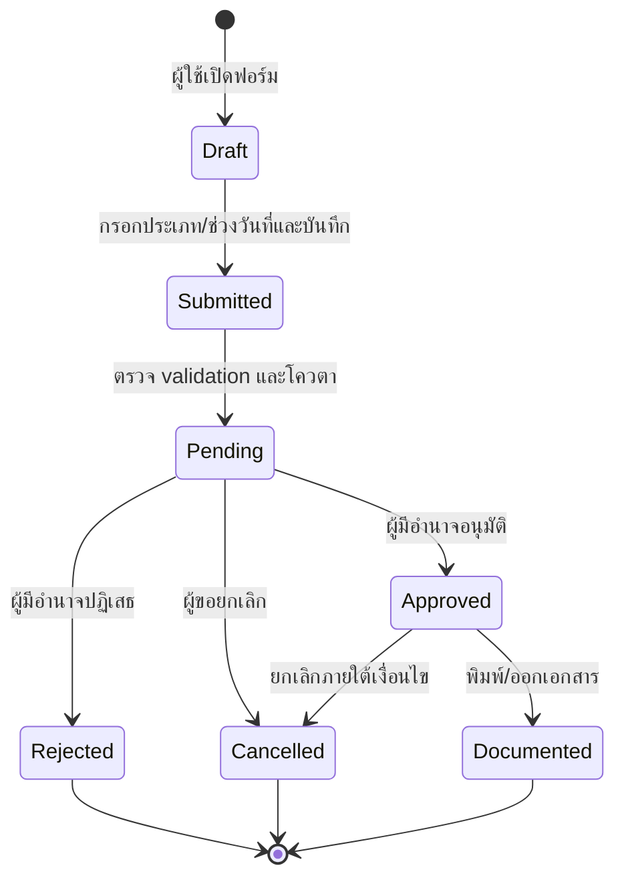

- ฟอร์ม ประวัติ ปฏิทิน โควตา สถานะ pending และการพิมพ์ **[CONFIRMED]**
- ตัวกรองยืนยัน vocabulary ปลายทาง 4 สถานะ: `PENDING` (`รออนุมัติ`), `APPROVED`, `REJECTED`, `CANCELLED` **[CONFIRMED เฉพาะ label; code เป็นชื่อเสนอ]**; `Draft/Submitted` ใน diagram เป็นแบบจำลองแนะนำก่อนถึงรายการที่บันทึกแล้ว.
- บัญชีผู้ดูแลหน่วยงานทำ pending → approved และ pending → rejected ได้จริง; ใบลาที่อนุมัติแล้วส่งคำขอยกเลิกพร้อมเหตุผลไม่บังคับและเปลี่ยนเป็น `ยกเลิก` ได้จริง **[MUTATION-VERIFIED]**
- ระบบอ้างอิงยอมให้บัญชีเดียวกันสร้างและอนุมัติใบลาของตนเองโดยไม่มี confirmation เพิ่มเติม **[MUTATION-VERIFIED; REFERENCE DEFECT]**; ระบบใหม่ต้องห้าม `requester = approver` ตามปกติ และอนุญาต break-glass เฉพาะ policy ที่ลงนามพร้อมเหตุผล/audit.
- วันหยุดที่กำหนดไว้แสดงในปฏิทินและเลือกเป็นวันลาไม่ได้ในการทดสอบ; เมื่อยกเลิกใบลา โควตาคืนหลัง reload แต่ค่าบนหน้าปัจจุบันอาจ stale ชั่วคราว **[MUTATION-VERIFIED]**.
- ผู้อนุมัติตามระเบียบ จำนวนขั้น delegation/acting, comment/evidence, SLA และ transition หลัง approved ยัง **[UNKNOWN]**
- ไปราชการใช้ข้อมูลเรื่อง ยานพาหนะ และผู้ร่วมเดินทาง; subtype `ไปอบรม` เพิ่มเรื่อง หลักสูตร/โครงการ หน่วยงานผู้จัด สถานที่ ค่าใช้จ่าย และหมายเหตุ; สร้าง แก้ไข และลบได้จริงโดยไม่แสดง approval status **[MUTATION-VERIFIED]** จึงควรเป็น aggregate/workflow แยกต่างหาก.

#### 7.1.2 Target workflow รุ่นแรก — Word-first และลงนามภายนอก

ระบบใหม่ไม่คัดลอก online approval ของระบบอ้างอิงใน MVP. ผู้ใช้ต้องได้เอกสารราชการที่กรอกง่าย ส่วนการเสนอ ตรวจ และลงนามยังทำบนกระดาษตามวิธีปฏิบัติงานจริง **[OWNER-CONFIRMED]**.

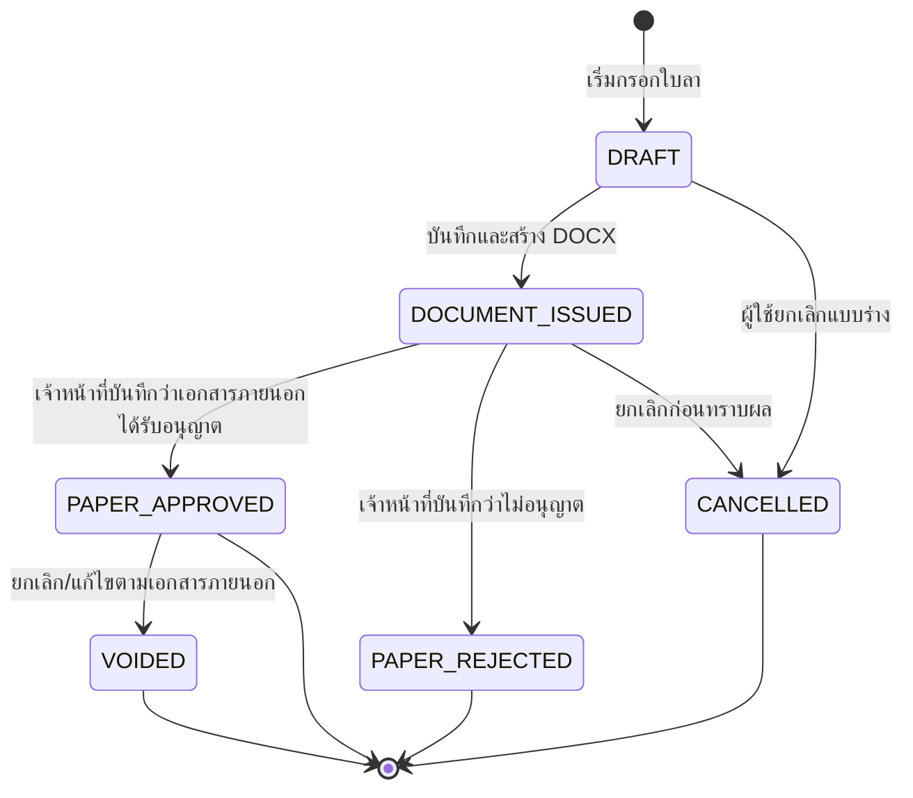

- `PAPER_APPROVED` หมายถึง “เจ้าหน้าที่บันทึกผลจากเอกสารที่ลงนามภายนอกแล้ว” ไม่ใช่การอนุมัติทางราชการในระบบ.
- ผู้ยื่นสร้าง DOCX และพิมพ์ได้เอง แต่ห้ามยืนยัน `PAPER_APPROVED` ให้รายการของตน; สิทธิ์นี้เป็นของ HR/เจ้าหน้าที่ผู้รับผิดชอบที่กำหนด และต้องเก็บ actor, เวลา, เลขที่/วันที่เอกสาร และเหตุผลการแก้ไข.
- ไฟล์สแกนฉบับลงนามเป็น attachment แบบ optional ใน MVP เพื่อลดภาระผู้ใช้; metadata การยืนยันและ audit เป็นข้อมูลบังคับ.
- การแก้ข้อมูลหลังออก DOCX ต้องสร้าง document revision ใหม่และรักษาไฟล์/ค่าที่เคยออก; ห้ามเปลี่ยนเอกสารเดิมเงียบ ๆ.
- เฉพาะ `PAPER_APPROVED` ที่ยังไม่ `VOIDED/CANCELLED` และมีผลทับช่วงเดือนเป้าหมายเท่านั้นที่ Special-Allowances ใช้คำนวณ.
- ไปราชการไม่อยู่ใน first production scope และยังคงเป็น aggregate แยกจาก Leave.

### 7.2 ตารางเวรและค่าตอบแทน


การเลือกหนึ่ง cell บันทึกอัตโนมัติและมีตัวเลือก `ว่าง/เช้า/เที่ยง/บ่าย` **[MUTATION-VERIFIED]**. ตัวอย่างกะเช้า 3.5 ชั่วโมงคำนวณยอด `144.375` ซึ่งสอดคล้องกับ `3.5 × 41.25` **[MUTATION-VERIFIED เฉพาะ rate/config นี้]**. เงื่อนไขวันหยุด เวรซ้อน อัตราอื่น การปัดเศษเป็นเงินจริง และ approval ก่อนออกเอกสารยัง **[UNKNOWN]**; ระบบใหม่ต้องแสดง save state/error และปัดเงินตาม rule ไม่ปล่อย silent auto-save หรือเศษเกิน precision.

### 7.3 สต็อกวัสดุ

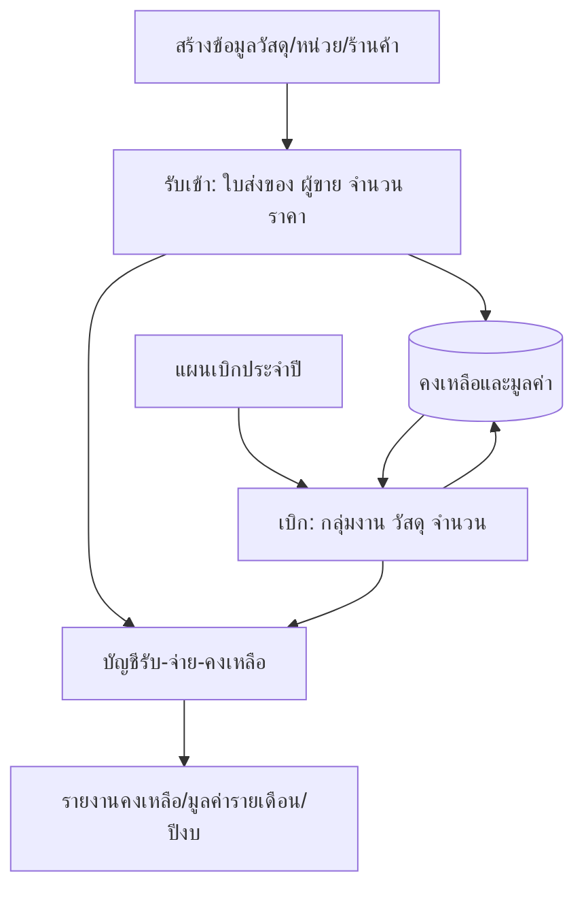

- Master, receipt, issue, annual plan และรายงานพบจริง **[CONFIRMED]**
- รับเข้า 5 หน่วยทำให้คงเหลือ 5; ระบบป้องกันเบิก 6 และยอมให้เบิก 2; ลบใบเบิกคืน stock แล้วจึงลบใบรับได้ **[MUTATION-VERIFIED]**.
- ระบบปฏิเสธการลบใบรับที่มีจำนวนถูกเบิกต่อแล้ว พร้อมสั่งให้ลบรายการเบิกที่อ้างอิงก่อน จึงป้องกัน negative stock ในเส้นทางนี้ **[MUTATION-VERIFIED]**.
- เบิกวัสดุนอกแผนได้หลังแสดง confirmation และเมื่อสร้างแผนภายหลัง ระบบนับยอดเบิกก่อนสร้างแผนเข้า utilization ของปี/กลุ่มงาน/วัสดุเดียวกันทันที **[MUTATION-VERIFIED]**; semantics แบบย้อนหลังนี้ต้องให้เจ้าของงานตัดสินก่อนสร้างใหม่.
- แผนประจำปีบันทึกแล้วล็อกและเปลี่ยนโดยลบแผน **[MUTATION-VERIFIED]** ระบบใหม่ควรใช้ revision/void แทน hard delete **[RECOMMENDED]**.

### 7.4 วงจรชีวิตทรัพย์สิน

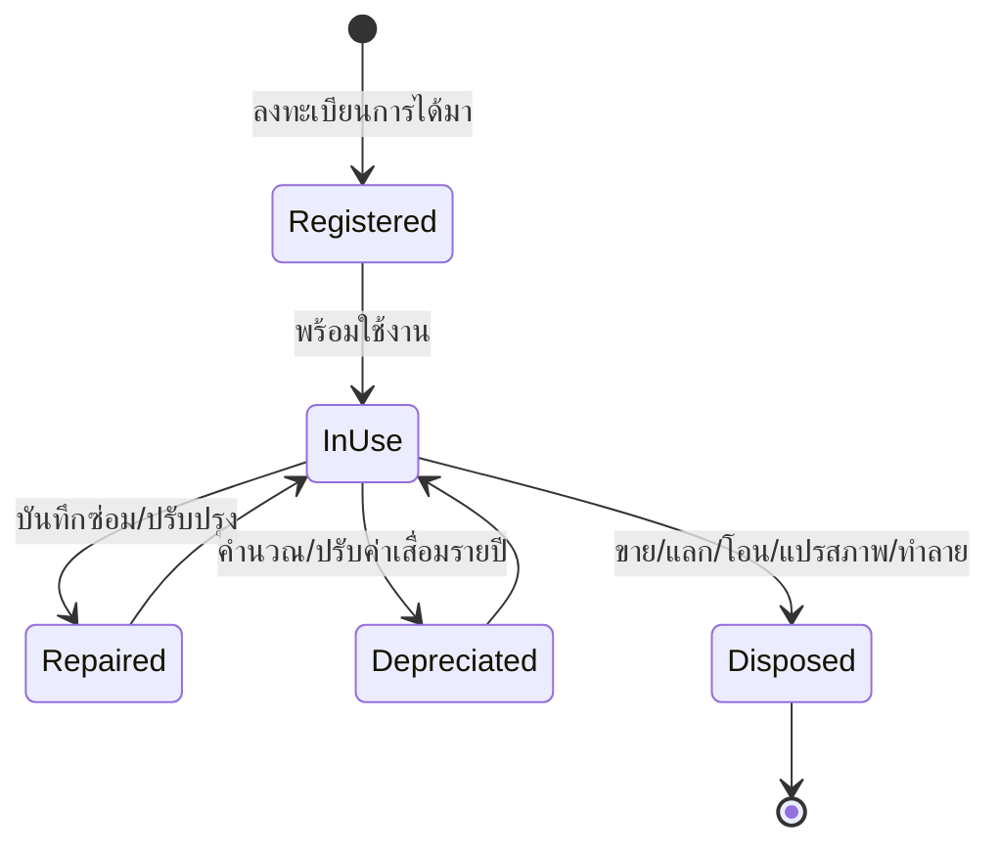

สร้างครุภัณฑ์ด้วยชื่อ รหัส และราคาทุนขั้นต่ำได้จริง; ระบบสร้างตารางค่าเสื่อมเส้นตรง 5 ปี และลบระเบียนได้ **[MUTATION-VERIFIED]**. ตารางตัวอย่างราคาทุน 1,000 แสดงมูลค่าคงเหลือปีที่ 4 เป็น floating-point artifact (`199.999999…`) **[REFERENCE DEFECT]**. สถานะ `IN_USE` และการเปลี่ยนเป็นจำหน่ายเมื่อบันทึก disposal **[CONFIRMED UI]**; รายชื่อสถานะอื่นทั้งหมดและการย้อนจำหน่าย **[UNKNOWN]**. บันทึกประโยชน์ ผู้รับผิดชอบ และซ่อมเป็น child history ที่อยู่ตลอดอายุทรัพย์สิน **[CONFIRMED]**.

### 7.5 ขอใช้ยานพาหนะและบันทึกการใช้

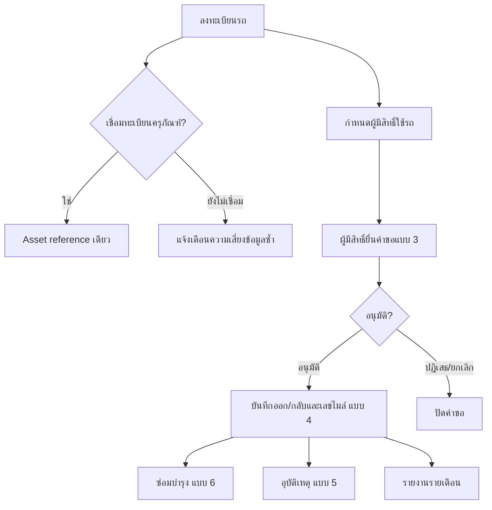

สร้างรถด้วยชื่อและทะเบียนขั้นต่ำได้จริง; รายละเอียดมี authorized users, request แบบ 3, usage แบบ 4, accident แบบ 5, maintenance แบบ 6 และ optional asset link **[MUTATION-VERIFIED/CONFIRMED UI]**. การลบรถเตือนว่าจะ hard-cascade ประวัติทั้งหมด **[MUTATION-VERIFIED; REFERENCE DEFECT สำหรับข้อมูลราชการ]**. ขั้นอนุมัติและการสร้าง usage จากคำขอ, actor, SLA และทุกสถานะยัง **[UNKNOWN]**.

### 7.6 แผนและผลการเงิน

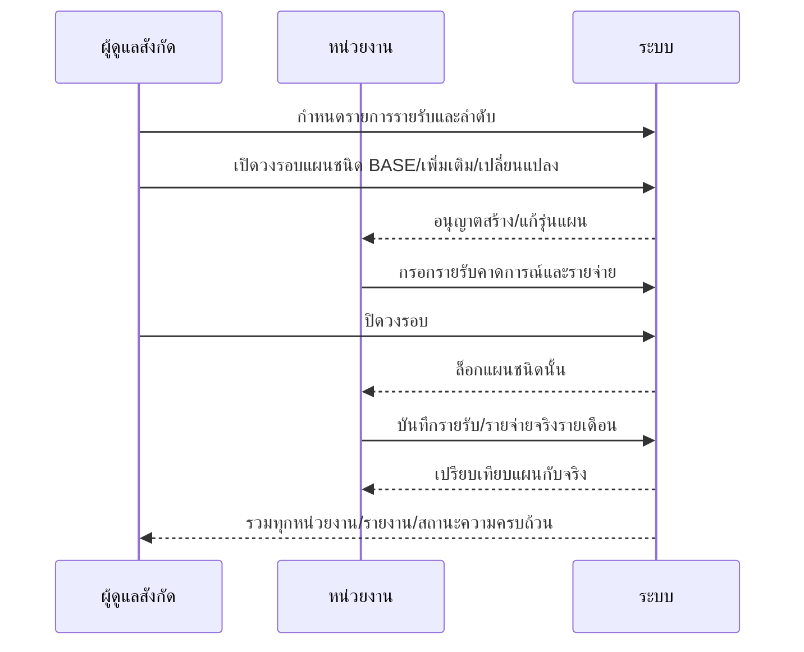

สังกัดเปิด/ปิด BASE แล้วปุ่มสร้างฉบับของ tenant เปิด/ล็อกตามจริง **[MUTATION-VERIFIED]**. ขณะ BASE เปิด ระบบ disable การเปิดแผนเพิ่มเติมและแผนเปลี่ยนแปลงพร้อมข้อความว่าต้องปิด/ล็อก BASE ก่อน **[MUTATION-VERIFIED]**. วิธีอนุมัติฉบับ การแก้หลังล็อก และการรวม revision ยัง **[UNKNOWN]**.

### 7.7 การย้ายบุคลากร

มีสองทาง **[CONFIRMED]**:

1. **Direct transfer:** ผู้ดูแลสังกัดเลือกบุคลากร → เลือกหน่วยงานปลายทาง → ยืนยัน
2. **Request transfer:** คำขอเข้าสถานะ pending → ผู้ดูแลสังกัด approve/reject → อาจ cancel ได้

เมื่อสำเร็จ ระบบควรปิด membership เดิม เปิด membership ใหม่ เก็บ effective date รักษาประวัติการจ้างและ audit ใน transaction เดียว **[RECOMMENDED]** ไม่ควรย้ายด้วยการแก้ `tenant_id` ตรง ๆ จนเสียประวัติ

### 7.8 ประกาศ

สร้าง แก้ไข เปิด/ปิด และลบประกาศได้จริง; เมื่อเปิดแล้วข้อความแสดงบน banner ของ tenant หลังสลับ scope **[MUTATION-VERIFIED]**. หากเปิดประกาศใหม่ ระบบปิดประกาศอื่นทั้งหมด **[CONFIRMED]** จึงเป็น single-active announcement policy ควรบังคับด้วย transaction/unique constraint ไม่ใช่เพียงปิดจาก UI **[RECOMMENDED]**.

### 7.9 การสร้างรายงาน

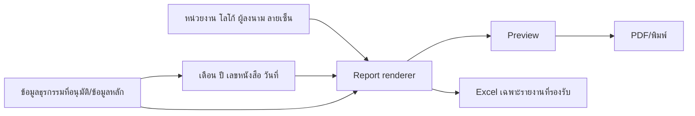

การตั้งค่าผู้ลงนาม พารามิเตอร์ preview/PDF และ Excel บางหน้า **[CONFIRMED]** การ snapshot ชื่อ/ตำแหน่ง/ลายเซ็น ณ เวลาออกรายงาน **[UNKNOWN แต่ควรมี]**

---

## 8. Business Rules

### 8.1 กฎที่ยืนยันได้

| ID     | Rule                                                                                                                                                   | Source                             | Confidence                                    |
| ------ | ------------------------------------------------------------------------------------------------------------------------------------------------------ | ---------------------------------- | --------------------------------------------- |
| BR-001 | บัญชีหนึ่งสลับ scope หน่วยงาน/สังกัดได้ และ role แสดงแยกตาม scope                                                                                      | organization switcher              | CONFIRMED                                     |
| BR-002 | role ที่เลือกได้ในฟอร์มการเข้าถึงมีเจ้าหน้าที่และผู้ดูแล                                                                                               | employee/access forms              | CONFIRMED                                     |
| BR-003 | บางข้อมูลพื้นฐานองค์กรเป็น read-only และต้องใช้ผู้ดูแลระบบสูงสุด                                                                                       | settings text/disabled fields      | CONFIRMED                                     |
| BR-004 | โทรศัพท์และ role บังคับสำหรับการตั้งค่าการเข้าถึง; อีเมลไม่บังคับ                                                                                      | employee form                      | CONFIRMED                                     |
| BR-005 | ประวัติการทำงานที่เลือกไว้ใช้คำนวณอายุงานสำหรับ ฉ.11                                                                                                   | employee form text                 | CONFIRMED                                     |
| BR-006 | เวรมีเวลา ชั่วโมง และฐานค่าตอบแทนต่อกะ/ต่อชั่วโมง                                                                                                      | shift type form                    | CONFIRMED                                     |
| BR-007 | ตารางเวรรวมชั่วโมงตามชนิดกะและยอดเงินรายบุคคล                                                                                                          | schedule totals                    | CONFIRMED                                     |
| BR-008 | โควตาลาแตกต่างตามประเภทและหน่วยเวลา “ต่อปี/ต่อครั้ง/ไม่จำกัด”                                                                                          | leave quota UI                     | CONFIRMED                                     |
| BR-009 | ไปราชการบังคับประเภท เรื่อง วันเริ่ม/สิ้นสุด และยานพาหนะ; ผู้ร่วมเดินทางไม่บังคับ                                                                      | official duty form                 | CONFIRMED                                     |
| BR-010 | กลุ่มงานในใบเบิกวัสดุถูกเติมจากกลุ่มงานของผู้ทำรายการ                                                                                                  | stock-out form                     | CONFIRMED                                     |
| BR-011 | แผนเบิกประจำปีบันทึกแล้วล็อก และข้อความระบุให้ลบแผนหากต้องเปลี่ยน                                                                                      | annual plan form                   | CONFIRMED                                     |
| BR-012 | รหัสครุภัณฑ์เป็นประเภท 3 หลัก + ปี พ.ศ. 2 หลัก + running 4 หลัก                                                                                        | asset form help                    | CONFIRMED                                     |
| BR-013 | ค่าเสื่อมเริ่มต้นเส้นตรง 5 ปีจากราคาทุน                                                                                                                | depreciation tab text              | CONFIRMED                                     |
| BR-014 | วิธีจำหน่าย: ขาย แลกเปลี่ยน โอน แปรสภาพ ทำลาย; บันทึกแล้วสถานะเป็นจำหน่าย                                                                              | disposal tab                       | CONFIRMED                                     |
| BR-015 | กำไร/ขาดทุนจำหน่ายคำนวณจากมูลค่าขายเทียบราคาทุนตามข้อความ UI                                                                                           | disposal tab                       | CONFIRMED                                     |
| BR-016 | เฉพาะบุคลากรที่อยู่ใน authorized users ของรถจึงขอใช้รถได้                                                                                              | vehicle permissions tab            | CONFIRMED                                     |
| BR-017 | ยานพาหนะเชื่อมหรือสร้างระเบียนครุภัณฑ์ประเภทยานพาหนะได้                                                                                                | vehicle detail                     | CONFIRMED                                     |
| BR-018 | หน่วยงานสร้างแผนได้เมื่อสังกัดเปิดวงรอบที่เกี่ยวข้อง                                                                                                   | finance plan disabled state        | CONFIRMED                                     |
| BR-019 | สังกัดปิดวงรอบแล้วแผนชนิดนั้นถูกล็อก                                                                                                                   | finance cycle text                 | CONFIRMED                                     |
| BR-020 | รายการรายรับกำหนดโดยสังกัด; หน่วยงานบันทึกจำนวนเงิน                                                                                                    | revenue items UI text              | CONFIRMED                                     |
| BR-021 | ปีการเงินแสดงเดือน ต.ค.–ก.ย.; กราฟรายรับไม่รวมยอดยกมา                                                                                                  | monthly finance UI                 | CONFIRMED                                     |
| BR-022 | การเปิดประกาศหนึ่งรายการทันทีจะปิดประกาศอื่นทั้งหมด                                                                                                    | announcement form text             | CONFIRMED                                     |
| BR-023 | โลโก้รับ PNG/JPG ขนาดไม่เกิน 2 MB                                                                                                                      | settings UI                        | CONFIRMED                                     |
| BR-024 | ลำดับหน่วยงาน/อำเภอถูกใช้ในเอกสารสรุประดับสังกัด                                                                                                       | tenant ordering UI text            | CONFIRMED                                     |
| BR-025 | ประวัติการทำงานแต่ละรายการระบุสถานที่ ระดับพื้นที่ วันเริ่ม/สิ้นสุด สถานะปัจจุบัน และเลือกได้ว่าจะนำไปคิด ฉ.11 หรือไม่                                 | employee edit form                 | CONFIRMED                                     |
| BR-026 | รายการใบลาที่บันทึกแล้วกรองได้อย่างน้อย 4 สถานะ: รออนุมัติ อนุมัติแล้ว ไม่อนุมัติ และยกเลิก                                                            | leave history filter               | CONFIRMED                                     |
| BR-027 | ในขอบเขตบัญชีผู้ดูแลหน่วยงาน ใบลา pending มี control อนุมัติ ไม่อนุมัติ และยกเลิก; การไปราชการตัวอย่างมี control แก้ไขและลบแทน                         | leave/duty detail panels           | CONFIRMED UI; server enforcement UNKNOWN      |
| BR-028 | แบบคำขอ ฉ.11 ทั้งปีแยก “เดือนคิดอายุงาน” ออกจาก “ช่วงคำขอ” และรับข้อมูลการประชุมคณะกรรมการ                                                             | annual request report settings     | CONFIRMED                                     |
| BR-029 | การแก้ข้อมูลบุคลากรที่กระทบการคำนวณให้เลือก “แก้ข้อมูลที่ผิด” หรือ “เปลี่ยนแปลงจริง”; กรณีหลังต้องระบุวันที่มีผลและรักษาค่าเดิมสำหรับเอกสารก่อนวันนั้น | employee edit decision dialog      | MUTATION-VERIFIED                             |
| BR-030 | เลขประจำตัวประชาชนผ่าน check digit และโทรศัพท์ห้ามซ้ำ; การสร้างบุคลากรต้องมีประวัติการทำงานอย่างน้อยหนึ่งรายการ                                        | employee create validation         | MUTATION-VERIFIED                             |
| BR-031 | วันหยุดในปฏิทินใบลาถูก disable; approve, reject และ cancel ทำให้สถานะประวัติเปลี่ยนจริง                                                                | leave workflow                     | MUTATION-VERIFIED                             |
| BR-032 | การยกเลิกใบลาคืนโควตาหลังข้อมูลถูกโหลดใหม่ และยังเก็บเอกสารใบลา/คำขอยกเลิกในประวัติ                                                                    | leave quota/history                | MUTATION-VERIFIED                             |
| BR-033 | `ไปอบรม` เก็บเรื่อง หลักสูตร/โครงการ หน่วยงานผู้จัด สถานที่ ค่าใช้จ่าย และช่วงเวลาเพิ่มจากไปราชการทั่วไป                                               | official-duty training form/detail | MUTATION-VERIFIED                             |
| BR-034 | การเลือกกะใน cell ตารางเวรบันทึกทันที และผลรวมรายบุคคลคำนวณชั่วโมง/เงินจากชนิดกะ                                                                       | schedule matrix/totals             | MUTATION-VERIFIED                             |
| BR-035 | เบิกเกินคงเหลือไม่ได้ และการลบใบรับถูกปฏิเสธหากมีการเบิกที่อาศัย stock จากใบรับนั้น                                                                    | stock issue/receipt delete guard   | MUTATION-VERIFIED                             |
| BR-036 | การเบิกนอกแผนทำได้เมื่อผู้ใช้ยืนยัน และ utilization แผนใหม่รวมรายการเบิกเดิมใน fiscal year/workgroup/item เดียวกัน                                     | stock issue + annual plan          | MUTATION-VERIFIED; target semantics OPEN      |
| BR-037 | ครุภัณฑ์ใช้ชื่อ รหัส และราคาทุนเป็นขั้นต่ำ; ตารางค่าเสื่อมเริ่มต้นเป็น 5 ปี × 20%                                                                      | asset create/depreciation          | MUTATION-VERIFIED                             |
| BR-038 | รถใช้ชื่อและทะเบียนเป็นขั้นต่ำ และอาจยังไม่ผูกครุภัณฑ์ตอนสร้าง                                                                                         | vehicle create/detail              | MUTATION-VERIFIED; target ownership rule OPEN |
| BR-039 | BASE planning cycle ต้องเปิดจึงสร้างแผน tenant ได้; ขณะ BASE เปิด รอบเพิ่มเติม/เปลี่ยนแปลงถูก disable                                                  | affiliation cycle + tenant plan    | MUTATION-VERIFIED                             |
| BR-040 | ประกาศ active ระดับสังกัดกระจายเป็น banner ในขอบเขต tenant และประกาศหนึ่งรายการมี create/edit/activate/deactivate/delete                               | announcement CRUD/scope switch     | MUTATION-VERIFIED                             |
| BR-041 | การตั้งค่าหน่วยงานใช้ explicit Save และเผยสถานะ dirty/saved; field สำหรับเลขที่หนังสือแก้แล้วคืนค่าได้                                                 | tenant settings                    | MUTATION-VERIFIED                             |

### 8.2 กฎที่อนุมานและควรยืนยัน

| ID     | Candidate rule                                                                                     | Confidence / Verification                                               |
| ------ | -------------------------------------------------------------------------------------------------- | ----------------------------------------------------------------------- |
| BR-C01 | วิธีตีราคาสต็อกเป็น FIFO/weighted average/latest และวิธีทำ opening/adjustment                      | UNKNOWN — ledger quantity behavior ยืนยันแล้วแต่ valuation ยังไม่ยืนยัน |
| BR-C02 | การเบิกนอกแผนต้องห้าม เตือน หรือให้อนุมัติเป็นกรณีพิเศษ และรายการก่อนสร้างแผนควรนับย้อนหลังหรือไม่ | OPEN — ระบบอ้างอิงเตือนแล้วให้ทำต่อและนับย้อนหลัง                       |
| BR-C03 | อัตราค่าตอบแทน วันหยุด multiplier เวรซ้อน ขอบเขตการปัดเศษ และ basis ต่อกะทุกชนิด                   | PARTLY CONFIRMED — ตัวอย่างต่อชั่วโมงหนึ่งกะคำนวณตรง; rulebook ยัง OPEN |
| BR-C04 | วันลาไม่นับ/นับวันหยุดตามประเภทและกฎหมายที่เกี่ยวข้อง                                              | UNKNOWN — ต้องให้ฝ่ายบุคคลกำหนด                                         |
| BR-C05 | คำขอใช้รถต้องได้รับอนุมัติก่อนสร้าง usage log                                                      | INFERRED — ต้องทดสอบ transition                                         |
| BR-C06 | เลขไมล์กลับต้องไม่น้อยกว่าเลขไมล์ออก และเป็นฐานเลขไมล์ปัจจุบันของรถ                                | INFERRED — ต้องทดสอบ validation                                         |
| BR-C07 | การลบข้อมูลสำคัญเป็น soft delete/void ไม่ใช่ hard delete                                           | UNKNOWN ในระบบเดิม; REQUIRED สำหรับระบบใหม่                             |
| BR-C08 | รายงานใช้ข้อมูล snapshot ณ วันออกเอกสาร                                                            | UNKNOWN; REQUIRED เพื่อความถูกต้องย้อนหลัง                              |
| BR-C09 | แผนเพิ่มเติม/เปลี่ยนแปลงรวมกับ BASE ด้วยสูตรเฉพาะ                                                  | UNKNOWN — ขอ specification การเงิน                                      |
| BR-C10 | การย้ายบุคลากรเปลี่ยนหน่วยงานโดยคงประวัติการจ้าง                                                   | INFERRED; REQUIRED สำหรับระบบใหม่                                       |

### 8.3 Validation ที่ควรเป็นข้อกำหนดระบบใหม่

- วันที่สิ้นสุดต้องไม่น้อยกว่าวันเริ่ม; ตรวจช่วงทับซ้อนสำหรับลา เวร คำขอรถ และการจองรถ.
- national ID ต้องตรวจรูปแบบ/check digit แต่เข้ารหัสหรือ tokenization ตามความเสี่ยง; ห้ามใช้เป็น primary key.
- วันที่เกิด/เริ่มงานต้องตรวจ business plausibility และ minimum employment age ตามนโยบาย; ห้ามยอมรับวันที่เกิดเท่ากับวันเริ่มงานโดยไม่มี exception ที่มีเหตุผล/audit.
- จำนวน ราคา เลขไมล์ และมูลค่าต้องไม่ติดลบ; decimal precision ของเงินต้องตายตัว.
- Create/Update บุคลากรต้องเป็น atomic command ครอบคลุม person, profile, membership, access/identity และ employment history; validation/duplicate failure ต้อง rollback ทั้งหมดหรือใช้ saga ที่ชดเชยได้.
- ค่าโทรศัพท์/อีเมล/role ที่บันทึกต้อง round-trip กลับหน้า edit ได้ตรงเดิม; ห้ามให้ผู้ใช้กรอกใหม่เพื่อรักษาบัญชีโดยไม่ตั้งใจ.
- MVP ไม่มี online approval; ผู้บันทึกว่าเอกสารกระดาษได้รับอนุญาตต้องไม่เป็นผู้ยื่นรายการเดียวกัน ยกเว้น break-glass policy ที่มีผู้อนุญาต เหตุผล หลักฐาน และ immutable audit.
- ชุดรหัสครุภัณฑ์ต้อง unique ภายใน scope ที่ตกลง และสร้างด้วย transaction-safe sequence.
- สต็อกต้องใช้ immutable movement ledger; การแก้ย้อนหลังสร้าง adjustment ไม่แก้ยอดคงเหลือตรง ๆ.
- การ void/reverse ใบรับต้องตรวจ downstream issue และปฏิเสธหาก reversal ทำให้ยอดติดลบ; การลบใบเบิก/ใบรับต้องสร้าง reversing movement ไม่ลบ ledger เดิม.
- เงิน ค่าเสื่อม ราคา และยอดรายงานต้องใช้ fixed decimal และ round ตาม boundary ที่ Rulebook กำหนด; ห้ามใช้ binary float ในค่าที่แสดง/เก็บ.
- การล็อกแผนต้องใช้ server-side state + version ไม่ใช่แค่ disable control.
- ผู้ร่วมเดินทาง ผู้มีสิทธิ์รถ ผู้ลงนาม และผู้อนุมัติต้องอยู่ในองค์กร/สิทธิ์ที่ถูกต้อง ณ effective date.
- ไฟล์โลโก้ ลายเซ็น และภาพทรัพย์สินต้องตรวจ MIME จริง สแกน malware จำกัดขนาด และใช้ signed URL.

### 8.4 Target-product decisions สำหรับ People, Leave และ ฉ.10/11

| ID     | Decision/guardrail                                                                                                                                      | Status                                   |
| ------ | ------------------------------------------------------------------------------------------------------------------------------------------------------- | ---------------------------------------- |
| TP-001 | `Person` ต้องแยกจาก `EmployeeProfile`, `UserIdentity`, `Membership` และ `EmploymentHistory`; ห้ามผูกบุคคลกับ รพ.สต. ด้วย foreign key เดียวที่แก้ทับอดีต | PROPOSED — required foundation           |
| TP-002 | เมื่อย้ายหน่วยงาน ให้ปิด membership เดิมและเปิด membership ใหม่โดยรักษาประวัติ                                                                          | PROPOSED — edge cases OPEN               |
| TP-003 | One Data เป็น source of truth ของข้อมูลลา; เฉพาะ `PAPER_APPROVED` ที่ยังมีผลเท่านั้นเป็น input ให้ Special-Allowances                                    | OWNER-CONFIRMED                          |
| TP-004 | One Data ไม่สร้างสูตร/Calculation Engine ฉ.10/11 ซ้ำ; `Special-Allowances` เดิมเป็นเจ้าของสูตร ตัวแปรอื่น รอบ ผล lock adjustment และ report           | OWNER-CONFIRMED + CODEBASE-VERIFIED      |
| TP-005 | ทุกการ sync ต้องมี period, person mapping, source cutoff, leave revision/source refs และ source hash เพื่อให้ Special-Allowances snapshot/reconcile ได้ | OWNER-CONFIRMED + PROPOSED CONTRACT      |
| TP-006 | เมื่อรอบ Special-Allowances ล็อกแล้ว ผลและไฟล์รายงานต้องไม่เปลี่ยนตามข้อมูลลา People หรือ Employment ปัจจุบัน                                           | OWNER-CONFIRMED                          |
| TP-007 | การแก้ลาหลังล็อกสร้าง adjustment อ้างรอบเดิมใน Special-Allowances; ห้ามแก้ผลเดิมเงียบ ๆ                                                                | OWNER-CONFIRMED                          |
| TP-008 | Excel/PDF ฉ.10/11 เป็น artifact ของ Special-Allowances; One Data แสดงหรือดาวน์โหลดผ่าน scoped API โดยไม่ regenerate ตัวเลขเอง                          | OWNER-CONFIRMED + CODEBASE-VERIFIED      |
| TP-009 | ฐานกฎสำหรับข้าราชการ อบจ. รุ่นแรกคือประกาศ ก.จ. เรื่องมาตรฐานทั่วไปว่าด้วยการลาของข้าราชการองค์การบริหารส่วนจังหวัด พ.ศ. 2569 และแบบแนบท้าย         | LEGAL-SOURCE; HR SIGN-OFF REQUIRED       |
| TP-010 | MVP ใช้ Word-first: กรอก → สร้าง DOCX → พิมพ์/ลงนามภายนอก → เจ้าหน้าที่บันทึกผล; ไม่มี online approval chain                                           | OWNER-CONFIRMED                          |
| TP-011 | บุคลากรต่างสถานะการจ้างต้องเลือก `LeavePolicyProfile` ตามฐานกฎหมาย/ช่วงมีผล; ห้ามใช้สิทธิ์ข้าราชการ อบจ. กับพนักงานจ้าง/ลูกจ้างโดยอัตโนมัติ          | LEGAL GUARDRAIL                          |
| TP-012 | รอบเปิด sync ซ้ำได้; ค่าเริ่มต้นช่วงตรวจสอบคือ 3 วันทำการหลังสิ้นเดือนแบบ configurable; หลังจ่าย/ล็อกใช้ adjustment รอบถัดไป                         | OWNER-CONFIRMED DIRECTION + CONFIGURABLE |
| TP-013 | Portal เป็นเจ้าของ login/module access และ One Data/Special-Allowances แยก session/authorization ของตน; ห้ามแชร์ password หรือ database               | CODEBASE-VERIFIED + PROPOSED ADOPTION    |

ฐานเอกสารกฎหมายที่ตรวจแล้ว:

- [ประกาศ ก.จ. ก.ท. และ ก.อบต. เรื่องมาตรฐานทั่วไปว่าด้วยการลา พ.ศ. 2569 — กรมส่งเสริมการปกครองท้องถิ่น](https://www.dla.go.th/land/tempHome.do?departmentLv2Id=98266y3oq5k96svhofn9vvklmz3tmc2skw)
- [ประกาศฉบับข้าราชการองค์การบริหารส่วนจังหวัด พ.ศ. 2569](https://infocenter.oic.go.th/upload/cms/1777261294_7413.pdf)
- [ชุดแบบฟอร์มแนบท้ายฉบับ Word](https://infocenter.oic.go.th/upload/cms/1777261315_7826.docx)
- [ตารางกำหนดผู้มีอำนาจพิจารณาอนุญาตการลา](https://infocenter.oic.go.th/upload/cms/1777261315_9244.docx)

ประกาศกำหนดการลา 11 กลุ่มและแบบฟอร์มที่เกี่ยวข้องสำหรับข้าราชการ อบจ. แต่ Rulebook implementation ยังต้องให้ฝ่ายบุคคลยืนยันการนับวัน สิทธิ์สะสม เอกสารประกอบ และกลุ่มบุคลากรที่อยู่ใต้ประกาศนี้. สำหรับพนักงานจ้าง ลูกจ้างประจำ ผู้ช่วยราชการ หรือสถานะอื่น ต้องมี policy profile และฐานระเบียบแยกก่อนเปิดใช้กับกลุ่มนั้น.

### 8.5 Reference defects และ anti-requirements จาก mutation testing

รายการต่อไปนี้คือ defect/risk ของระบบอ้างอิง ไม่ใช่ข้อกำหนดที่ต้องสร้างตาม:

| ID          | หลักฐานที่พบ                                                                                                              | ความเสี่ยง                                       | Guardrail ของระบบใหม่                                                     |
| ----------- | ------------------------------------------------------------------------------------------------------------------------- | ------------------------------------------------ | ------------------------------------------------------------------------- |
| REF-DEF-001 | การสร้างบุคลากรครั้งแรกแจ้งโทรศัพท์ซ้ำและค้างหน้า create แต่ระเบียน person/core ถูกสร้างแล้ว ขณะที่ access/history ไม่ครบ | partial aggregate, duplicate retry, ข้อมูลกำพร้า | atomic command + idempotency key + rollback/integration test              |
| REF-DEF-002 | หน้า edit ไม่แสดงอีเมล/โทรศัพท์ access ที่เพิ่งบันทึก แม้ list ยังแสดงโทรศัพท์                                            | overwrite credential/contact โดยไม่ตั้งใจ        | read-after-write/round-trip contract test และแยก contact จาก identity     |
| REF-DEF-003 | บัญชีเดียวกันยื่นและอนุมัติใบลาของตนเองได้                                                                                | fraud/SoD violation                              | MVP ไม่มี online approval; `paper_result_recorded_by != requester_id` และ break-glass audit |
| REF-DEF-004 | โควตาหลังยกเลิกยังแสดงค่าเดิมจน reload                                                                                    | ผู้ใช้ตัดสินใจจาก stale projection               | transactional balance ledger + cache invalidation + consistency indicator |
| REF-DEF-005 | วันที่เกิดเท่ากับวันเริ่มงานและวันปัจจุบันผ่าน validation                                                                 | ข้อมูลบุคลากรไร้ความสมเหตุผล                     | age/date plausibility rule + migration exception workflow                 |
| REF-DEF-006 | แก้ไขไปราชการสำเร็จแต่ toast ระบุว่าแก้ “ใบลา”                                                                            | domain feedback ผิด ทำให้ผู้ใช้ไม่มั่นใจ         | typed notification/event + UX regression test                             |
| REF-DEF-007 | ตารางเวร auto-save แบบเงียบ ไม่มี saved/error feedback                                                                    | เข้าใจผิดว่าบันทึกแล้วและแก้ชนกัน                | pending/saved/error state, optimistic version และ retry ที่มองเห็นได้     |
| REF-DEF-008 | ค่าเสื่อมปีหนึ่งแสดง `199.999999…`                                                                                        | ยอดรายงาน/บัญชีผิดรูป                            | fixed decimal, explicit rounding และ golden schedule test                 |
| REF-DEF-009 | ลบยานพาหนะแล้ว cascade ประวัติคำขอ การใช้ ซ่อม และอุบัติเหตุทั้งหมด                                                       | สูญเสียหลักฐานราชการ/audit                       | archive/void vehicle; child histories immutable ตาม retention             |
| REF-DEF-010 | ระหว่างมีบุคลากรทดสอบ summary สังกัดรวม 13 คน แต่ card หน่วยงานรายแถวแสดง 12 คน                                           | aggregate/projection ไม่สอดคล้อง                 | source/version watermark, reconciliation job และ consistency SLO          |
| REF-DEF-011 | ฟอร์มใบลาคงค่าหลังบันทึกและการกดซ้ำไม่มี feedback ชัด แม้ไม่เห็นรายการซ้ำ                                                 | duplicate intent/unclear idempotency             | clear success transition, disable resubmit, idempotency key               |
| REF-DEF-012 | การลบบุคลากร/แผน/รถ/ครุภัณฑ์เป็น hard-delete flow ที่เข้าถึงได้ง่าย                                                       | สูญเสียประวัติและ reference                      | soft delete/void/supersede + dependency impact preview + reason           |

ข้อสรุปเชิงออกแบบ: ให้ใช้พฤติกรรม `BR-*` เป็น evidence ของ domain แต่ทุก acceptance criterion ต้องตรวจผ่าน guardrail ในตารางนี้ก่อนอนุมัติ implementation.

---

## 9. Conceptual Data Model

### 9.1 กลุ่ม entity

**Organization & Identity**

- `Affiliation`, `District`, `Tenant`, `OrganizationOrder`
- `Person`, `EmployeeProfile`, `TenantMembership`, `AffiliationMembership`
- `Role`, `Permission`, `RolePermission`, `FunctionalAssignment`
- `PositionGroup`, `Position`, `WorkGroup`, `EmployeeType`
- `EmploymentHistory`, `ProfessionalLicense`, `Address`, `UserCredential/IdentityLink`

**Workforce Operations**

- `ShiftType`, `SchedulePeriod`, `ShiftAssignment`, `ScheduleInspector`
- `Holiday`
- `LeaveType`, `LeavePolicyProfile`, `LeavePolicy`, `LeaveBalance`, `LeaveRequest`, `LeaveDocumentRevision`, `LeaveExternalDecision`
- `OfficialDutyRequest`, `OfficialDutyCompanion`, `OfficialDutyApproval`

**Special-Allowances Integration — First Production Boundary**

- `ExternalSystem`, `ExternalPersonMapping`
- `LeaveExportBatch`, `LeaveExportItem`, `IntegrationDelivery`, `IntegrationReconciliation`
- `ExternalAllowancePeriodRef`, `ExternalAllowanceReportRef` เป็น reference/projection เท่านั้น; calculation entities จริงอยู่ใน `Special-Allowances`

**Inventory**

- `SupplyType`, `SupplyCategory`, `SupplyItem`, `UnitOfMeasure`, `StorageLocation`
- `Vendor`
- `StockReceipt`, `StockReceiptLine`
- `StockIssue`, `StockIssueLine`
- `StockMovement`, `StockBalance`
- `AnnualIssuePlan`, `AnnualIssuePlanLine`

**Assets & Vehicles**

- `Asset`, `AssetType`, `AssetAcquisition`, `LandBuildingDetail`
- `AssetDepreciation`, `AssetDisposal`, `AssetBenefit`, `AssetCustodian`, `AssetRepair`
- `Vehicle`, `VehicleAuthorization`, `VehicleRequest`, `VehicleUsage`
- `VehicleAccident`, `AccidentParty`, `AccidentInjury`, `AccidentWitness`, `VehicleMaintenance`

**Finance**

- `FiscalYear`, `PlanningCycle`, `PlanRevision`, `FinancialPlan`
- `RevenueType`, `RevenueItem`, `PlannedRevenue`
- `ExpenseCategory`, `ExpenseSubtype`, `PlannedExpense`
- `MonthlyIncomeActual`, `MonthlyExpenseActual`
- `PlanLock`, `PriceSource`

**Documents, Communication & Governance**

- `ReportDefinition`, `ReportRun`, `DocumentNumber`, `SignatureSnapshot`
- `Announcement`
- `EmployeeTransfer`, `EmployeeTransferApproval`
- `Attachment`, `AuditEvent`, `OutboxEvent`, `Notification`
- `OrganizationSetting`, `UserSignature`

### 9.2 Mermaid ER Diagram (conceptual)

```mermaid
erDiagram
    AFFILIATION ||--o{ TENANT : governs
    AFFILIATION ||--o{ AFFILIATION_MEMBERSHIP : grants
    TENANT ||--o{ TENANT_MEMBERSHIP : employs_or_grants
    PERSON ||--o{ TENANT_MEMBERSHIP : has
    PERSON ||--o{ AFFILIATION_MEMBERSHIP : has
    PERSON ||--o{ EMPLOYMENT_HISTORY : owns
    PERSON ||--o{ PROFESSIONAL_LICENSE : owns
    POSITION ||--o{ TENANT_MEMBERSHIP : assigns
    WORK_GROUP ||--o{ TENANT_MEMBERSHIP : groups

    AFFILIATION ||--o{ SHIFT_TYPE : defines
    TENANT ||--o{ SCHEDULE_PERIOD : owns
    SCHEDULE_PERIOD ||--o{ SHIFT_ASSIGNMENT : contains
    PERSON ||--o{ SHIFT_ASSIGNMENT : works

    LEAVE_TYPE ||--o{ LEAVE_POLICY : governed_by
    PERSON ||--o{ LEAVE_REQUEST : requests
    LEAVE_REQUEST ||--o{ LEAVE_DOCUMENT_REVISION : renders
    LEAVE_REQUEST ||--o{ LEAVE_EXTERNAL_DECISION : records_paper_result
    PERSON ||--o{ OFFICIAL_DUTY_REQUEST : requests
    OFFICIAL_DUTY_REQUEST ||--o{ OFFICIAL_DUTY_COMPANION : includes

    EXTERNAL_SYSTEM ||--o{ EXTERNAL_PERSON_MAPPING : maps
    PERSON ||--o{ EXTERNAL_PERSON_MAPPING : identifies
    TENANT ||--o{ LEAVE_EXPORT_BATCH : exports
    LEAVE_EXPORT_BATCH ||--|{ LEAVE_EXPORT_ITEM : contains
    LEAVE_REQUEST ||--o{ LEAVE_EXPORT_ITEM : contributes
    LEAVE_EXPORT_BATCH ||--o{ INTEGRATION_DELIVERY : delivers
    LEAVE_EXPORT_BATCH ||--o{ INTEGRATION_RECONCILIATION : reconciles

    TENANT ||--o{ SUPPLY_ITEM : owns
    VENDOR ||--o{ STOCK_RECEIPT : supplies
    STOCK_RECEIPT ||--|{ STOCK_RECEIPT_LINE : contains
    STOCK_ISSUE ||--|{ STOCK_ISSUE_LINE : contains
    SUPPLY_ITEM ||--o{ STOCK_MOVEMENT : moves
    ANNUAL_ISSUE_PLAN ||--|{ ANNUAL_ISSUE_PLAN_LINE : contains

    TENANT ||--o{ ASSET : owns
    ASSET ||--o| VEHICLE : may_represent
    ASSET ||--o{ ASSET_DEPRECIATION : depreciates
    ASSET ||--o{ ASSET_REPAIR : repaired
    ASSET ||--o| ASSET_DISPOSAL : disposed_by
    VEHICLE ||--o{ VEHICLE_AUTHORIZATION : authorizes
    VEHICLE ||--o{ VEHICLE_REQUEST : requested
    VEHICLE_REQUEST ||--o| VEHICLE_USAGE : produces
    VEHICLE ||--o{ VEHICLE_ACCIDENT : has
    VEHICLE ||--o{ VEHICLE_MAINTENANCE : maintained

    AFFILIATION ||--o{ PLANNING_CYCLE : controls
    TENANT ||--o{ FINANCIAL_PLAN : prepares
    PLANNING_CYCLE ||--o{ FINANCIAL_PLAN : permits
    REVENUE_ITEM ||--o{ PLANNED_REVENUE : categorizes
    EXPENSE_CATEGORY ||--o{ PLANNED_EXPENSE : categorizes
    FINANCIAL_PLAN ||--o{ PLANNED_REVENUE : contains
    FINANCIAL_PLAN ||--o{ PLANNED_EXPENSE : contains
    TENANT ||--o{ MONTHLY_INCOME_ACTUAL : records
    TENANT ||--o{ MONTHLY_EXPENSE_ACTUAL : records

    PERSON ||--o{ EMPLOYEE_TRANSFER : subject
    TENANT ||--o{ EMPLOYEE_TRANSFER : source_or_destination
    AFFILIATION ||--o{ ANNOUNCEMENT : publishes
    PERSON ||--o{ AUDIT_EVENT : acts
```

### 9.3 Aggregate boundaries ที่แนะนำ

- `EmployeeOnboarding` command ต้องสร้าง/เชื่อม `Person` + profile + primary membership + access/identity + employment history แบบ atomic และ idempotent; aggregate ภายในอาจแยกตารางได้แต่ห้ามเผย partial success. การแก้ข้อมูลต้องบันทึกชนิด `CORRECTION` หรือ `REAL_CHANGE` พร้อม `effective_from` และรักษา snapshot เก่า.
- `SchedulePeriod` aggregate ต่อ tenant/month ลดการชนกันของการแก้แต่ละ cellด้วย optimistic versioning.
- `LeaveRequest` เป็น document-centric aggregate แยกจาก `OfficialDutyRequest`: เก็บ draft, document revisions และผลอนุญาตจากกระดาษ. การยืนยัน `PAPER_APPROVED` ต้องบังคับ separation ระหว่าง requester กับ verifier และปรับ balance/eligibility ใน transaction เดียว.
- `LeaveExportBatch` เป็น integration aggregate ของ One Data: สรุปเฉพาะ effective `PAPER_APPROVED` leave ต่อ period/person พร้อม source refs/hash. `CalculationRun`/ผล/lock/adjustment เป็น aggregate ของ Special-Allowances และห้ามจำลองซ้ำในฐานข้อมูล One Data.
- `SupplyItem` ไม่เก็บยอดเป็นแหล่งความจริงเพียงฟิลด์เดียว; source of truth คือ `StockMovement`, ส่วน `StockBalance` เป็น projection. Receipt/Issue ที่ posted ใช้ reversal movement และ dependency guard แทน hard delete.
- `Asset` เป็น supertype; vehicle อ้าง `asset_id` แบบ optional แต่ควรกำหนดนโยบายให้ยานพาหนะที่เป็นกรรมสิทธิ์ต้องเชื่อม. เงินและค่าเสื่อมทั้งหมดเป็น fixed decimal; vehicle/asset ใช้ archive/void โดยไม่ cascade-delete history.
- `FinancialPlan` แยกตาม tenant/fiscal year/revision type/version และ immutable เมื่อ locked.
- `ReportRun` เก็บ parameters, data version/hash, signer snapshot และตำแหน่งไฟล์ เพื่อพิมพ์ซ้ำได้ตรงเดิม.
- `ExternalAllowanceReportRef` เชื่อมหน้าจอ One Data กับ report artifact/run ใน Special-Allowances; การดาวน์โหลดรอบเก่าต้องอ้าง external artifact เดิม ไม่ query live data แล้วสร้างตัวเลขใหม่.

---

## 10. Observed API Catalog

### 10.1 วิธีและข้อจำกัดของหลักฐาน

รายการนี้มาจาก URL ของทรัพยากรที่หน้าเว็บเรียกระหว่าง navigation ตามปกติ **[CONFIRMED URL]** ไม่ได้ดัก request/response body หรืออ่าน credential; แม้ revision 1.4 ทดสอบ mutation ผ่าน UI แต่ไม่ได้บันทึก mutation payload มาใช้สร้าง catalog ดังนั้น:

- HTTP method ที่ใส่ `GET?` เป็นการอนุมานจากการโหลดข้อมูลหน้า **[INFERRED]**
- status code, headers, request body, response schema, error schema, pagination contract และ authorization enforcement **[UNKNOWN]**
- ตัวเลข ID จริงถูกแทนด้วย `{tenantId}`, `{affiliationId}`, `{vehicleId}`, `{employeeId}` เพื่อไม่ผูก blueprint กับข้อมูลตัวอย่าง
- endpoint ที่เสนอสำหรับระบบใหม่อยู่ในหัวข้อ 18 และไม่จำเป็นต้องเลียนแบบ endpoint เหล่านี้

### 10.2 Identity, session และข้อมูลร่วม

| Method | Observed path                       | Purpose                                      | Evidence                          |
| ------ | ----------------------------------- | -------------------------------------------- | --------------------------------- |
| GET?   | `/api/auth/me`                      | ข้อมูลผู้ใช้/session และ scope ที่เข้าถึงได้ | URL CONFIRMED; semantics INFERRED |
| GET?   | `/api/auth/refresh`                 | ต่ออายุ session/token                        | URL CONFIRMED; semantics INFERRED |
| GET?   | `/api/announcements`                | ประกาศที่ active                             | URL CONFIRMED                     |
| GET?   | `/api/tenants/{tenantId}`           | metadata หน่วยงาน                            | URL CONFIRMED                     |
| GET?   | `/api/affiliations`                 | รายการสังกัดที่เกี่ยวข้อง                    | URL CONFIRMED                     |
| GET?   | `/api/affiliations/{affiliationId}` | metadata สังกัด                              | URL CONFIRMED                     |
| GET?   | `/api/employees`                    | รายการบุคลากรสำหรับ selector/list            | URL CONFIRMED                     |

### 10.3 Dashboard และบุคลากร

| Method | Observed path/query                              | Purpose                       | Evidence      |
| ------ | ------------------------------------------------ | ----------------------------- | ------------- |
| GET?   | `/api/tenants/{tenantId}/dashboard`              | KPI dashboard หน่วยงาน        | URL CONFIRMED |
| GET?   | `/api/affiliations/{affiliationId}/dashboard`    | KPI dashboard สังกัด          | URL CONFIRMED |
| GET?   | `/api/employees?isActive=all`                    | directory รวม active/inactive | URL CONFIRMED |
| GET?   | `/api/position-groups`                           | กลุ่มตำแหน่ง                  | URL CONFIRMED |
| GET?   | `/api/employee-transfer/requests?status=PENDING` | คำขอย้ายตามสถานะ              | URL CONFIRMED |

### 10.4 ลา วันหยุด และไปราชการ

| Method | Observed path/query                                                     | Purpose                      | Evidence      |
| ------ | ----------------------------------------------------------------------- | ---------------------------- | ------------- |
| GET?   | `/api/leaves?month={m}&year={gregorianYear}`                            | รายการลารายเดือนสำหรับปฏิทิน | URL CONFIRMED |
| GET?   | `/api/official-duties?month={m}&year={gregorianYear}`                   | ไปราชการรายเดือน             | URL CONFIRMED |
| GET?   | `/api/holidays?year={gregorianYear}`                                    | วันหยุดรายปี                 | URL CONFIRMED |
| GET?   | `/api/leaves/quota-summary?employeeId={employeeId}&year={buddhistYear}` | สรุปโควตาบุคคล               | URL CONFIRMED |
| GET?   | `/api/leaves/history?year={buddhistYear}`                               | ประวัติการลา                 | URL CONFIRMED |
| GET?   | `/api/official-duties?fiscalYear={buddhistYear}`                        | ประวัติไปราชการปีงบ          | URL CONFIRMED |

ข้อสังเกต: UI/endpoint ใช้ทั้งปี ค.ศ. และ พ.ศ. ในหน้ากระบวนงานเดียวกัน **[CONFIRMED]** ระบบใหม่ควรใช้ ISO date/ค.ศ. ใน storage/API และแปลง พ.ศ. ที่ presentation layer เพื่อลดความผิดพลาด

### 10.5 วัสดุ

| Method | Observed path/query                                             | Purpose                          | Evidence      |
| ------ | --------------------------------------------------------------- | -------------------------------- | ------------- |
| GET?   | `/api/supplies?page={p}&limit={n}&sort={field}&dir={direction}` | รายการวัสดุพร้อม pagination/sort | URL CONFIRMED |
| GET?   | `/api/supply-types`                                             | ประเภทวัสดุหลัก                  | URL CONFIRMED |

endpoint สำหรับ receipt, issue, annual plan และ vendor ไม่ได้ปรากฏในชุดทรัพยากรที่บันทึก ณ หน้ารายการที่ตรวจ **[UNKNOWN]**

### 10.6 ยานพาหนะ

| Method | Observed path/query                               | Purpose                  | Evidence                          |
| ------ | ------------------------------------------------- | ------------------------ | --------------------------------- |
| GET?   | `/api/vehicles/{vehicleId}`                       | รายละเอียดรถ             | URL CONFIRMED                     |
| GET?   | `/api/vehicles/{vehicleId}/usages`                | บันทึกการใช้             | URL CONFIRMED                     |
| GET?   | `/api/vehicles/{vehicleId}/maintenance`           | ซ่อมบำรุง                | URL CONFIRMED                     |
| GET?   | `/api/vehicles/{vehicleId}/accidents`             | อุบัติเหตุ               | URL CONFIRMED                     |
| GET?   | `/api/vehicles/permissions?global=true`           | สิทธิ์รถระดับรวม         | URL CONFIRMED; semantics INFERRED |
| GET?   | `/api/vehicles/permissions?vehicleId={vehicleId}` | ผู้มีสิทธิ์ของรถเฉพาะคัน | URL CONFIRMED                     |

### 10.7 การเงิน

| Method | Observed path/query                                                 | Purpose                  | Evidence      |
| ------ | ------------------------------------------------------------------- | ------------------------ | ------------- |
| GET?   | `/api/financial-plan/cycles`                                        | วงรอบที่หน่วยงานใช้ได้   | URL CONFIRMED |
| GET?   | `/api/financial-plan/categories`                                    | หมวดรายจ่าย              | URL CONFIRMED |
| GET?   | `/api/financial-plan/expense-subtypes`                              | หมวดย่อยรายจ่าย          | URL CONFIRMED |
| GET?   | `/api/financial-plan/price-sources`                                 | แหล่งอ้างอิงราคา         | URL CONFIRMED |
| GET?   | `/api/monthly-actuals/summary?year={buddhistYear}`                  | สรุปรายเดือน             | URL CONFIRMED |
| GET?   | `/api/monthly-actuals/income?year={buddhistYear}`                   | รายรับจริง               | URL CONFIRMED |
| GET?   | `/api/monthly-actuals/expense?year={buddhistYear}`                  | รายจ่ายจริง              | URL CONFIRMED |
| GET?   | `/api/monthly-actuals/comparison?year={buddhistYear}`               | แผนเทียบจริง             | URL CONFIRMED |
| GET?   | `/api/financial-plan-admin/summary?fiscalYear={year}&revision=BASE` | ภาพรวมแผนระดับสังกัด     | URL CONFIRMED |
| GET?   | `/api/financial-plan-admin/personnel?fiscalYear={year}`             | แผนบุคลากร/ผู้รับจ้างรวม | URL CONFIRMED |
| GET?   | `/api/financial-plan-admin/cycles/{fiscalYear}`                     | สถานะวงรอบรายปี          | URL CONFIRMED |
| GET?   | `/api/financial-plan-admin/plans?fiscalYear={year}`                 | แผนทุกหน่วยงาน           | URL CONFIRMED |

### 10.8 External resources ที่สังเกตได้

| Service        | Observed use                            | Confidence                                |
| -------------- | --------------------------------------- | ----------------------------------------- |
| Umami          | script และ `/api/send` สำหรับ analytics | URL CONFIRMED; payload/consent UNKNOWN    |
| Cloudflare RUM | ทรัพยากรวัดประสิทธิภาพเว็บ              | CONFIRMED resource; configuration UNKNOWN |
| Line OA        | ช่องทางแจ้งปัญหา                        | CONFIRMED                                 |
| NocoDB form    | แบบฟอร์มแจ้งปัญหาภายนอก                 | CONFIRMED                                 |
| GMTech website | ลิงก์ผู้พัฒนา                           | CONFIRMED                                 |

ไม่พบ console warning/error ในช่วงตรวจครั้งสุดท้าย **[CONFIRMED ณ session นั้นเท่านั้น]** ไม่ใช่หลักฐานว่าระบบไม่มีข้อผิดพลาดในทุกเส้นทาง

---

## 11. Dashboard & Reporting

### 11.1 KPI ที่พบ

| Dashboard     | KPI/visual                                         | Logic ที่สังเกตได้                                       | Confidence                                           |
| ------------- | -------------------------------------------------- | -------------------------------------------------------- | ---------------------------------------------------- |
| หน่วยงาน      | จำนวนบุคลากรทั้งหมด/มาปฏิบัติงาน/ลา/ไปราชการวันนี้ | นับตามสถานะรายวัน                                        | UI CONFIRMED; สูตร precedence เมื่อสถานะซ้อน UNKNOWN |
| หน่วยงาน      | จำนวนกลุ่มตำแหน่งและสัดส่วนตำแหน่ง                 | group/count บุคลากร                                      | CONFIRMED                                            |
| หน่วยงาน      | ขนาดองค์กรและสถานะอัตรากำลังรายกลุ่ม/ตำแหน่ง       | เทียบ actual กับ benchmark แล้วแสดงครบ/ขาด/เกิน/ไม่จำกัด | UI CONFIRMED; benchmark source UNKNOWN               |
| หน่วยงาน      | การเงินจริง/คงเหลือ                                | summary ของผลรายเดือนและยอดยกมา                          | CONFIRMED UI/API URL; สูตรละเอียด UNKNOWN            |
| สังกัด        | จำนวนหน่วยงาน บุคลากรรวม ค่าเฉลี่ยต่อหน่วยงาน      | aggregate cross-tenant                                   | CONFIRMED                                            |
| สังกัด        | อัตรากำลังตามขนาดองค์กร                            | count complete/room/over/no-size                         | CONFIRMED                                            |
| สังกัดการเงิน | ยอดยกมา รายรับคาดการณ์ รายจ่าย เงินยกไป การใช้แผน  | sum แผนทุกหน่วยงาน                                       | CONFIRMED UI; rounding/revision logic UNKNOWN        |
| สังกัดการเงิน | จำนวนแผนล็อกและความครบถ้วนการบันทึก                | count/status per tenant                                  | CONFIRMED                                            |
| รายเดือน      | รายรับจริง รายจ่ายจริง สุทธิ คงเหลือ % ใช้แผน      | aggregation Oct–Sep                                      | CONFIRMED UI; exact formulas partly UNKNOWN          |

### 11.2 สูตรที่ยืนยัน/อนุมานได้

สมการต่อไปนี้เป็น specification ที่เหมาะสมสำหรับระบบใหม่ โดยระบุความมั่นใจต่อสูตร:

```text
net_actual = total_income_actual - total_expense_actual
```

**[INFERRED]** จาก KPI รายรับ/รายจ่าย/สุทธิ; ต้องยืนยันว่ารายได้รวมยอดยกมาหรือไม่ในแต่ละ card

```text
closing_balance = opening_balance + income_actual - expense_actual
```

**[INFERRED]** UI ระบุว่าคงเหลือต้องอาศัยยอดยกมา และกราฟรายรับไม่รวมยอดยกมา **[CONFIRMED ข้อความ]**

```text
budget_utilization_pct = expense_actual / approved_plan_expense * 100
```

**[INFERRED]** ควรกำหนดกรณี denominator = 0, การรวม revision และการปัดเศษ

```text
staffing_gap = actual_headcount - benchmark_headcount
status = under if gap < 0; complete if gap = 0; over if gap > 0
```

**[INFERRED]** UI มีครบ/ขาด/เกินและ “ไม่จำกัด” แต่แหล่ง benchmark/ช่วงที่ถือว่าครบ **[UNKNOWN]**

```text
shift_hours = end_time - start_time
shift_compensation =
  rate_per_shift                        when basis = PER_SHIFT
  worked_hours * rate_per_hour          when basis = PER_HOUR
```

**[INFERRED]** จากข้อมูลชนิดกะและยอดรวม; rate, rounding, holiday multiplier และ overlapping shifts **[UNKNOWN]**

```text
straight_line_annual_depreciation = (cost - residual_value) / useful_life_years
```

UI ยืนยันเส้นตรง 5 ปีจากราคาทุน **[CONFIRMED]** แต่ residual value, partial year, start convention, accumulated depreciation และ impairment **[UNKNOWN]**

### 11.3 Report catalog

**ระดับหน่วยงาน — 17 แบบ [CONFIRMED]**

| กลุ่ม   | รายงาน                                                                                                     | Parameters ที่เห็น/คาด                                                                                                           | Output    |
| ------- | ---------------------------------------------------------------------------------------------------------- | -------------------------------------------------------------------------------------------------------------------------------- | --------- |
| เวร     | ตารางเวร                                                                                                   | เดือน ปี ผู้อนุมัติ                                                                                                              | PDF/print |
| OT      | ใบลงชื่อ, ใบสำคัญรับเงิน, สรุป, ขออนุมัติ                                                                  | เดือน ปี เลขหนังสือ วันที่ ผู้จัดทำ/ตรวจ/อนุมัติ                                                                                 | PDF/print |
| ฉ.11    | ใบขอรับเงินค่าตอบแทน; บันทึกขออนุมัติเบิกจ่าย; หลักฐานการจ่าย; สรุปคำขอรายเดือน; สรุปทั้งปี; แบบคำขอทั้งปี | เดือน/ปี, ผู้ลงนาม/ผู้รับรอง/หัวหน้าผู้ควบคุม; บางแบบมีวันที่ เลขหนังสือแยกกลุ่มการจ้าง เดือนคิดอายุงาน ช่วงคำขอ และข้อมูลประชุม | PDF/print |
| ลา      | สรุปการลา                                                                                                  | ปี/เดือน พนักงาน/ประเภท/สถานะ                                                                                                    | PDF/print |
| วัสดุ   | คงเหลือ, ledger, มูลค่ารายเดือน, รายละเอียดคงเหลือปีงบ                                                     | เดือน/ปีงบ วัสดุ/หมวด                                                                                                            | PDF/print |
| ฝึกอบรม | ทะเบียนฝึกอบรม                                                                                             | ช่วงเวลา/บุคลากร                                                                                                                 | PDF/print |

**ระดับสังกัด [CONFIRMED]**

- รายงาน ฉ.5 รวมทุกหน่วยงาน
- สรุปการลารวมทุกหน่วยงาน
- รายงานวงรอบการเงิน: รายรับคาดการณ์, รายจ่ายเงินบำรุง, งบ อปท./SML, รวม, สรุปรายรับ-รายจ่าย, แยกรายการ, ครุภัณฑ์ทั้งหมด, ค่าเสื่อม, ครุภัณฑ์ตามประเภท
- รายงานกำลังคน/ผู้รับจ้าง แยกทั้งสังกัดหรือรายหน่วยงาน

**ยานพาหนะ [CONFIRMED]**

- ทะเบียนรถแบบ 2
- คำขอใช้รถแบบ 3
- บันทึกการใช้แบบ 4
- รายงานอุบัติเหตุแบบ 5
- รายงานซ่อมบำรุงแบบ 6
- รายงานรถรายเดือน

**ข้อสังเกตเรื่อง ฉ.10 [CONFIRMED/OPEN]**

- ไม่พบ card/route รายงานชื่อ ฉ.10 ใน catalog 17 แบบของขอบเขตหน่วยงานที่สำรวจ; พบหมวด `พตส.` จำนวน 0.
- ระบบใหม่ยังคงมี ฉ.10 ใน first-production scope ตามทิศทางโครงการ แต่ต้องได้ชื่อทางการ แบบฟอร์ม และ mapping ว่าเกี่ยวข้องกับ `พตส.` หรือไม่จากเจ้าของงานก่อนออกแบบ schema/template.

### 11.4 Reporting requirements สำหรับระบบใหม่

- Report definition ต้อง versioned; template เปลี่ยนแล้วเอกสารเก่าต้องพิมพ์ซ้ำได้เหมือนเดิม.
- Report run ต้อง snapshot ชื่อ ตำแหน่ง ลายเซ็น เลขหนังสือ พารามิเตอร์ และ source record versions.
- Preview กับ downloaded PDF ต้องใช้ render pipeline เดียวกัน.
- ตัวเลขทุกจุดต้องมี data dictionary: definition, filter, timezone, fiscal calendar, rounding, inclusion/exclusion.
- Drill-down จาก KPI ไปยังรายการต้นทางต้องรักษา filter และ scope.
- Export ข้อมูลบุคคลต้องจำกัดสิทธิ์ ใส่ watermark/ผู้ส่งออก และลง audit.
- รายงานขนาดใหญ่ควรสร้างผ่าน background job พร้อมสถานะ/หมดอายุไฟล์ ไม่บล็อก request.
- รองรับภาษาไทย ฟอนต์ฝังใน PDF ปี พ.ศ. และรูปแบบเลขราชการ โดยเก็บวันที่ภายในเป็น ISO/Gregorian.

### 11.5 First-production reporting — Leave และ ฉ.10/11

- ใบลาต้องสร้าง DOCX จากแบบแนบท้ายประกาศ พ.ศ. 2569 โดยเก็บ `template_version`, source record version, document revision และ checksum; ผู้ใช้พิมพ์เพื่อลงนามภายนอก.
- เอกสารใบลาแต่ละ revision ต้องพิมพ์ซ้ำได้ตรงกับข้อมูล ณ เวลาที่ออก แม้ People/Position/Leave จะถูกแก้ภายหลัง.
- Excel/PDF ฉ.10/11 ยังคงสร้างโดย Special-Allowances จาก calculation run/period ที่ระบบนั้นเป็นเจ้าของ; One Data เพียงแสดงสถานะ/ลิงก์ดาวน์โหลดหรือ proxy ไฟล์ผ่าน scoped API.
- ทุก leave export ไป Special-Allowances ต้องอ้าง source cutoff, leave revisions/source refs, person mapping, row count และ checksum; มี reconciliation ต่อ รพ.สต. และรวม อบจ.ยะลา.
- เมื่อ period ใน Special-Allowances `LOCKED` แล้ว การแก้ People/Employment/Leave ภายหลังต้องไม่เปลี่ยนผลเดิม; ใช้ adjustment ที่เชื่อมกลับรอบเดิม.
- One Data ห้ามคำนวณ eligible amount, deduction หรือ final amount ซ้ำ และห้ามสร้าง workbook ฉ.10/11 จาก live data เอง.

---

## 12. Import / Export

### 12.1 สิ่งที่พบ

| Capability           | Observed behavior                                                | Confidence                                       |
| -------------------- | ---------------------------------------------------------------- | ------------------------------------------------ |
| PDF/Print            | หน้ารายงาน เอกสารลา/ไปราชการ และแบบรถเปิด preview/พิมพ์ได้       | CONFIRMED                                        |
| Excel export         | หน้ารับ-จ่ายรายเดือนและรายงานการเงินระดับสังกัดมีปุ่ม Excel      | CONFIRMED                                        |
| Image upload         | โลโก้หน่วยงาน/สังกัด ภาพครุภัณฑ์ ภาพรถ ลายเซ็น                   | CONFIRMED                                        |
| Signature input      | พิมพ์ชื่อ อัปโหลด หรือวาด                                        | CONFIRMED                                        |
| Copy from prior year | รายการรายรับหลักคัดลอกจากปีงบอื่นได้                             | CONFIRMED; เป็น internal copy ไม่ใช่ file import |
| Bulk CSV/XLSX import | ไม่พบ wizard, mapping, validation preview หรือ template download | NOT OBSERVED                                     |
| JSON/API export      | ไม่พบ UI                                                         | NOT OBSERVED                                     |

คำว่า “นำเข้าวัสดุ” ใน navigation หมายถึงรับวัสดุเข้าคลังจากใบส่งของ ไม่ใช่นำเข้าไฟล์ **[CONFIRMED จากฟอร์ม]**

### 12.2 Data ingestion ที่แนะนำ

สำหรับการเริ่มใช้งานจริงควรมี bulk import แบบ staged:

1. ดาวน์โหลด template ตามชนิดข้อมูลและเวอร์ชัน.
2. อัปโหลดไฟล์ไป quarantine storage.
3. ตรวจ MIME/virus/ขนาด/encoding.
4. parse ลง staging table โดยไม่แตะ production records.
5. แสดง validation row-by-row, duplicate candidates และ mapping preview.
6. ผู้มีสิทธิ์ยืนยัน import พร้อม idempotency key.
7. commit เป็น batch transaction หรือ partial success ตาม policy.
8. สร้าง audit, error file และ rollback/compensating batch.

ลำดับ first migration: อบจ.ยะลา/รพ.สต. 38 แห่ง → บุคลากร 267 คน → membership/ตำแหน่ง/กลุ่มงาน/ประเภทการจ้าง → ประวัติการจ้าง/ใบอนุญาตที่จำเป็น → leave opening balances/history ตาม cutoff **[OWNER-CONFIRMED BASELINE + PROPOSED]**. ข้อมูล module อื่นย้ายตาม release ภายหลัง. การ import PII และยอดการเงินต้องใช้ permission เฉพาะและ encryption.

### 12.3 Export ที่แนะนำ

- DOCX สำหรับใบลาตามแบบราชการ พร้อม immutable document revision; PDF เป็น optional preview/export ภายหลังและไม่แทนเอกสาร Word ที่ผู้ใช้ต้องนำไปลงนาม.
- PDF สำหรับเอกสารทางการอื่นพร้อม immutable report run.
- XLSX สำหรับรายงานเชิงตาราง โดยแยกชีต `Metadata`, `Data Dictionary`, `Data`.
- XLSX ฉ.10/11 ต้องสร้างและเก็บโดย Special-Allowances จาก locked period/run; One Data ดาวน์โหลดผ่าน API โดยไม่คำนวณหรือแก้ artifact.
- CSV UTF-8 BOM สำหรับ migration/analytics ที่ไม่ต้องรักษารูปแบบ.
- ZIP evidence package สำหรับ audit ที่รวม manifest/hash ไม่รวมข้อมูลเกิน scope.
- Scheduled export หรือ API access ควรใช้ service account, scoped token และ rate limit.
- ทุก export ต้องบันทึก actor, scope, filter, row count, classification และ file expiry.

### 12.4 Retention และไฟล์

อายุไฟล์ export, การลบภาพ/ลายเซ็น, retention เอกสารราชการ และ legal hold ไม่ปรากฏ **[UNKNOWN]** ต้องกำหนดก่อน production และแยก metadata ออกจาก object storage เพื่อให้ลบ/เก็บรักษาตามนโยบายได้

---

## 13. Integration

### 13.1 Integration ที่สังเกตได้

| Integration        | Direction                    | Purpose                 | Confidence                                                      |
| ------------------ | ---------------------------- | ----------------------- | --------------------------------------------------------------- |
| Line OA            | outbound link                | ติดต่อ support          | CONFIRMED                                                       |
| NocoDB public form | outbound link                | แจ้งปัญหา               | CONFIRMED                                                       |
| Umami              | browser → external analytics | product/web analytics   | endpoint CONFIRMED; payload/consent UNKNOWN                     |
| Cloudflare RUM     | browser → external telemetry | performance monitoring  | resource CONFIRMED; payload/retention UNKNOWN                   |
| GMTech site        | outbound link                | ผู้พัฒนา                | CONFIRMED                                                       |
| Browser push       | diagnostics ในบัญชีผู้ใช้    | notification capability | UI CONFIRMED; current browser reported unsupported/unregistered |

### 13.2 Integration ที่ไม่พบและห้ามสมมติ

- SSO/OIDC/SAML, ThaiD, Microsoft Entra ID, Google Workspace **[UNKNOWN]**
- ระบบทะเบียนบุคลากร/HR กลาง **[UNKNOWN]**
- e-Saraban/เลขหนังสือราชการ **[UNKNOWN]**
- ระบบบัญชี/ERP/ธนาคาร **[UNKNOWN]**
- ระบบครุภัณฑ์หรือคลังภายนอก **[UNKNOWN]**
- Email/SMS/Line notification automation **[UNKNOWN]**
- Public API, webhook, API key management หรือ scheduled sync **[NOT OBSERVED]**

### 13.3 Integration architecture ที่แนะนำ

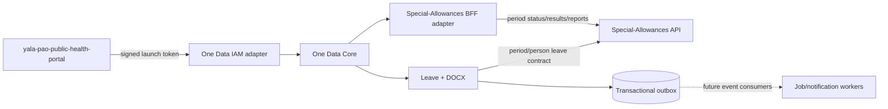

- **Portal contract:** รองรับ manifest/launch endpoint ตาม Portal project, ตรวจ `iss/aud/exp/signature/return_to`, สร้าง local session และ map `portal_user_id`; launch token ใช้ครั้งเดียวหรือมี replay protection และห้ามใช้แทน long-lived API token.
- **Special-Allowances contract:** เริ่มด้วย synchronous REST และ service account แบบ least privilege. Special-Allowances ดึงหรือ One Data สั่ง sync เฉพาะ leave summary ของ period; exact direction ปิดใน contract test แต่ source of truth ไม่เปลี่ยน.
- **Anti-corruption layer:** map canonical leave types/person IDs ของ One Data ไป attendance fields/entries ที่ Special-Allowances รองรับ โดยไม่ให้ schema ของ Special แพร่เข้ามาใน Leave domain.
- **Identity mapping:** ใช้ immutable external ID ระหว่าง `person_id`, `portal_user_id` และ employee ID ของ Special-Allowances; ห้ามจับคู่ด้วยชื่อ เลขโทรศัพท์ หรือ national ID เพียงอย่างเดียว.
- **Period protocol:** `OPEN` sync ซ้ำแบบ idempotent ได้; ก่อน lock ต้องคืน unmapped persons, changed/cancelled leave, row counts และ checksum ให้ผู้ใช้ reconcile. เมื่อ `LOCKED/PAID` แล้ว Special-Allowances ปฏิเสธการ overwrite และรับเฉพาะ adjustment/correction flow.
- **Security:** ไม่แชร์ database credential, root MySQL user, browser cookie หรือ application secret ระหว่างระบบ. Internal API ใช้ TLS/private network, audience-scoped credential, rotation, rate limit, correlation ID และ audit ทั้งผู้ส่ง/ผู้รับ.
- **Infrastructure:** ใช้ reverse proxy/network/MySQL server ของ `shared-infra` ร่วมกันได้ แต่แต่ละ application มี database และ DB user ของตน; backup/restore ต้องทดสอบแยก application และเก็บสำเนานอกเครื่องตามนโยบาย production.
- Transactional outbox เก็บไว้สำหรับ publication หลัง commit และ retry แต่ MVP ไม่ต้องติดตั้ง event broker หาก REST + reconciliation ตอบโจทย์แล้ว.
- Analytics ฝั่ง browserต้องผ่าน consent/data minimization และห้ามส่ง PII/เลขประจำตัว/ข้อมูลสุขภาพใน URL หรือ event.

### 13.4 Existing codebase baseline

| Project | Responsibility used by this blueprint | Verified implementation evidence |
| ------- | ------------------------------------- | -------------------------------- |
| `Special-Allowances` | Financial Calculation System ระดับกองสาธารณสุข; One Data เติมเฉพาะข้อมูลลา | NestJS/Prisma/MySQL backend, Next.js frontend, attendance entries→scalar projection, optimistic record/period version, period lock, adjustment period, audit/export และ test suites **[CODEBASE-VERIFIED]** |
| `yala-pao-public-health-portal` | Login/module access/SSO entry สำหรับ One Data และระบบย่อย | module manifest, signed short-lived launch token, deep-link return flow และ local session contract **[CODEBASE-VERIFIED; project in active development]** |
| `shared-infra` | Reverse proxy, shared Docker network, MySQL host และ backup foundation บน server เดียวกัน | Nginx Proxy Manager, `webproxy`, MySQL 8 และ scheduled local backup **[CODEBASE-VERIFIED]** |

การอยู่ repository/server เดียวกันไม่เปลี่ยน bounded-context ownership. Dependency ระหว่างระบบต้อง pin contract version และทดสอบร่วมใน CI/UAT; ห้ามอาศัย internal table/schema ของอีก project แม้เข้าถึงได้ทาง network.

---

## 14. Audit & Security Model

### 14.1 สิ่งที่สังเกตได้

- หลายตารางแสดงผู้แก้ไขล่าสุดและเวลา **[CONFIRMED]**
- ตารางเวรมีข้อความแก้ไขล่าสุด **[CONFIRMED]**
- มี session ที่ login แล้ว, endpoint `/api/auth/me` และ `/api/auth/refresh`, เมนู logout **[CONFIRMED URL/UI; กลไก token UNKNOWN]**
- มี role ต่อ scope และตัวสลับองค์กร **[CONFIRMED]**
- ข้อมูลพื้นฐานบางส่วน disabled ตามระดับสิทธิ์ **[CONFIRMED UI; server enforcement UNKNOWN]**
- ลายเซ็น ภาพ และข้อมูลส่วนบุคคลถูกเก็บ/แสดงในระบบ **[CONFIRMED]**
- Mutation ผ่าน UI ยืนยันว่า workflow state เปลี่ยนจริง แต่พบ self-approval ของใบลา, partial employee create และ destructive cascade บางชนิด **[MUTATION-VERIFIED]**; สิ่งเหล่านี้เป็น security/integrity findings ไม่ใช่ permission specification.
- ไม่พบ audit log ส่วนกลาง, history diff, login history, session management หรือ MFA setting **[NOT OBSERVED]**
- ไม่ได้ทดสอบ IDOR, privilege escalation, CSRF, rate limiting, direct API mutation หรือ file upload attack ตามข้อจำกัด safe exploration **[UNKNOWN]**

### 14.2 Functional audit requirements

ทุก event สำคัญควรเก็บ append-only:

```text
event_id, occurred_at_utc, actor_person_id, actor_session_id,
scope_type, scope_id, action, resource_type, resource_id,
before_hash, after_hash, changed_fields, reason,
request_id, correlation_id, source_ip_hash, user_agent_class,
result, policy_decision, export_metadata
```

ต้องมี event อย่างน้อยสำหรับ:

- login/logout/refresh failure/MFA changes
- grant/revoke role และ functional assignment
- อ่าน/ส่งออกข้อมูลอ่อนไหวจำนวนมาก
- create/update/void/delete บุคลากร สต็อก ทรัพย์สิน รถ และการเงิน
- issue/reissue/download DOCX, record paper decision, cancel/void/correct ใบลา; แยกจาก approve/reject ของรถ/การย้ายบุคลากร
- สร้าง/ส่ง/รับ acknowledgment/retry/reconcile leave export รวม period, cutoff, source hash, external period/request ID และผลรวมโดยไม่ log PII
- อ่าน/download ผลหรือรายงาน ฉ.10/11 ผ่าน adapter และส่ง correction/adjustment request โดยอ้าง external original period/result; calculation transition audit ตัวจริงอยู่ใน Special-Allowances
- เปิด/ปิด/ล็อก/ปลดล็อกวงรอบแผน
- เปลี่ยนผู้ลงนาม/ลายเซ็น/เลขหนังสือ/template
- generate/download report
- failed authorization และ validation ที่เสี่ยง

Audit ต้องแยก storage/permission จากข้อมูลธุรกรรม ไม่ให้ผู้ดูแลทั่วไปแก้ย้อนหลัง และต้องมี retention/verification hash ตามความต้องการกำกับดูแล.

### 14.3 Security requirements

**Identity & session**

- ใช้ Portal launch-token contract เป็น SSO baseline; ตรวจ issuer, audience, signature, expiry, nonce/replay และ allowlisted `return_to` ก่อนสร้าง local session.
- One Data ไม่เก็บ password ซ้ำจาก Portal; local session ต้องมี idle/absolute timeout, revoke และผูก external identity ที่ immutable.
- MFA/account recovery เป็นหน้าที่ Portal; action เสี่ยงใน One Data อาจขอ fresh launch/reauthentication ตาม contract และต้อง audit.

**Authorization & multi-tenancy**

- ตรวจ `affiliation_id/tenant_id` ทุก query ที่ server/repository layer; ห้ามรับ scope จาก client โดยไม่เทียบ membership.
- policy decision รวม action + scope + resource state + functional assignment.
- ใช้ deny-by-default และ automated cross-tenant isolation tests.
- superadmin action ต้อง just-in-time, reason-required และ ideally dual control.

**Data protection**

- TLS in transit; encryption at rest; field-level encryption/tokenization สำหรับเลขประจำตัว ลายเซ็น และข้อมูลที่จัดเป็น sensitive.
- PII masking ใน list/search และ export ตาม least privilege.
- ห้ามบันทึก PII/token ใน analytics, URL, log หรือ error message.
- แยก object storage bucket/prefix ตาม classification; signed URL อายุสั้น; malware scan; content-disposition ปลอดภัย.
- backup encryption, restore drill, RPO/RTO และ key rotation.

**Application & API**

- CSRF protection เมื่อใช้ cookie session, SameSite/HttpOnly/Secure, CSP, clickjacking defense และ strict CORS.
- schema validation ฝั่ง server, parameterized query, output encoding, file validation และ rate limits.
- idempotency สำหรับ create/approve/stock movement/payment-like operations.
- employee onboarding ต้อง atomic ข้าม person/profile/membership/access/history และมี failure-injection test; API ห้ามตอบ failure หลัง commit บางส่วนโดยไม่มี recoverable operation ID.
- approval policy ต้องบังคับ segregation of duties ฝั่ง server (`requester != approver`) พร้อม delegation/break-glass ที่มีเหตุผลและ audit.
- optimistic concurrency (`version`/ETag) สำหรับตารางเวร แผน และ monthly actuals.
- mutation สำคัญใช้ transaction และ state transition guard; ห้าม client ตั้งสถานะใด ๆ ได้อิสระ.

**Privacy & governance**

- สร้าง data classification, purpose, owner, retention และ lawful basis ต่อ entity.
- รองรับ correction/retention/archival โดยไม่ทำลายหลักฐานเอกสารราชการ.
- ทำ DPIA/threat model ก่อน production โดยเฉพาะ PII บุคลากร ลายเซ็น และการเคลื่อนย้ายข้ามหน่วยงาน.

### 14.4 Security test plan ก่อน go-live

- RBAC/ABAC matrix test ทุก endpoint และทุก state.
- tenant isolation/IDOR test ด้วยอย่างน้อย 2 สังกัดสังเคราะห์และ 3 หน่วยงาน แม้ production รุ่นแรกมีหนึ่ง อบจ.; ใช้เป็น defense-in-depth test ไม่ใช่ production topology.
- workflow tampering: approve เอง, ข้าม pending, แก้หลัง locked, stock ติดลบ, mileage ย้อน.
- upload test: MIME spoof, polyglot, oversized image, SVG/script, malware.
- export abuse/bulk scrape และ search enumeration.
- session fixation/refresh reuse/logout revocation/CSRF/CORS.
- report injection, formula injection ใน Excel และ PII leakage ใน filename/metadata.
- calculation tampering: เปลี่ยน rule/input หลังคำนวณ, lock ซ้ำ, แก้ผล locked, adjustment ไม่มีสิทธิ์ และ replay command.

---

## 15. UX/UI Assessment

### 15.1 สิ่งที่ควรรักษาไว้

- **Navigation แยก domain ชัด:** บุคลากร วัสดุ ครุภัณฑ์ รถ การเงิน และระบบ แยกกลุ่มเข้าใจง่าย **[CONFIRMED]**
- **Scope switcher เห็นชื่อองค์กรและ role:** ลดความสับสนเมื่อบัญชีเดียวดูหลายบริบท **[CONFIRMED]**
- **Dashboard สรุปงานจริง:** ใช้จำนวนบุคลากร สถานะวันนี้ อัตรากำลัง และแผนเทียบจริง ไม่ใช่เพียงกราฟตกแต่ง **[CONFIRMED]**
- **ฟอร์มวงจรชีวิตเป็นแท็บ:** ครุภัณฑ์และรถรวมข้อมูลที่เกี่ยวข้องโดยไม่ยัดในหน้าเดียว **[CONFIRMED]**
- **Contextual help:** ข้อความรหัสครุภัณฑ์ การล็อกแผน และผลของประกาศ active ช่วยป้องกันความผิดพลาด **[CONFIRMED]**
- **Official-document orientation:** preview/print และผู้ลงนามอยู่ใกล้กระบวนงาน **[CONFIRMED]**
- **Calendar/matrix/table views:** เลือก representation เหมาะกับเวร ลา รถ และข้อมูลจำนวนมาก **[CONFIRMED]**
- **Audit hint ในรายการ:** แสดงผู้แก้ล่าสุด/เวลาเป็น feedback ที่ดี แม้ควรมี history เต็ม **[CONFIRMED]**

### 15.2 สิ่งที่ควรออกแบบใหม่

1. **สิทธิ์คลุมเครือ:** UI มีเพียง Staff/Admin แต่มี superadmin และบทบาทผู้ลงนามแฝงอยู่ ควรมีหน้าสิทธิ์/ขอบเขต/เหตุผลที่อ่านได้.
2. **คำว่า “นำเข้าวัสดุ” กำกวม:** อาจถูกเข้าใจว่า file import ควรใช้ “รับวัสดุเข้าคลัง”.
3. **แผนประจำปีต้องลบเพื่อแก้:** เสี่ยงเสีย audit ควรใช้ Draft → Submitted → Locked → Superseded/Voided พร้อม revision.
4. **รถกับครุภัณฑ์ซ้ำได้:** ควรสร้างรถจาก asset หรือเชื่อมแบบบังคับตาม ownership และแจ้ง duplicate candidate.
5. **Search behavior ไม่สม่ำเสมอ:** ใน workflow ย้ายบุคลากร การค้นหาตัวอย่างไม่กรองผลตามข้อความที่ใส่ อาจเป็น bug/delay **[CONFIRMED จาก session เดียว; root cause UNKNOWN]**.
6. **สถานะบางรายการไม่ชัด:** ไปราชการแสดง `—` ในคอลัมน์สถานะ ขณะที่ลามี pending; ควรใช้ status vocabulary สม่ำเสมอ.
7. **ปี พ.ศ./ค.ศ. ผสมใน request:** ผู้ใช้เห็น พ.ศ. แต่ resource บางหน้าส่ง ค.ศ.; ควรมี date boundary ชัดและ test conversion.
8. **ปุ่ม destructive บนหน้ารายละเอียด:** รถมี edit/delete ที่เห็นชัด ควรใช้ permission, confirm, reason, dependency preview และ soft delete.
9. **ฟอร์มยาวและ PII มาก:** employee/accident ควรเป็น stepper, autosave draft, section completion, privacy hint และ field-level permissions.
10. **Notification diagnostics เปิดเผยข้อจำกัดแต่ไม่มี recovery:** ควรบอกวิธีเปิดใช้งาน ช่องทางสำรอง และสถานะ subscription แบบเข้าใจง่าย.
11. **ไม่มี audit center:** “แก้ล่าสุด” ไม่พอสำหรับ dispute; เพิ่ม timeline/filter/export เฉพาะผู้ตรวจ.
12. **Empty state ควร actionable:** หน้าสต็อก/ร้านค้า/แผนว่างควรแนะนำลำดับเริ่มต้นและ dependency.

### 15.3 Information architecture ที่แนะนำ

```text
Workspace selector
├── หน่วยงาน
│   ├── งานวันนี้
│   ├── บุคลากรและเวลา
│   ├── วัสดุ
│   ├── ทรัพย์สินและรถ
│   ├── การเงิน
│   ├── เอกสาร
│   └── ตั้งค่า
└── สังกัด
    ├── ภาพรวม
    ├── หน่วยงานและบุคลากร
    ├── แผนและกำกับการเงิน
    ├── รายงานรวม
    ├── ข้อมูลหลักร่วม
    └── ตั้งค่าและสิทธิ์
```

เพิ่ม “งานที่รอดำเนินการ” เป็น inbox เดียวสำหรับคำขอ/approval/แผนใกล้ปิด แทนให้ผู้ใช้ไล่เข้าแต่ละโมดูล และใช้ global search ที่จำกัดตาม scope/permission.

### 15.4 Accessibility และ responsive behavior

ไม่ได้ทำ accessibility audit หรือทดสอบหลายอุปกรณ์ **[UNKNOWN]** ระบบใหม่ควรกำหนด WCAG 2.2 AA, keyboard navigation, focus management สำหรับ sheet/dialog, label/error ที่อ่านด้วย screen reader, contrast, touch target และ table responsive พร้อม alternate card/list view.

---

## 16. Recommended Architecture

### 16.1 หลักการออกแบบ

1. **Domain-first:** แบ่งตามงานธุรกิจ ไม่แบ่งตามหน้าจอของระบบอ้างอิง.
2. **Multi-organization by design:** affiliation/tenant scope เป็นส่วนหนึ่งของ identity, query และ audit ทุกชั้น.
3. **Modular monolith first:** เริ่มด้วย deployable เดียวแต่บังคับ module boundary; ลด distributed complexity ใน MVP และแยก service ภายหลังเฉพาะจุดที่มีเหตุผล.
4. **Workflow as state machine:** approval/lock/transfer/disposal ใช้ transition ที่ตรวจได้ ไม่ใช่ boolean หลายตัวกระจัดกระจาย.
5. **Ledger and history over mutable totals:** สต็อก การเงิน สิทธิ์ ประวัติการจ้าง และสถานะสำคัญต้องมีประวัติที่ reconstruct ได้.
6. **Report reproducibility:** เอกสารทางการต้อง version/snapshot และพิมพ์ซ้ำได้.
7. **Secure by default:** deny-by-default, server-side scope, encryption, least privilege, append-only audit.
8. **Interoperable boundaries:** API/event ที่ versioned และ adapter สำหรับระบบภายนอก.
9. **Thai public-sector ready:** พ.ศ. ใน presentation, ปีงบ ต.ค.–ก.ย., ฟอนต์ไทย, เลขหนังสือ และลายเซ็น โดยไม่ผูก storage กับ locale.

### 16.2 Logical architecture

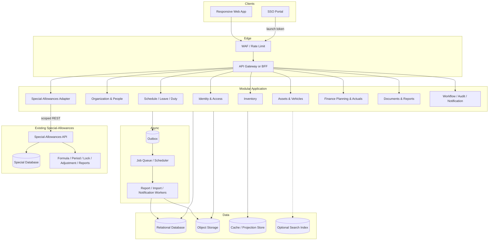

แผนภาพไม่บังคับภาษา framework หรือ cloud vendor. One Data เริ่มเป็น modular monolith แต่ Special-Allowances และ Portal คงเป็น deployable/database แยก. Relational database เหมาะเพราะมี transaction, constraint, reporting relation และ audit consistency สูง. Object storage เหมาะกับ DOCX, attachment และไฟล์รายงาน. Queue ใช้สำหรับ document/import/notification ที่ใช้เวลานานเมื่อจำเป็น.

### 16.3 Module boundaries

| Module                | Owns                                                                                       | May read via API/projection                            | Must not mutate directly             |
| --------------------- | ------------------------------------------------------------------------------------------ | ------------------------------------------------------ | ------------------------------------ |
| Identity & Access     | identities, memberships, roles, permissions, sessions                                      | person display projection                              | HR profile/history                   |
| Organization & People | affiliation, tenant, employee profile, job history, position                               | access grants                                          | session/credential                   |
| Workforce             | shift, schedule, holiday, leave, official duty; รุ่นแรกใช้ Leave แบบ Word-first             | employee/workgroup, signer                             | employee master                      |
| Special Integration   | external ID mapping, leave export batches, delivery/reconciliation, external period/report refs | effective People data, paper-approved leave, Special API | สูตร/period/result/report ใน Special |
| Inventory             | supply master, receipt, issue, movement, vendor, annual plan                               | workgroup/actor                                        | finance actual without command/event |
| Assets & Vehicles     | asset lifecycle, vehicle workflow                                                          | employee/tenant, finance categories                    | inventory/employee master            |
| Finance               | cycles, plan revisions, revenue/expense taxonomy, actuals                                  | organization, personnel/asset plan projections         | stock ledger/asset register          |
| Documents & Reports   | templates, report runs, snapshots                                                          | read models from all modules                           | source transactions                  |
| Governance            | audit, outbox, notification, approval tasks                                                | actor/resource metadata                                | domain state except through command  |

### 16.4 Deployment evolution

**First production release:** One Data เป็น modular monolith + relational database ของตน + object storage/document worker. เปิดใช้ Platform, People/Organization, Leave/DOCX และ Special-Allowances adapter ก่อน; Portal, Special-Allowances และ One Data เป็น deployable/database แยกแม้อยู่ server/network เดียวกัน. ใช้ transaction ภายใน One Data, scoped REST + reconciliation ข้ามระบบ และ outbox สำหรับ retry/future events **[OWNER-CONFIRMED DIRECTION + PROPOSED DESIGN]**.

**Scale-out triggers:** แยก Report/Import worker ก่อนเพราะ workload หนัก; แยก Notification/Integration ต่อมา; แยก transactional domain เฉพาะเมื่อ team ownership, scaling หรือ regulatory isolation ชัดเจน. ห้ามเริ่ม microservices เพียงเพราะมีหลายเมนู.

### 16.5 Multi-tenancy strategy

- Capacity baseline คือ อบจ.ยะลา 1 แห่ง, รพ.สต. 38 แห่ง และบุคลากร 267 คน **[OWNER-CONFIRMED]**; การทดสอบ aggregation ต้อง seed ครบ baseline นี้.
- Capacity headroom ที่เสนอสำหรับ design/load test คืออย่างน้อย 100 หน่วยงานและ 1,500–2,000 บัญชีโดยไม่เปลี่ยน architecture **[PROPOSED; ต้องเทียบแผนเติบโตจริง]**.
- ทุก business row มี `affiliation_id` และ/หรือ `tenant_id` ตาม owner; foreign key ต้องสอดคล้อง scope.
- Application sets authorized scope จาก session ไม่รับค่า tenant จาก query เพียงอย่างเดียว.
- Repository/query policy เติม scope predicate อัตโนมัติ; integration test ตรวจ cross-scope.
- Unique key เป็น composite เช่น `(tenant_id, asset_code)` หรือ `(affiliation_id, fiscal_year, code)`.
- สำหรับข้อมูลอ่อนไหวมาก อาจใช้ database row-level security เป็น defense-in-depth แต่ยังต้องมี application policy.
- Analytics/report projection ต้องรักษา scope lineage และ aggregate เฉพาะสิทธิ์ที่อนุญาต.

### 16.6 Reliability and operations

- เป้าหมายเริ่มต้นที่เสนอ: availability 99.9% รายเดือน, RPO ≤ 15 นาที, RTO ≤ 4 ชั่วโมง; เจ้าของระบบต้องยืนยัน **[RECOMMENDED/UNKNOWN]**.
- Structured logs ไม่มี PII, metrics ต่อ module, distributed correlation ID, audit แยก.
- Health/readiness checks, migration gating, feature flags, blue/green หรือ rolling deployment.
- Backup point-in-time + restore drill; immutable backup สำหรับ audit/report artifacts ตาม retention.
- Idempotent workers, retry with backoff, dead-letter queue และ operator replay UI.
- Performance budget: list p95 < 2s, command p95 < 3s, dashboard p95 < 3s ภายใต้ volume ที่กำหนด; report async เมื่อเกิน 5s **[RECOMMENDED]**.

### 16.7 Environments and delivery

- แยก dev/test/UAT/staging/production และแยกข้อมูล/credential จริง.
- UAT ใช้ synthetic/de-identified data; seed scenarios ครอบคลุม 1 สังกัด, 38 รพ.สต., บุคลากรประมาณ 267 คน, หลายปีงบ และ state transitions. เพิ่ม multi-affiliation test เฉพาะเมื่ออนุมัติเป็น future requirement.
- Database migration forward-compatible; destructive migration สองช่วงและ backup verified.
- CI: lint/unit/schema/contract/security/tenant-isolation/report golden tests.
- CD: approval สำหรับ production, migration preview, automated smoke และ rollback/roll-forward plan.

---

## 17. Proposed Database Model

### 17.1 Common conventions

ทุกตารางธุรกรรมควรมีอย่างน้อย:

```text
id UUID/ULID primary key
affiliation_id nullable/not-null by ownership
tenant_id nullable/not-null by ownership
created_at timestamptz, created_by
updated_at timestamptz, updated_by
version bigint                  -- optimistic concurrency
status enum/reference           -- เมื่อมี lifecycle
voided_at, voided_by, void_reason -- แทน hard delete สำหรับข้อมูลสำคัญ
```

- เวลาเก็บ UTC; วันที่ธุรกิจใช้ `date`; เดือนงบใช้ `fiscal_year` + `fiscal_month` 1–12 โดยมี calendar mapping.
- เงินใช้ fixed decimal ไม่ใช้ float; ระบุสกุลเงินหากมีโอกาสขยาย.
- เลขประจำตัวไม่เป็น key; เก็บ normalized encrypted value + blind index สำหรับ exact search หากจำเป็น.
- JSON ใช้เฉพาะ metadata ที่เปลี่ยนรูปบ่อย ไม่ใช้แทน relation หลัก.
- Enum สำคัญ versioned/reference table เมื่อหน่วยงานต้อง configure.

### 17.2 Organization, people and access

| Table                     | Key fields                                                                                                                                                               | Constraints/notes                                                                                                                           |
| ------------------------- | ------------------------------------------------------------------------------------------------------------------------------------------------------------------------ | ------------------------------------------------------------------------------------------------------------------------------------------- |
| `affiliations`            | id, name, department, logo_object_id, settings_version                                                                                                                   | base organization                                                                                                                           |
| `districts`               | id, affiliation_id, code, name, display_order                                                                                                                            | unique code/order per affiliation                                                                                                           |
| `tenants`                 | id, affiliation_id, district_id, name, short_name, hosp_code, size_code, cup_code, address fields, active                                                                | unique hosp_code; effective-dated if changed                                                                                                |
| `organization_order`      | affiliation_id, district_id, tenant_id, display_order                                                                                                                    | exactly one row per unit/order scope                                                                                                        |
| `persons`                 | id, prefix, first_name, last_name, national_id_ciphertext/blind_index, birth_date, gender, phone, email, address_id                                                      | PII classification; search projection masked                                                                                                |
| `employee_profiles`       | person_id, active, profile metadata                                                                                                                                      | person-level employment profile separated from organization assignment/access                                                               |
| `tenant_memberships`      | id, person_id, tenant_id, work_group_id, position_id, employee_type_id, start_date, end_date, membership_type, access_enabled                                            | effective-dated; no overlapping primary employment unless policy allows; onboarding command atomic with person/access/history               |
| `affiliation_memberships` | id, person_id, affiliation_id, source_tenant_membership_id, access_enabled                                                                                               | shared person, no duplication                                                                                                               |
| `employment_history`      | person_id, organization_id?, workplace_name, area_level_code, start_date, end_date, is_current, include_in_ch11, change_kind, effective_from, corrected_record_id, notes | effective-dated; distinguish correction vs real change; fields mirror observed ฉ.11 inputs; organization link optional for external history |
| `professional_licenses`   | person_id, license_type, license_no_ciphertext, issue_date, expiry_date                                                                                                  | expiry alert optional                                                                                                                       |
| `roles`                   | id, code, name, scope_type, system_defined                                                                                                                               | STAFF/ADMIN seed but extensible                                                                                                             |
| `permissions`             | id, code, description, risk_level                                                                                                                                        | action catalog                                                                                                                              |
| `role_permissions`        | role_id, permission_id, conditions_json                                                                                                                                  | reviewed/versioned                                                                                                                          |
| `membership_roles`        | membership_type/id, role_id, effective dates                                                                                                                             | many-to-many if future roles expand                                                                                                         |
| `functional_assignments`  | organization_scope, function_code, person_id, start/end, priority                                                                                                        | director, payer, procurement, signer, vehicle approver                                                                                      |
| `identity_links`          | person_id, provider, subject, status, last_login_at                                                                                                                      | provider subject unique                                                                                                                     |
| `sessions`                | identity_id, session_hash, device, issued/expires/revoked, risk                                                                                                          | no raw token stored                                                                                                                         |

### 17.3 Workforce

| Table                      | Key fields                                                                                                                         | Constraints/notes                                                                      |
| -------------------------- | ---------------------------------------------------------------------------------------------------------------------------------- | -------------------------------------------------------------------------------------- |
| `shift_types`              | affiliation_id, code, name, start_time, end_time, hours, compensation_basis, rate, active                                          | unique code; handle overnight shifts                                                   |
| `schedule_periods`         | tenant_id, year, month, status, version                                                                                            | unique tenant/month                                                                    |
| `shift_assignments`        | schedule_period_id, person_id, work_date, shift_type_id, worked_hours, rate_snapshot                                               | unique per allowed combination; detect overlap                                         |
| `schedule_inspectors`      | schedule_period_id, work_date/person_id/role                                                                                       | clarify actual inspector grain in discovery                                            |
| `holidays`                 | jurisdiction_scope, holiday_date, name, type                                                                                       | unique date/type; source/version                                                       |
| `leave_types`              | code, name, official_group_code, active                                                                                            | seeded 11 groups ตามประกาศ ก.จ. พ.ศ. 2569; version/effective date                      |
| `leave_policy_profiles`    | affiliation_id, code, employee_type_scope, legal_basis, effective_from/to, status                                                   | แยกข้าราชการ อบจ. ออกจากพนักงานจ้าง/ลูกจ้าง/สถานะอื่น                                 |
| `leave_policies`           | policy_profile_id, leave_type_id, entitlement, period_basis, accumulation, effective dates, conditions                             | replaces hard-coded quotas; published version immutable                                 |
| `leave_balances`           | person_id, policy_id, period, granted, used, reserved, adjusted                                                                    | projection/ledger backed                                                               |
| `leave_requests`           | tenant_id, requester_id, policy_id, leave_type_id, start/end, calculated_days, reason, canonical_status, issued_at, cancelled/void fields | status `DRAFT/DOCUMENT_ISSUED/PAPER_APPROVED/PAPER_REJECTED/CANCELLED/VOIDED`; overlap/quota guards |
| `leave_document_revisions` | request_id, revision_no, template_code/version, source_snapshot/hash, docx_object_id/checksum, generated_by/at                      | immutable published revision; regenerate from snapshot                                  |
| `leave_external_decisions` | request_id, decision, external_document_no/date, recorded_by/at, note, attachment_id nullable, supersedes_id                       | บันทึกผลกระดาษ ไม่ใช่ online approval; requester != recorder โดย default                |
| `official_duty_requests`   | tenant_id, requester_id, type, subject, start/end, vehicle_text/vehicle_id, lifecycle_status, updated/deleted/voided by/at/reason  | separate lifecycle from leave; deletion policy OPEN                                    |
| `official_duty_companions` | request_id, person_id                                                                                                              | unique pair                                                                            |
| `official_duty_approvals`  | request_id, step_no, decision fields                                                                                               | optional only if owner confirms approval workflow; do not infer from leave             |

### 17.4 Special-Allowances Integration — ฉ.10/11

One Data ไม่สร้างตาราง calculation engine, formulas, results หรือ report artifacts ของ ฉ.10/11 ซ้ำ. ตารางเหล่านั้นคงอยู่ในฐานข้อมูล `Special-Allowances` ซึ่งรองรับ calculation, period integrity, optimistic locking, adjustment period และ report อยู่แล้ว **[CODEBASE-VERIFIED + OWNER-CONFIRMED]**.

ตารางต่อไปนี้เป็น integration metadata ที่ One Data เป็นเจ้าของ:

| Table                         | Key fields                                                                                                                                    | Constraints/notes                                                                  |
| ----------------------------- | --------------------------------------------------------------------------------------------------------------------------------------------- | ---------------------------------------------------------------------------------- |
| `external_systems`            | id, code (`SPECIAL_ALLOWANCES`), base_url_ref, audience, active, contract_version                                                             | ไม่เก็บ secret plaintext; config/secret manager เป็นเจ้าของ credential             |
| `external_person_mappings`    | system_id, person_id, external_person_id, effective_from/to, status, verified_by/at                                                           | unique active mapping; ห้าม map ด้วยชื่ออย่างเดียว                                 |
| `leave_export_batches`        | id, system_id, tenant_id, period_start/end, source_cutoff_at, status, item_count, source_hash, created_by/at                                  | idempotency key unique ต่อ consumer/tenant/period/source hash                      |
| `leave_export_items`          | batch_id, person_id, external_person_id, leave_type_code, working_days, source_request_refs/revisions, item_hash                              | immutable batch item; aggregate contract ต้องตรง attendance projection ของ Special |
| `integration_deliveries`      | batch_id, attempt_no, request_id, sent/acknowledged_at, response_code, external_period_ref, error_code/detail_redacted                        | retry/audit; no PII in operational log                                             |
| `integration_reconciliations` | batch_id, external_period_ref, expected/accepted/rejected/unmapped counts, local/external hash, status, reviewed_by/at                        | ต้อง PASS ก่อน lock หรือมี exception ที่ลงเหตุผล                                   |
| `external_report_refs`        | system_id, external_period_ref, external_report_id, format, checksum, generated_at, access_scope                                             | reference/cache metadata; artifact owner คือ Special-Allowances                    |

Current Special-Allowances attendance contract ที่ตรวจจาก source **[CODEBASE-VERIFIED]**:

| One Data leave group        | Special attendance type | Projection basis ใน Special | Contract status |
| --------------------------- | ----------------------- | --------------------------- | --------------- |
| ลากิจส่วนตัว               | `PERSONAL_LEAVE`        | วันทำการ                    | direct mapping  |
| ลาป่วย                      | `SICK_LEAVE`            | วันทำการ                    | direct mapping  |
| ลาคลอดบุตร                  | `MATERNITY_LEAVE`       | วันปฏิทิน                   | direct mapping  |
| ลาไปประกอบพิธีฮัจย์         | `HAJJ_LEAVE`            | วันปฏิทิน                   | direct mapping  |
| ลาอุปสมบท                   | `ORDAIN_LEAVE`          | วันปฏิทิน                   | direct mapping  |
| ลาพักผ่อน                   | `VACATION_LEAVE`        | วันทำการ                    | direct mapping  |
| ขาดราชการ                   | `ABSENT`                | วันทำการ                    | ไม่ใช่ใบลา; One Data Leave ห้ามสร้างอัตโนมัติ |
| ฝึกอบรมโดยสมัครใจ/ตามคำสั่ง | `TRAINING_*`            | วันทำการ + occurrence count | ไม่ใช่ตัวแปรจาก Leave; รักษาค่าเดิมใน Special |
| ลาอีก 6 กลุ่ม/ถือศีลฯ ที่ไม่มีชนิดตรง | ไม่มี direct type       | —                           | ต้องให้เจ้าของสูตรอนุมัติ mapping/version ก่อนส่ง |

ห้ามรวมประเภทที่ยังไม่มี direct type เข้า `leaveUnclassifiedDays` หรือประเภทใกล้เคียงโดยคาดเดา เพราะอาจเปลี่ยนผลคำนวณ. การส่ง complete snapshot ต้อง reset เฉพาะ leave types ที่ contract version นั้นประกาศว่า One Data เป็นเจ้าของ และต้องรักษา `ABSENT`, `TRAINING_*`, historical unclassified และ other non-working fields ที่ Special เป็นเจ้าของไว้.

ข้อกำหนดสำคัญ:

- One Data ส่งเฉพาะ leave dimensions ที่ Special-Allowances contract ต้องใช้ และไม่เขียน scalar/calendar fields ในฐานข้อมูล Special โดยตรง.
- Adapter ต้องรองรับ source contract ของ Special ที่ใช้ attendance entries แล้ว project เป็น scalar fields ด้วย logic เดียวกัน; การเปลี่ยน schema ต้อง version contract และทดสอบทั้ง save/lock path.
- ช่วง `OPEN` sync ซ้ำได้แบบ idempotent และแทน complete leave snapshot ของ period ตาม contract; omission semantics ต้องชัดเจนเพื่อไม่คงค่า stale.
- ค่าเริ่มต้น grace period คือ 3 วันทำการหลังสิ้นเดือนแบบ configurable. ก่อน lock ต้อง reconcile unmapped person, rejected item, changed/cancelled leave และ hash.
- หลัง `LOCKED/PAID` ห้าม overwrite รอบเดิม. การแก้ข้อมูลลาสร้าง correction/adjustment ใน Special-Allowances โดยอ้าง original period; controlled reopen ใช้เฉพาะกรณียังไม่จ่ายและต้องมี permission + reason + audit.

### 17.5 Inventory

| Table                     | Key fields                                                                                                                              | Constraints/notes                                                                        |
| ------------------------- | --------------------------------------------------------------------------------------------------------------------------------------- | ---------------------------------------------------------------------------------------- |
| `supply_types`            | affiliation/global scope, code, name, default_category_id, active                                                                       | 19 seeded groups                                                                         |
| `supply_categories`       | code, name, inventory_class                                                                                                             | configurable mapping                                                                     |
| `units_of_measure`        | code, name, precision                                                                                                                   | shared master                                                                            |
| `storage_locations`       | tenant_id, code, name                                                                                                                   | optional hierarchy                                                                       |
| `supply_items`            | tenant_id, code, type_id, category_id, name, unit_id, storage_id, min_qty, max_qty, active                                              | unique tenant/code                                                                       |
| `vendors`                 | tenant_id/affiliation_id, name, address, contact, phone, terms, active                                                                  | dedupe strategy                                                                          |
| `stock_receipts`          | tenant_id, receipt_no, delivery_no, delivery_date, vendor_id, actor_id, note, status, total, reversed_by_id                             | posted/voided lifecycle; reject reversal if downstream issue would make balance negative |
| `stock_receipt_lines`     | receipt_id, supply_item_id, qty, unit_cost, line_total, lot/expiry optional                                                             | qty > 0                                                                                  |
| `stock_issues`            | tenant_id, issue_no, issue_date, work_group_id, actor_id, note, status, total, plan_compliance_status, exception_reason, reversed_by_id | approval optional pending decision; out-of-plan exception explicit/audited               |
| `stock_issue_lines`       | issue_id, supply_item_id, qty, unit_cost_snapshot, line_total                                                                           | qty > 0                                                                                  |
| `stock_movements`         | tenant_id, supply_item_id, occurred_at, movement_type, qty_delta, value_delta, source_type/id, reverses_movement_id, sequence           | append-only/idempotent source; reversal links original movement                          |
| `stock_balances`          | tenant_id, supply_item_id, qty_on_hand, value_on_hand, last_movement_seq                                                                | projection; reconcile job                                                                |
| `annual_issue_plans`      | tenant_id, fiscal_year, work_group_id, revision_no, status, locked_at, supersedes_id                                                    | never require hard delete to revise                                                      |
| `annual_issue_plan_lines` | plan_id, supply_item_id, planned_qty, issued_qty_projection                                                                             | unique plan/item                                                                         |

### 17.6 Assets and vehicles

| Table                                 | Key fields                                                                                                                                                                              | Constraints/notes                                                                                            |
| ------------------------------------- | --------------------------------------------------------------------------------------------------------------------------------------------------------------------------------------- | ------------------------------------------------------------------------------------------------------------ |
| `asset_types`                         | affiliation/global scope, code3, name, useful_life_years, depreciation_method                                                                                                           | version/effective date                                                                                       |
| `assets`                              | tenant_id, asset_code, form_type, name, description, type_id, status, acquired_date, cost, funding_source, acquisition_method, vendor_id, approval_ref, image_id                        | unique tenant/code; money decimal                                                                            |
| `asset_details`                       | asset_id, maker, model, serial, machine, chassis, registration, color, unit, delivery_ref, warranty/insurance fields                                                                    | subtype fields may split further                                                                             |
| `land_building_details`               | asset_id, location, rai, ngan, square_wah, deed_type/no, building_type, structure, floors, dimensions                                                                                   | only form_type LAND                                                                                          |
| `asset_depreciations`                 | asset_id, fiscal_year, opening_book_value, expense, accumulated, closing_book_value, method/life/rate snapshot                                                                          | unique asset/year; fixed decimal only; explicit rounding/residual invariant; approved version                |
| `asset_disposals`                     | asset_id, disposal_date, method, approval_ref, proceeds, gain_loss, reason                                                                                                              | one active disposal; transition guard                                                                        |
| `asset_benefits`                      | asset_id, fiscal_year, description, amount, receipt_basis                                                                                                                               | child history                                                                                                |
| `asset_custodians`                    | asset_id, fiscal_year/effective dates, division, user_person_id, division_head_id                                                                                                       | prevent overlapping primary custodian                                                                        |
| `asset_repairs`                       | asset_id, occurrence_no, document_ref, date, description, amount, repairer, note                                                                                                        | history                                                                                                      |
| `vehicles`                            | tenant_id, asset_id nullable, name, model, production_year, engine_cc, registration, ownership_type, acquisition_date, initial/current_mileage, status, image_id, archived_at/by/reason | unique registration in agreed scope; owned vehicle may require asset; never cascade-delete lifecycle history |
| `vehicle_authorizations`              | vehicle_id, person_id, start/end, granted_by                                                                                                                                            | active unique pair                                                                                           |
| `vehicle_requests`                    | vehicle_id, requester_id, destination, purpose, start/end, passengers, status, approver_snapshot                                                                                        | overlap/authorization guard                                                                                  |
| `vehicle_usages`                      | vehicle_id, request_id nullable, user_id, driver_id, location, depart/return at, depart/return mileage, distance                                                                        | mileage monotonic; one usage/request                                                                         |
| `vehicle_accidents`                   | vehicle_id, usage_id nullable, occurred_at, speed, location, route, own_damage, investigator, station, result                                                                           | sensitive fields separated/masked                                                                            |
| `accident_parties/injuries/witnesses` | accident_id, structured person/contact/detail fields                                                                                                                                    | repeatable children; retention policy                                                                        |
| `vehicle_maintenance`                 | vehicle_id, mileage, items, amount, accepted_date, vendor/place, note                                                                                                                   | may link asset repair/finance actual                                                                         |

### 17.7 Finance

| Table                     | Key fields                                                                                                                      | Constraints/notes                                                                                                 |
| ------------------------- | ------------------------------------------------------------------------------------------------------------------------------- | ----------------------------------------------------------------------------------------------------------------- |
| `fiscal_years`            | affiliation_id, buddhist_year_display, start_date, end_date, status                                                             | dates are canonical                                                                                               |
| `planning_cycles`         | affiliation_id, fiscal_year_id, revision_type, open_at, close_at, status, locked_at, version                                    | unique year/type; BASE must be closed/locked before opening ADDITIONAL/CHANGE unless approved rule says otherwise |
| `revenue_types`           | code, name                                                                                                                      | 8 seeded groups                                                                                                   |
| `revenue_items`           | affiliation_id, fiscal_year_id, code, name, type_id, display_order, is_opening_balance, is_local_budget, active, copied_from_id | unique year/code/order                                                                                            |
| `expense_categories`      | code, name, display_order                                                                                                       | 11 major categories                                                                                               |
| `expense_subtypes`        | category_id, code, name, supply_type_id nullable, active                                                                        | configurable                                                                                                      |
| `financial_plans`         | tenant_id, cycle_id, revision_no, status, submitted/locked at, totals projection, supersedes_id                                 | immutable when locked                                                                                             |
| `planned_revenues`        | plan_id, revenue_item_id, amount, note                                                                                          | unique plan/item                                                                                                  |
| `planned_expenses`        | plan_id, category_id, subtype_id, funding_source, month optional, amount, detail                                                | aggregation source                                                                                                |
| `monthly_income_actuals`  | tenant_id, fiscal_year_id, fiscal_month, revenue_item_id, amount, source_ref, version                                           | unique grain agreed; adjustment history                                                                           |
| `monthly_expense_actuals` | tenant_id, fiscal_year_id, fiscal_month, category/subtype, amount, source_ref, version                                          | same                                                                                                              |
| `financial_adjustments`   | source_type/id, old/new amount, reason, approved_by, effective_at                                                               | no silent overwrite                                                                                               |
| `price_sources`           | affiliation_id, name, reference, effective dates                                                                                | observed master endpoint                                                                                          |

### 17.8 Documents, files and governance

| Table                 | Key fields                                                                                                                             | Constraints/notes                                               |
| --------------------- | -------------------------------------------------------------------------------------------------------------------------------------- | --------------------------------------------------------------- |
| `report_definitions`  | code, name, version, template_object_id, parameter_schema, active                                                                      | immutable published versions                                    |
| `report_runs`         | definition_id/version, organization scope, requested_by, parameters_json, data_snapshot_ref/hash, status, output_object_id, expires_at | reproducible and auditable                                      |
| `report_artifacts`    | report_run_id, format, object_key, checksum, size, generated_at, retention_class                                                       | one run may have DOCX/PDF/XLSX variants; immutable artifact metadata |
| `signature_snapshots` | report_run_id, function_code, person_display, title_display, signature_object_hash                                                     | copy-on-generate                                                |
| `attachments`         | owner_type/id, object_key, mime, size, checksum, classification, scan_status                                                           | signed access                                                   |
| `announcements`       | affiliation_id, message, active, activated_at, created_by                                                                              | partial unique index for one active                             |
| `employee_transfers`  | person_id, affiliation_id, source_tenant_id, destination_tenant_id, effective_date, request_type, status, reason                       | state machine                                                   |
| `transfer_approvals`  | transfer_id, approver_id, decision, comment, at                                                                                        | immutable                                                       |
| `audit_events`        | fields in 14.2                                                                                                                         | append-only/partitioned                                         |
| `outbox_events`       | aggregate, event_type, payload_version, occurred/published, attempts                                                                   | transactional                                                   |
| `notifications`       | recipient, channel, template, status, attempts, provider_ref                                                                           | no sensitive payload in provider log                            |

### 17.9 Critical constraints and indexes

- Composite indexes เริ่มด้วย `tenant_id`/`affiliation_id` สำหรับทุก list/report path.
- Partial unique: announcement active หนึ่งรายการต่อสังกัด; open primary membership ตาม policy; one disposal per asset.
- Partial/unique: leave export batch/idempotency ต่อ consumer/tenant/period/source hash และ active external person mapping ต้องไม่ซ้ำ; calculation constraints เป็นความรับผิดชอบของ Special-Allowances.
- Exclusion/validation for overlapping vehicle bookings and optionally employee leave/shift.
- Check constraints: date order, positive quantity, nonnegative money/mileage, fiscal month 1–12.
- Command invariant: employee onboarding is all-or-nothing across person/profile/membership/access/history and requires idempotency key for retry.
- Paper-result invariant: ผู้บันทึก `PAPER_APPROVED/PAPER_REJECTED` ต้องต่างจาก requester เว้นแต่มี recorded break-glass approval/reason/evidence; ไม่เรียก action นี้ว่า online approval.
- Document invariant: `leave_document_revisions` ที่ออกแล้ว immutable และ DOCX checksum ต้องตรง artifact; การแก้สร้าง revision ใหม่.
- Integration invariant: เฉพาะ effective `PAPER_APPROVED` leave เข้าสู่ export; ทุก batch trace กลับ request revision ได้และต้องไม่ mutate หลังส่งสำเร็จ.
- Stock invariant: on-hand projection may not become negative; receipt reversal with downstream consumption is rejected or preceded by explicit issue reversal.
- Decimal invariant: money/depreciation/quantity precision uses fixed decimal; closing book value and report totals obey an approved rounding rule.
- Retention invariant: vehicle, asset, employee, leave, finance plan and posted-stock records use archive/void/supersede; no cascading hard delete of histories.
- Foreign key ต้องป้องกัน cross-tenant reference; ใช้ composite FK หรือ trigger/policy เมื่อ DB ไม่รองรับตรง.
- Search index: normalized Thai text สำหรับชื่อ/รหัส; national ID exact-only blind index ไม่ full-text.
- Partition `audit_events`, `stock_movements`, monthly actual/history ตามเวลา/tenant เมื่อ volume ถึงเกณฑ์.

---

## 18. Proposed API Design

### 18.1 API principles

- Versioned REST JSON เช่น `/v1` พร้อม OpenAPI; use-case ที่ซับซ้อนใช้ command endpoint ชัดเจน.
- Server derives authorized organization context; route มี ID เพื่อความชัดแต่ต้องตรวจ membership/policy.
- Standard resource envelope ไม่จำเป็นสำหรับทุก response แต่ error/pagination ต้องสม่ำเสมอ.
- ISO 8601 dates/UTC timestamps; API ใช้ ค.ศ. เท่านั้น, UI แปลง พ.ศ.
- เงินส่งเป็น decimal string หรือ minor unit ตามมาตรฐานเดียว; ไม่ใช้ binary float.
- `Idempotency-Key` สำหรับ POST command สำคัญ; `If-Match`/version สำหรับ update ที่ชนกันได้.
- ทุก response มี `requestId`; audit ใช้ `correlationId`.

### 18.2 Endpoint groups

**Identity and scope**

```http
GET    /v1/me
GET    /v1/me/scopes
GET    /v1/me/sessions
DELETE /v1/me/sessions/{sessionId}
POST   /v1/scopes/{scopeType}/{scopeId}:select
```

**Organizations and people**

```http
GET    /v1/affiliations/{affiliationId}
GET    /v1/affiliations/{affiliationId}/tenants
PATCH  /v1/affiliations/{affiliationId}/tenant-order
GET    /v1/tenants/{tenantId}/employees
POST   /v1/tenants/{tenantId}/employees
GET    /v1/employees/{employeeId}
PATCH  /v1/employees/{employeeId}
POST   /v1/affiliations/{affiliationId}/memberships
DELETE /v1/affiliations/{affiliationId}/memberships/{membershipId}
```

**Schedule, leave and official duty**

```http
GET    /v1/tenants/{tenantId}/schedules/{year}/{month}
PUT    /v1/tenants/{tenantId}/schedules/{year}/{month}/assignments/{assignmentKey}
POST   /v1/tenants/{tenantId}/leave-requests
GET    /v1/tenants/{tenantId}/leave-requests?year=&status=&employeeId=
PATCH  /v1/leave-requests/{id}
POST   /v1/leave-requests/{id}:issue-document
GET    /v1/leave-requests/{id}/document-revisions
GET    /v1/leave-document-revisions/{revisionId}/download
POST   /v1/leave-requests/{id}:record-paper-decision
POST   /v1/leave-requests/{id}:cancel
POST   /v1/leave-requests/{id}:void
GET    /v1/employees/{employeeId}/leave-balance?year=
POST   /v1/tenants/{tenantId}/official-duty-requests
POST   /v1/official-duty-requests/{id}:approve
```

`record-paper-decision` รับเฉพาะ `APPROVED/REJECTED` จากเจ้าหน้าที่ผู้รับผิดชอบและ metadata ของเอกสารภายนอก; เป็นการรับรองการบันทึกข้อมูล ไม่ใช่การอนุมัติออนไลน์. `issue-document` ต้อง snapshot ข้อมูลและสร้าง DOCX revision แบบ immutable.

**Special-Allowances integration — ฉ.10/11**

```http
GET    /internal/v1/allowance-leave-periods/{year}/{month}?tenantId=
GET    /internal/v1/allowance-leave-periods/{year}/{month}/changes?since=&tenantId=
POST   /v1/integrations/special-allowances/periods/{year}/{month}:sync-leave
GET    /v1/integrations/special-allowances/periods/{year}/{month}/reconciliation?tenantId=
GET    /v1/integrations/special-allowances/periods?fiscalYear=&tenantId=
GET    /v1/integrations/special-allowances/periods/{externalPeriodId}/results
GET    /v1/integrations/special-allowances/periods/{externalPeriodId}/reports
GET    /v1/integrations/special-allowances/reports/{externalReportId}/download
```

`/internal` เป็น consumer contract สำหรับ service account ของ Special-Allowances และคืนเฉพาะ effective `PAPER_APPROVED` leave พร้อม external person mapping/source revisions/hash. Endpoint `/v1/integrations/...` เป็น BFF/operation surface สำหรับ One Data UI; adapter เรียก Special API จริงและห้ามคำนวณ/lock/adjust result ใน One Data. Exact upstream paths ต้องยืนยันด้วย OpenAPI/contract tests ก่อน implementation.

**Inventory**

```http
GET    /v1/tenants/{tenantId}/supplies?query=&type=&sort=&cursor=
POST   /v1/tenants/{tenantId}/supplies
POST   /v1/tenants/{tenantId}/stock-receipts
POST   /v1/stock-receipts/{id}:post
POST   /v1/stock-receipts/{id}:void
POST   /v1/tenants/{tenantId}/stock-issues
POST   /v1/stock-issues/{id}:post
POST   /v1/stock-issues/{id}:void
GET    /v1/tenants/{tenantId}/stock-ledger?supplyId=&from=&to=
GET    /v1/tenants/{tenantId}/stock-balances
POST   /v1/tenants/{tenantId}/annual-issue-plans
POST   /v1/annual-issue-plans/{id}:lock
POST   /v1/annual-issue-plans/{id}:supersede
```

**Assets and vehicles**

```http
GET    /v1/tenants/{tenantId}/assets
POST   /v1/tenants/{tenantId}/assets
PATCH  /v1/assets/{assetId}
POST   /v1/assets/{assetId}/depreciations
POST   /v1/assets/{assetId}/repairs
POST   /v1/assets/{assetId}:dispose
POST   /v1/assets/{assetId}:reverse-disposal   # permission สูง + reason
GET    /v1/tenants/{tenantId}/vehicles
POST   /v1/tenants/{tenantId}/vehicles
PUT    /v1/vehicles/{vehicleId}/asset-link
POST   /v1/vehicles/{vehicleId}/authorizations
DELETE /v1/vehicles/{vehicleId}/authorizations/{id}
POST   /v1/vehicles/{vehicleId}/requests
POST   /v1/vehicle-requests/{id}:approve
POST   /v1/vehicle-requests/{id}:cancel
POST   /v1/vehicle-requests/{id}/usage
POST   /v1/vehicles/{vehicleId}/accidents
POST   /v1/vehicles/{vehicleId}/maintenance
```

**Finance**

```http
GET    /v1/affiliations/{affiliationId}/finance/cycles?fiscalYear=
POST   /v1/affiliations/{affiliationId}/finance/cycles/{revisionType}:open
POST   /v1/affiliations/{affiliationId}/finance/cycles/{revisionType}:close
GET    /v1/affiliations/{affiliationId}/revenue-items?fiscalYear=
POST   /v1/affiliations/{affiliationId}/revenue-items
POST   /v1/affiliations/{affiliationId}/revenue-items:copy-year
PATCH  /v1/affiliations/{affiliationId}/revenue-item-order
POST   /v1/tenants/{tenantId}/financial-plans
POST   /v1/financial-plans/{id}:submit
POST   /v1/financial-plans/{id}:lock
POST   /v1/financial-plans/{id}:supersede
PUT    /v1/tenants/{tenantId}/monthly-actuals/income/{fiscalYear}/{month}/{itemId}
PUT    /v1/tenants/{tenantId}/monthly-actuals/expense/{fiscalYear}/{month}/{itemId}
GET    /v1/tenants/{tenantId}/finance/plan-vs-actual?fiscalYear=
GET    /v1/affiliations/{affiliationId}/finance/summary?fiscalYear=&revision=
```

**Transfers, announcements, reports and audit**

```http
POST   /v1/affiliations/{affiliationId}/employee-transfers
POST   /v1/employee-transfers/{id}:submit
POST   /v1/employee-transfers/{id}:approve
POST   /v1/employee-transfers/{id}:reject
POST   /v1/employee-transfers/{id}:cancel
POST   /v1/affiliations/{affiliationId}/announcements
POST   /v1/announcements/{id}:activate
POST   /v1/reports/{reportCode}/runs
GET    /v1/report-runs/{runId}
GET    /v1/report-runs/{runId}/download
GET    /v1/audit-events?scope=&resourceType=&resourceId=&actor=&from=&to=
```

### 18.3 Command example

```json
POST /v1/leave-requests/01J...:record-paper-decision
Idempotency-Key: 9e2f...
If-Match: "4"

{
  "decision": "APPROVED",
  "externalDocumentNo": "ยล 0000/000",
  "externalDecisionDate": "2026-08-29",
  "note": "ตรวจเอกสารฉบับลงนามแล้ว",
  "clientRequestId": "..."
}
```

```json
{
  "data": {
    "id": "01J...",
    "status": "PAPER_APPROVED",
    "version": 5,
    "paperDecisionRecordedAt": "2026-08-29T03:15:00Z"
  },
  "requestId": "req_..."
}
```

### 18.4 Error contract

```json
{
  "type": "https://example.invalid/problems/invalid-transition",
  "title": "Invalid state transition",
  "status": 409,
  "code": "LEAVE_NOT_DOCUMENT_ISSUED",
  "detail": "Only a document-issued request can receive a paper decision.",
  "fields": [],
  "requestId": "req_..."
}
```

ใช้ HTTP 400 validation envelope, 401 unauthenticated, 403 policy denied, 404 not found within authorized scope, 409 state/version conflict, 422 business rule, 429 rate limit. อย่าเปิดเผยว่าทรัพยากรต่าง tenant มีอยู่หรือไม่.

### 18.5 Pagination, filtering and search

- Cursor pagination เป็น default สำหรับ movement/audit; offset ใช้กับ master list ขนาดเล็กได้.
- Allowlist field สำหรับ sort/filter; คืน `nextCursor` และ `total` เฉพาะเมื่อคำนวณคุ้ม.
- Search ชื่อไทยรองรับ normalization/word boundary แต่ masking field อ่อนไหว.
- Report endpoint ไม่ควร reuse list API แบบวนหน้า; ใช้ query/read model ที่ versioned.

### 18.6 Events

Event ที่ควร publish หลัง commit:

```text
EmployeeTransferred.v1
LeaveDocumentIssued.v1
LeavePaperDecisionRecorded.v1
LeaveRequestVoided.v1
LeaveExportPrepared.v1
LeaveExportAcknowledged.v1
LeaveIntegrationReconciliationFailed.v1
OfficialDutyApproved.v1
SchedulePublished.v1
StockReceiptPosted.v1
StockIssuePosted.v1
AssetDisposed.v1
VehicleUsageCompleted.v1
PlanningCycleOpened.v1
PlanningCycleClosed.v1
FinancialPlanLocked.v1
MonthlyActualChanged.v1
AnnouncementActivated.v1
ReportRunCompleted.v1
```

Event payload ส่งเพียง ID, scope, version และข้อมูลที่ผู้บริโภคจำเป็น; หลีกเลี่ยง PII. Consumer ต้อง idempotent และรองรับ schema version.

---

## 19. Development Modules

### 19.1 Work packages

| Module                      | Scope                                                                                      | Key deliverables                                                        | Dependencies           |
| --------------------------- | ------------------------------------------------------------------------------------------ | ----------------------------------------------------------------------- | ---------------------- |
| M1 Platform Foundation      | org scope, IAM, session, role/policy, audit, files, notification skeleton                  | secure shell, scope switch, permission SDK, audit viewer                | none                   |
| M2 Organization & People    | affiliation/tenant, employee, job/license, access grants, org order                        | directory, forms, effective history, transfer foundation                | M1                     |
| M3 Workforce                | leave first; shifts, holidays and official duty phased later                               | policy profile, balance, request, DOCX revision, paper-result record/cancel/void | M1–M2             |
| M4 Special Integration      | Portal identity mapping, Special-Allowances person mapping, leave sync, period/result/report adapter, reconciliation | reliable API boundary to systems already developed | M1–M3                  |
| M5 Documents & Reporting    | templates, DOCX/report runs, artifacts and source snapshots                                | first: official Leave DOCX; ฉ.10/11 artifacts remain owned by Special   | M1 + M2–M4 read models |
| M6 Inventory                | supplies, vendors, receipt, issue, ledger, annual plan                                     | immutable movement, balances, reports                                   | M1–M2, M5              |
| M7 Assets                   | asset/land lifecycle, depreciation, disposal, repair/custodian/benefit                     | พ.ด.1/พ.ด.2 registers                                                   | M1–M2, M5              |
| M8 Vehicles                 | registry, asset link, authorizations, requests, usages, accidents, maintenance             | forms 2–6, calendar/conflict                                            | M1–M2, M7, M5          |
| M9 Finance                  | master taxonomy, cycles, plans, actuals, comparisons, aggregate                            | tenant and affiliation dashboards/reports                               | M1–M2, M5              |
| M10 Integration & Migration | import, external adapters, reconciliation                                                  | templates, staging, sync/outbox ops                                     | all relevant modules   |
| M11 Quality & Operations    | observability, security, performance, DR, accessibility                                    | dashboards, runbooks, test harness                                      | continuous             |

### 19.2 Recommended team topology

- Platform/Security team owns M1, common libraries, policy and delivery platform.
- People/Leave/Integration owners develop M2–M4 for first production release; ทีมเล็กสองคนสามารถแบ่งตาม module ownership ใน monorepo.
- Reporting capability owner works with M5 and HR; first priority is official Leave DOCX. ฉ.10/11 Excel ใช้ implementation เดิมของ Special-Allowances.
- Resource Operations team owns M6–M8 after pilot.
- Finance team owns M9 while starting rule/report discovery early.
- Enabling QA/Data team owns migration test data, report golden masters, tenant isolation and performance.

ถ้าทีมเล็ก ให้ใช้ code ownership ภายใน monorepo/module แทนสร้างหลายทีม/หลาย service.

### 19.3 Cross-cutting definition of done

ทุก feature ต้องมี:

- approved business rule/state diagram
- permission and scope tests
- audit events
- validation/error/empty/loading states
- accessibility keyboard/screen-reader checks
- localization/date/fiscal-year tests
- OpenAPI/contract tests
- migration/rollback strategy
- telemetry without PII
- user documentation and UAT scenario

---

## 20. MVP

### 20.1 MVP goal

สร้าง Core Personnel Platform ที่ถูกต้อง แล้วเปิดใช้ระบบลาแบบ DOCX/ลงนามภายนอกเป็น source of truth พร้อมส่งวันลาที่ได้รับอนุญาตแล้วไปยังระบบ Special-Allowances เดิมผ่าน API. เปิดใช้งานแบบ incremental โดยยังไม่สร้าง One Data System ทุกโมดูลและไม่สร้าง Calculation Engine ฉ.10/11 ซ้ำ **[OWNER-CONFIRMED]**.

### 20.2 In scope

**Release 0 — Core Foundation**

- อบจ.ยะลา/รพ.สต. และ workspace/scope model.
- Person, EmployeeProfile, UserIdentity, Tenant/Affiliation Membership.
- effective-dated Employment History, Position, Workgroup, Employee Type และ Professional License เท่าที่จำเป็นต่อ Release 1.
- Authentication/session และ baseline role/permission ที่บังคับฝั่ง server.
- integration กับ SSO Portal launch token และ external identity mapping.
- functional assignment ขั้นต้นสำหรับเจ้าหน้าที่บันทึกผลเอกสาร ผู้ตรวจข้อมูล และผู้ลงนามที่ต้องแสดงใน Word.
- append-only audit, secure file/artifact storage และ fiscal/calculation period.
- seed/migration framework สำหรับ 38 รพ.สต. และบุคลากร 267 คน.

**Release 1 — First Production Modules**

- Leave policy profile สำหรับข้าราชการ อบจ. ตามประกาศ พ.ศ. 2569; สถานะบุคลากรอื่นยังไม่เปิดจนมี Rulebook ของกลุ่มนั้น.
- แบบร่างใบลา การคำนวณวัน/ยอดสิทธิ์ การออก DOCX ตามแบบราชการ และ document revision ที่พิมพ์ซ้ำได้.
- การบันทึกผลเอกสารกระดาษ `PAPER_APPROVED/PAPER_REJECTED`, การยกเลิก/void/correction และประวัติ audit; ไม่มี online approval chain.
- Portal SSO integration และ permission สำหรับ requester, HR/paper-result verifier, affiliation viewer และ auditor.
- External person mapping และ versioned leave API/adapter ไป Special-Allowances.
- Sync/reconciliation รายเดือน, configurable grace period, handling สำหรับ Special period ที่ open/locked และ adjustment หลังล็อก.
- แสดงสถานะรอบ ผล และลิงก์รายงาน ฉ.10/11 จาก Special-Allowances ผ่าน One Data UI โดยไม่คำนวณซ้ำ.
- basic leave/integration dashboard, audit timeline และ reconciliation report.

**Pilot rollout**

- รพ.สต. ขนาดใหญ่ 1 แห่ง, ขนาดกลาง 1 แห่ง และขนาดเล็ก 1 แห่ง.
- ใช้ข้อมูลจริงเฉพาะหลัง migration rehearsal, PDPA/security sign-off และ UAT.
- rollout แบบ `3 → 10 → 38 รพ.สต.` เมื่อผ่าน exit criteria แต่ละช่วง.

### 20.3 Out of scope for first release

- ตารางเวร/OT, ไปราชการ และรายงานที่ไม่จำเป็นต่อ Leave + ฉ.10/11 first workflow.
- Inventory, Assets, Vehicles และ Finance planning/actuals.
- รายงาน One Data System ทั้ง 17 แบบนอกเหนือจากแบบที่ต้องใช้ใน first workflow.
- การเขียนสูตร calculation engine, period/result/lock/adjustment และ template ฉ.10/11 ซ้ำใน One Data; ใช้ Special-Allowances เดิม.
- Online leave approval, digital signature/PKI และการบังคับอัปโหลดสแกนเอกสารลงนาม.
- mobile native app, offline-first, public API marketplace.
- advanced forecasting/AI, OCR, automated bank/accounting integration.
- highly configurable workflow designer.
- multi-language beyond Thai/technical English labels.
- Clinical/patient/HDC data จนกว่าจะมีการตัดสิน System Boundary และ security/privacy review.

### 20.4 MVP acceptance gates

- Target baseline ถูกต้อง: อบจ.ยะลา 1 แห่ง, รพ.สต. 38 แห่ง และบุคลากร 267 คน ณ migration cutoff พร้อม reconciliation ที่เจ้าของข้อมูลลงนาม.
- UAT end-to-end อย่างน้อย 3 รพ.สต. ขนาดใหญ่/กลาง/เล็ก และ role/policy profiles ที่ได้รับอนุมัติ.
- ไม่มี cross-tenant data leakage ใน automated suite/penetration test.
- Leave balance/day counting, DOCX, paper-result/cancel/void ผ่าน golden cases/edge cases ที่ฝ่ายงานรับรอง.
- Employee onboarding ผ่าน atomicity/idempotency/failure-injection test และ correction-vs-real-change ย้อนหลังให้เอกสารถูก version.
- ผู้ยื่นไม่สามารถบันทึกว่าเอกสารของตนได้รับอนุญาต; break-glass ทุกกรณีมีผู้อนุญาต เหตุผล หลักฐาน และ immutable audit.
- DOCX golden-master ผ่านข้อความ ช่องข้อมูล หน้า ฟอนต์ และ checksum policy; ดาวน์โหลด revision เดิมให้ข้อมูลเหมือนเดิม.
- API contract test ยืนยัน mapping วันลาจาก One Data ไป attendance projection ที่ Special-Allowances ใช้ทั้ง save และ period-lock path.
- Reconciliation ก่อน lock รายงาน unmapped/rejected/changed/cancelled leave และ checksum; unresolved discrepancy ต้อง block lock หรือมี exception ที่ผู้มีอำนาจลงเหตุผล.
- Locked/Paid period ใน Special-Allowances ไม่ถูก overwrite เมื่อแก้ข้อมูลบุคลากรหรือใบลาภายหลัง; adjustment ย้อนรอยถึง original period ได้.
- Seed/load test ครบ 38 รพ.สต. และประมาณ 267 คน รวม aggregate report และช่วงปิดรอบ.
- Restore drill สำเร็จตาม RPO/RTO ที่ตกลง.
- Zero open critical/high security issue; medium มี risk acceptance/plan.
- Accessibility critical path ผ่าน WCAG 2.2 AA audit.
- Migration rehearsal อย่างน้อย 2 รอบและ reconciliation signed off.

### 20.5 Pilot exit criteria

- ใช้งานครบรอบคำนวณจริงอย่างน้อยหนึ่งรอบโดยไม่มี discrepancy ที่ยังหาสาเหตุไม่ได้.
- ไม่มี defect ระดับ critical/high ที่เปิดค้าง; business-rule defect มี decision owner และ regression test.
- ผู้ใช้แต่ละขนาด รพ.สต. ทำ critical tasks สำเร็จตาม usability target ที่ตกลง.
- Support, backup, incident, correction และ rollback runbook ผ่านการซ้อม.
- Product owner, HR/ผู้รับผิดชอบการลา, เจ้าของสูตร ฉ.10/11, การเงิน/ผู้ตรวจ และ security/PDPA ลงนาม go/no-go.

---

## 21. Phase 2 / Future Features

Roadmap หลัง First Production Release **[PROPOSED; reprioritize ตามผล pilot]**:

1. **Release 2 — Workforce Expansion:** ตารางเวร วันหยุด ไปราชการ/อบรม OT และรายงานที่เชื่อมค่าตอบแทน.
2. **Release 3 — Vehicles:** ทะเบียนรถ ผู้มีสิทธิ์ คำขอ/อนุมัติ usage/mileage อุบัติเหตุ ซ่อม และแบบ 2–6. หากรถต้องเชื่อมครุภัณฑ์ ให้สร้าง minimum asset registry เป็น dependency.
3. **Release 4 — Inventory:** วัสดุ ร้านค้า รับเข้า เบิก ledger/balance แผนประจำปี และรายงานคงเหลือ.
4. **Release 5 — Assets:** พ.ด.1/พ.ด.2 ค่าเสื่อม ผู้รับผิดชอบ ซ่อม ประโยชน์ และจำหน่าย.
5. **Release 6 — Finance:** master/cycle, BASE/เพิ่มเติม/เปลี่ยนแปลง, แผน ผลจริง เทียบแผน dashboard และรายงานรวม.
6. **Release 7 — Advanced Reporting & Integration:** รายงานราชการครบชุด, bulk import/export, event/webhook, HR/e-Saraban/accounting connectors และ analytics; Portal SSO กับ Special-Allowances API เป็น foundation ตั้งแต่ Release 0–1.

Future enhancements ที่ไม่ผูกกับ release จนกว่าจะมี business case:

- Notification orchestration ผ่าน in-app/push/email/Line/SMS พร้อม preference/escalation.
- Mobile/PWA สำหรับขอลา ขอรถ รับ/คืนรถ ถ่ายภาพเลขไมล์ และอนุมัติ.
- Barcode/QR, mobile stock count, lot/expiry/serial tracking และ reconciliation.
- Preventive maintenance ตามเวลา/เลขไมล์, asset survey, geotag และ duplicate detection.
- Advanced HR: license expiry, workforce planning, replacement and competency.
- Data warehouse/BI semantic layer พร้อม KPI dictionary และ cross-year trends.
- Workflow/rule configuration ต่อสังกัด โดยมี guardrail/version/test sandbox.
- Digital signature ที่สอดคล้องกฎหมาย/PKI หากต้องการ มากกว่าภาพลายเซ็น.
- Archival/records management, retention automation, legal hold และ e-discovery.
- Anomaly detection โดยมี human review.

ทุก future feature ต้องเริ่มจาก business owner, data classification และ success metric ไม่ควรเพิ่มเพียงเพราะระบบอ้างอิงมีช่องให้กรอก.

---

## 22. Development Backlog

### Epic E01 — Platform, tenancy and identity

**Features**

- E01-F1 Affiliation/tenant scope and switcher
- E01-F2 Authentication, MFA, session lifecycle
- E01-F3 RBAC/ABAC policy service
- E01-F4 Functional assignments and signer selection
- E01-F5 Append-only audit and audit viewer
- E01-F6 Secure attachment/object storage

**Representative tasks**

- Define permission catalog and risk levels.
- Implement membership-derived scope middleware/repository guard.
- Seed STAFF/ADMIN without hard-coding future matrix.
- Build cross-tenant test fixture and IDOR suite.
- Implement session revoke/refresh reuse detection.
- Add audit event SDK, immutable sink and PII redaction.
- Add malware scan/signed URL/checksum pipeline.

### Epic E02 — Organization and people

**Features**

- E02-F1 Affiliation/tenant master and district ordering
- E02-F2 Employee profile/address/contact
- E02-F3 Position, workgroup, employee type
- E02-F4 Employment history and professional license
- E02-F5 Tenant/affiliation access grants
- E02-F6 Direct and request-based transfer

**Representative tasks**

- Confirm national ID search/encryption policy.
- Implement effective-dated memberships and overlap checks.
- Implement atomic/idempotent onboarding across person/profile/membership/access/employment history; add failure-injection tests proving no partial commit.
- Model correction vs real change with effective date and verify historical documents retain the correct version.
- Build org/list views and masked cross-unit directory.
- Implement 3-step transfer preview with dependency impact.
- Preserve source/destination history transactionally.
- Add access grant/revoke and transfer audit.

### Epic E03 — Leave-first workforce

**Features**

- E03-F1 Leave policy/rule catalog and effective dates
- E03-F2 Leave balances/usage ledger
- E03-F3 Draft, DOCX issue, paper-result record, cancel/void and correction
- E03-F4 Holiday/day-counting source
- E03-F5 Official DOCX template/version/revision
- E03-F6 Shift/official duty extension after pilot

**Representative tasks**

- Convert the 2569 PAO announcement and official Word attachments into a signed Leave Rulebook/template inventory; confirm employee-type scope with HR.
- Workshop all 11 leave groups and day-counting examples; implement effective-dated policy profiles rather than one global quota table.
- Implement date/overlap/balance engine and immutable leave usage/correction history.
- Build DRAFT→DOCUMENT_ISSUED→PAPER_APPROVED/PAPER_REJECTED→VOIDED/CANCELLED guards without an online approval chain.
- Enforce requester/paper-result-verifier separation and test permission/break-glass paths.
- Generate versioned DOCX from official forms; golden-test fields, Thai layout, pagination, checksum and repeat download.
- Add cancel/void/correction handling that restores balance and emits integration changes.
- Verify quota projection refreshes immediately after paper decision/cancel/void and repeated commands are idempotent with explicit feedback.
- Defer shift matrix/official duty coding until first production workflow is stable.

### Epic E04 — Special-Allowances integration

**Features**

- E04-F1 Portal/external identity and person mapping
- E04-F2 Versioned leave-summary contract
- E04-F3 Idempotent period sync and source snapshots
- E04-F4 Special period/result/report adapter for One Data UI
- E04-F5 Cutoff, lock awareness and reconciliation
- E04-F6 Late correction/adjustment hand-off

**Representative tasks**

- Inventory existing Special-Allowances OpenAPI/routes, attendance-entry projection, period lock and adjustment contracts; do not duplicate its formulas.
- Define canonical mapping from One Data leave groups to the exact Special fields/types already supported, including omission/reset semantics.
- Implement and reconcile immutable external person mappings; block unknown/duplicate mappings.
- Build internal leave-summary API and Special adapter with service-account auth, idempotency key, source refs/hash and contract tests.
- Sync repeatedly while Special period is open; default grace period 3 business days after month-end, configurable by authorized operator.
- Before lock, reconcile expected/accepted/rejected/unmapped/changed/cancelled counts and hashes.
- For locked/paid periods, hand late corrections to Special adjustment flow; controlled reopen only before payment with permission/reason/audit.
- Surface Special period status/results/reports in One Data without copying calculation ownership.

### Epic E05 — Reporting and documents

**Features**

- E05-F1 Versioned report definitions
- E05-F2 Async render/preview/download
- E05-F3 Signer and data snapshots
- E05-F4 XLSX/PDF artifact framework
- E05-F5 Report access/audit/retention
- E05-F6 Calculation-run report reproducibility

**Representative tasks**

- Inventory official Leave templates and obtain HR-approved golden DOCX files; use existing Special report artifacts for ฉ.10/11.
- Define parameter schemas and data dictionaries.
- Embed Thai fonts and test pagination.
- Prevent spreadsheet formula injection.
- Implement report job retry, expiry and regeneration policy.
- Build report diff tests across template versions.
- Verify repeated Leave document revision download is stable and Special report download resolves to the same external locked artifact/checksum.

### Epic E06 — Inventory

**Features**

- E06-F1 Supply/vendor/unit/location master
- E06-F2 Receipt and posting
- E06-F3 Issue and posting
- E06-F4 Movement ledger/balance/reconciliation
- E06-F5 Annual issue plan revision/lock
- E06-F6 Stock reports

**Representative tasks**

- Decide valuation method and negative-stock policy.
- Implement idempotent post/void with immutable movements.
- Block receipt reversal when downstream issues would make stock negative; require issue reversal first and preserve both movement links.
- Decide out-of-plan exception and whether pre-plan issues count retroactively; encode as versioned policy/golden cases.
- Add min/max warning and search/sort/pagination.
- Build reconciliation job and variance dashboard.
- Replace delete-to-edit with superseding revision.
- Golden-test opening/receipt/issue/balance values.

### Epic E07 — Assets and land/buildings

**Features**

- E07-F1 พ.ด.1/พ.ด.2 register
- E07-F2 Asset code generator
- E07-F3 Depreciation engine
- E07-F4 Custodian/benefit/repair histories
- E07-F5 Disposal workflow

**Representative tasks**

- Confirm code uniqueness and running reset scope.
- Confirm depreciation/residual/partial-year rules with finance.
- Use fixed-decimal depreciation with rounding/residual invariants; regression-test values that expose binary-float artifacts.
- Implement disposal transition and gain/loss calculation.
- Add annual survey and value adjustment audit.
- Build asset duplicate search by serial/registration/code.
- Golden-test registers and depreciation schedule.

### Epic E08 — Vehicles

**Features**

- E08-F1 Vehicle registry and asset link
- E08-F2 Authorized users
- E08-F3 Request/approval/calendar conflict
- E08-F4 Usage and mileage
- E08-F5 Accident and maintenance
- E08-F6 Forms 2–6/monthly report

**Representative tasks**

- Approve state diagram and approver source.
- Enforce authorization and booking overlap.
- Validate monotonic mileage and compute distance.
- Define owned/leased asset-link rule and merge duplicate process.
- Replace vehicle hard-delete cascade with archive/void and retention-aware child history.
- Classify/secure accident PII.
- Add service reminder hooks and report golden tests.

### Epic E09 — Finance planning and actuals

**Features**

- E09-F1 Fiscal calendar/revenue/expense master
- E09-F2 BASE planning cycle open/close
- E09-F3 Tenant plan and lock
- E09-F4 Monthly actual income/expense
- E09-F5 Plan-vs-actual dashboards
- E09-F6 Affiliation aggregate/reports

**Representative tasks**

- Obtain approved formula/data dictionary for every KPI.
- Implement cycle state and close preconditions.
- Enforce and test BASE → close/lock → ADDITIONAL/CHANGE sequencing with concurrent toggle protection.
- Add plan version/lock/ETag and adjustment audit.
- Normalize Oct–Sep fiscal month mapping.
- Implement zero-denominator/rounding rules.
- Reconcile tenant totals to affiliation aggregates.

### Epic E10 — Announcements, notifications and support

**Features**

- E10-F1 Single-active announcement with activation history
- E10-F2 In-app task inbox
- E10-F3 Notification adapters/preferences
- E10-F4 Support case handoff

**Representative tasks**

- Enforce one-active constraint transactionally.
- Verify activation propagates to every authorized tenant and deactivation removes the banner without stale cache.
- Design templates without PII in external channels.
- Add delivery status/retry/dead-letter.
- Replace opaque browser diagnostics with actionable setup.

### Epic E11 — Migration, security and production readiness

**Features**

- E11-F1 Staged import center
- E11-F2 Data reconciliation and cutover
- E11-F3 Observability/runbooks/DR
- E11-F4 Security/privacy/accessibility test program
- E11-F5 Performance/capacity

**Representative tasks**

- Define migration source ownership and mapping sign-off.
- Build synthetic/de-identified UAT dataset.
- Run tenant isolation, threat model and penetration test.
- Restore drill and report reproducibility drill.
- Accessibility audit critical paths.
- Load-test dashboard, schedule matrix, aggregate reports and export jobs.

### Backlog prioritization

Suggested sequence:

```text
E01 Platform
  ↓
E02 People/Organization
  ↓
E03 Leave + DOCX → E04 Special-Allowances API/SSO Integration → E05 Unified UI/Reports
  ↓
Pilot 3 รพ.สต. → 10 → 38
  ↓
E08 Vehicles / E06 Inventory / E07 Assets / E09 Finance ตามผล pilot และ roadmap ที่ Product Owner อนุมัติ

E10 spans workflows; E11 spans all releases
```

Leave Rulebook/official DOCX และ Special-Allowances integration contract ต้องเริ่มก่อน E03/E04 coding. สูตรและ report ฉ.10/11 ไม่ใช่งานสร้างใหม่ของ One Data; ใช้ implementation/golden tests ใน Special-Allowances และเพิ่ม cross-system contract/reconciliation tests. Finance discovery ควรเริ่มล่วงหน้าแม้ coding E09 มาภายหลัง เพราะกฎไม่ชัดและเสี่ยง rework สูง.

---

## 23. Decision Register / Unknown / Requires Verification

### 23.0 Decisions and baselines closed through revision 1.5

| ID     | Decision/baseline                                                                                                                                                            | Status                                   | Impact                                       |
| ------ | ---------------------------------------------------------------------------------------------------------------------------------------------------------------------------- | ---------------------------------------- | -------------------------------------------- |
| DR-001 | Target affiliation รุ่นแรกคือ อบจ.ยะลา 1 แห่ง                                                                                                                                | OWNER-CONFIRMED                          | organization root/scope                      |
| DR-002 | มี รพ.สต. 38 แห่ง ณ baseline                                                                                                                                                 | OWNER-CONFIRMED                          | tenant seed, aggregation, rollout            |
| DR-003 | บุคลากร 267 คน ณ 10 ส.ค. 2569 และจะเพิ่ม                                                                                                                                     | OWNER-CONFIRMED                          | migration/capacity/test data                 |
| DR-004 | กลุ่มเป้าหมายคือเจ้าหน้าที่ทุกคนของ รพ.สต. ในสังกัด                                                                                                                          | OWNER-CONFIRMED                          | identity/UX/training; login mapping ยัง OPEN |
| DR-005 | พัฒนา incremental ไม่สร้างทุกโมดูลก่อนเปิดใช้                                                                                                                                | OWNER-CONFIRMED                          | release strategy                             |
| DR-006 | First production direction คือ People/Organization Core → Leave/DOCX → Special-Allowances API → unified UI/report access                                                      | OWNER-CONFIRMED                          | MVP/backlog/data model                       |
| DR-007 | Rollout แบบ pilot 3 แห่ง แล้ว 10 และ 38                                                                                                                                      | PROPOSED — formal approval pending       | UAT/support/cutover                          |
| DR-008 | Modular Monolith เป็น architecture baseline; technology stack ยังไม่ล็อก                                                                                                     | PROPOSED — ADR pending                   | implementation/deployment                    |
| DR-009 | ระบบใหม่ต้องไม่ลอก defect ของ reference: onboarding ต้อง atomic, approval ต้องมี SoD, เงินใช้ fixed decimal และข้อมูลราชการใช้ void/reversal/history แทน destructive cascade | PROPOSED — required engineering baseline | architecture, API, schema, acceptance gates  |
| DR-010 | MVP ไม่มี online leave approval; ผู้ใช้สร้าง Word พิมพ์และลงนามภายนอก แล้วเจ้าหน้าที่บันทึกผลเอกสารกลับเข้าระบบ                                                                  | OWNER-CONFIRMED                          | leave workflow/API/permissions               |
| DR-011 | เฉพาะใบลาสถานะ `PAPER_APPROVED` ที่ยังมีผลเป็น source input ให้ Special-Allowances                                                                                                 | OWNER-CONFIRMED                          | integration/filter/reconciliation            |
| DR-012 | `Special-Allowances` เดิมเป็นเจ้าของสูตร ตัวแปรที่ไม่ใช่การลา period/result/lock/adjustment/report; One Data ห้าม reimplement calculation engine                                   | OWNER-CONFIRMED + CODEBASE-VERIFIED      | system boundary/development scope            |
| DR-013 | ข้าราชการ อบจ. ใช้ประกาศมาตรฐานทั่วไปว่าด้วยการลาของข้าราชการองค์การบริหารส่วนจังหวัด พ.ศ. 2569 และแบบ Word แนบท้ายเป็น baseline                                                | LEGAL-SOURCE; HR SIGN-OFF REQUIRED       | policy profile/document templates            |
| DR-014 | สถานะการจ้างอื่นต้องมี LeavePolicyProfile/ฐานกฎหมายแยก และยังไม่เปิดสิทธิ์จนฝ่ายบุคคลรับรอง                                                                                         | OWNER-CONFIRMED GUARDRAIL                | rollout/data model                           |
| DR-015 | รอบ Special ที่ open sync ซ้ำได้; grace period เริ่มต้น 3 วันทำการแบบ configurable; หลัง locked/paid ใช้ adjustment ไม่ overwrite ผลเดิม                                            | OWNER-CONFIRMED                          | period protocol/late correction              |
| DR-016 | ใช้ `yala-pao-public-health-portal` เป็น SSO/module-entry และใช้ launch token/external identity mapping; แต่ละระบบมี local session/authorization                                       | OWNER-CONFIRMED + CODEBASE-VERIFIED      | IAM/integration                              |
| DR-017 | One Data, Portal และ Special-Allowances อยู่ server/shared-infra เดียวกันได้ แต่แยก database/user/secret และเชื่อมผ่าน API เท่านั้น                                                     | OWNER-CONFIRMED + PROPOSED SECURITY      | deployment/security                          |

#### 23.0.1 Observed constraints verified in revision 1.3

| ID     | Evidence closed by read-only verification                                               | Impact                                    |
| ------ | --------------------------------------------------------------------------------------- | ----------------------------------------- |
| VE-001 | ประวัติการทำงานมีระดับพื้นที่, current flag, include-in-ฉ.11 flag และช่วงวันที่         | People model + ฉ.11 input snapshot        |
| VE-002 | Leave filter มี 4 ปลายทาง และ tenant-admin UI แสดง approve/reject/cancel สำหรับ pending | Permission workshop + Leave State Diagram |
| VE-003 | Official duty UI แสดง edit/delete/print โดยตัวอย่างไม่มี approval status                | แยก aggregate/workflow จาก Leave          |
| VE-004 | ฉ.11 มี 6 routes และ report-specific parameters ตาม catalog; ไม่พบ ฉ.10                 | Report matrix + P0-07/P0-09               |

#### 23.0.2 Observed constraints verified by mutation in revision 1.4

| ID     | Evidence closed by authorized synthetic transaction                                                                 | Impact                                                 |
| ------ | ------------------------------------------------------------------------------------------------------------------- | ------------------------------------------------------ |
| VE-005 | Employee edit distinguishes correction from real change and requires effective date for the latter                  | People temporal model + document snapshot              |
| VE-006 | Thai ID checksum/duplicate phone validation works, but failed employee create can leave a partial record            | Atomic onboarding/idempotency is P0 engineering gate   |
| VE-007 | Leave approve/reject/cancel transitions and quota reversal work; same actor can submit and approve                  | Leave state machine confirmed; SoD policy remains P0   |
| VE-008 | Holiday dates are disabled in leave selection; cancelled/rejected requests remain in history                        | Day-counting input + retention behavior                |
| VE-009 | Schedule auto-saves one cell and calculates a tested hourly shift as hours × configured rate                        | Shift calculation evidence; rounding/rates remain open |
| VE-010 | Stock blocks over-issue and blocks receipt deletion after downstream issue; issue reversal permits receipt reversal | Inventory reversal/dependency constraints              |
| VE-011 | Out-of-plan issue can proceed after warning and new plan utilization includes earlier issues                        | Annual-plan semantics decision required before E06     |
| VE-012 | Asset 5-year depreciation is active but leaks binary-float precision; vehicle delete cascades lifecycle history     | Decimal + retention guardrails                         |
| VE-013 | Affiliation BASE switch gates tenant plan creation and locks alternative plan switches until BASE closes            | Finance cycle state machine                            |
| VE-014 | One active affiliation announcement propagates to tenant banner; CRUD/deactivation work                             | Single-active transaction + cache invalidation         |
| VE-015 | After cleanup dashboard returned to 12 total/12 working/0 leave/0 duty/0 shift; synthetic CRUD records removed      | Test-environment restoration evidence                  |

### 23.1 Priority 0 — ต้องตอบก่อน finalize Release 0–1 domain/API

| ID    | Open decision                                                                                                                                                                                                                                                                 | Suggested owner                                         | Required artifact                                  |
| ----- | ----------------------------------------------------------------------------------------------------------------------------------------------------------------------------------------------------------------------------------------------------------------------------- | ------------------------------------------------------- | -------------------------------------------------- |
| P0-01 | ระบบรุ่นแรกเป็นงานบริหารหลังบ้านเท่านั้น หรือรวมข้อมูลผู้ป่วย/เวชระเบียน/HDC                                                                                                                                                                                                  | Product owner + DPO/security + health-information owner | signed System Boundary                             |
| P0-02 | ยืนยันการ map บุคลากร 267 คนกับบัญชี Portal, module role, account recovery/MFA และผู้ที่เป็น employee record แต่ไม่ต้อง login; Portal เป็น SSO baseline แล้ว                                                                                                                    | Product owner + Portal owner + IT/security              | Identity & Account Mapping Policy                  |
| P0-03 | บุคลากรมีหลาย รพ.สต./หลายกลุ่มงาน/ช่วยราชการ/รักษาการพร้อมกันได้หรือไม่, ย้ายกลางงวดอย่างไร และ semantics “แก้ข้อมูลที่ผิด” เทียบ “เปลี่ยนแปลงจริง” ใช้ย้อนหลังกับเอกสาร/สูตรใด                                                                                               | HR owner                                                | People & Membership Rulebook + correction policy   |
| P0-04 | Role matrix จริง: self/tenant/affiliation visibility, CRUD, approve, export, PII และ superadmin/auditor                                                                                                                                                                       | Process owners + security/DPO                           | signed Permission Matrix                           |
| P0-05 | ปิด online approval ออกจาก MVP แล้ว; ต้องยืนยันว่า role ใดบันทึกผลกระดาษ, metadata/หลักฐานขั้นต่ำ, cancel/void/correct/backdate และ break-glass เมื่อ requester กับ verifier อาจเป็นคนเดียวกันในหน่วยงานเล็ก                                                                  | HR/process owner + auditor                              | Paper-result State Diagram + Permission/SoD matrix |
| P0-06 | ประกาศ ก.จ. พ.ศ. 2569 และ 11 กลุ่มเป็น baseline แล้ว; ยังต้องยืนยันวันหยุด ครึ่งวัน overlap อายุงาน สะสม ยกมา เอกสารประกอบ และ policy profile ของพนักงานจ้าง/ลูกจ้าง/สถานะอื่น                                                                                                  | HR/legal/process owner                                  | Signed Leave Rulebook + golden cases                |
| P0-07 | ยืนยัน field/type mapping จาก `PAPER_APPROVED` leave ไป attendance contract ที่ Special-Allowances รองรับ รวม employee mapping, complete-snapshot/reset semantics และช่วงวันที่ข้ามเดือน; สูตร ฉ.10/11 ไม่ implement ซ้ำใน One Data                                             | Special owner + HR + integration owner                 | Versioned API mapping + contract tests              |
| P0-08 | Direction cutoff/lock ปิดแล้ว: open sync ซ้ำ, grace 3 วันทำการ configurable, locked/paid ใช้ adjustment; ต้อง map exact status/API และสิทธิ์ controlled reopen ของ Special-Allowances                                                                                            | Allowance owner + auditor + integration owner          | Period Integration State Diagram                    |
| P0-09 | Leave DOCX ใช้แบบแนบท้าย พ.ศ. 2569; ต้องอนุมัติ golden layout/field mapping. ฉ.10/11 report เป็น artifact ของ Special-Allowances; One Data ต้องตกลง API download, permission, retention และ checksum contract                                                                 | HR/document owner + Special owner                      | approved Leave DOCX + report-access contract        |
| P0-10 | แหล่งข้อมูลบุคลากร 267 คน/38 รพ.สต., field mapping, duplicates, validation, migration cutoff และ reconciliation                                                                                                                                                               | Data owners + HR + IT                                   | migration inventory/mapping                        |

ห้ามเริ่ม integration production หรือออก Leave DOCX ใช้งานจริงจน P0-05–P0-09 ได้รับอนุมัติ. สามารถพัฒนา skeleton/adapter test doubles ได้ แต่ห้ามสร้างสูตรหรือ report engine ฉ.10/11 ซ้ำใน One Data.

### 23.2 Deferred domain unknowns — ต้องปิดก่อน release ของโมดูลนั้น

- **Shift/OT/Official Duty:** rate, overlap, holiday multiplier, inspectors, approval และเอกสาร.
- **Stock:** valuation (FIFO/weighted average/latest), approval, reservation, lot/expiry และ opening; negative-stock/receipt-dependency guard ยืนยันแล้ว แต่ out-of-plan exception และ pre-plan utilization แบบย้อนหลังยัง OPEN.
- **Vehicles:** request states, approver, booking conflict, driver qualification, mileage correction, fuel, asset link.
- **Assets:** code uniqueness/reset, useful life, residual/partial year, rounding, revaluation, transfer/disposal reversal; binary-float artifact เป็น defect ที่ต้องมี regression test.
- **Finance:** KPI/formulas, submit/approve/lock/unlock, revision aggregation และ rounding; BASE gate/ลำดับเปิด alternative cycle ยืนยันแล้ว.
- **Organization expansion:** หลาย อบจ., affiliation nesting, tenant transfer/no-affiliation และ district master.
- **Integration:** Portal SSO และ Special-Allowances source ownership ปิดแล้วสำหรับ MVP; exact OpenAPI/identity mapping ยังต้องปิด. HR, HDC, e-Saraban, accounting และ webhook อื่นเป็น future discovery.

รายการเหล่านี้ไม่บล็อก Release 0–1 หากไม่มี dependency โดยตรง แต่ discovery ต้องเริ่มก่อน release ที่เกี่ยวข้อง.

### 23.3 Priority 1 — ต้องตอบก่อน Pilot/Production

1. Retention/archival/legal hold ของบุคลากร ลา calculation snapshots/results ลายเซ็น รายงาน และ audit.
2. Data classification/PDPA purpose/lawful basis, ROPA, masking, DSAR และสิทธิ์ข้ามหน่วยงาน.
3. RPO/RTO, availability, peak usage, support hours และ incident escalation.
4. ผู้ลงนามใช้ภาพลายเซ็นหรือ digital signature ตามกฎหมาย; acting/snapshot/effective date.
5. Notification channels, SLA, preference และข้อมูลที่อนุญาตให้ออกจากระบบ.
6. Browser/mobile/accessibility/offline/พื้นที่ bandwidth ต่ำ.
7. Hosting/data residency, backup key ownership และผู้ดูแลระบบหลังส่งมอบ.
8. แผนเติบโต 3–5 ปี เพื่อยืนยัน capacity headroom 100 หน่วยงาน/1,500–2,000 บัญชี.
9. ภาษา/timezone/currency อื่นนอก Thai/Asia-Bangkok/THB.
10. Pilot sites ขนาดใหญ่/กลาง/เล็ก, champion, training, support และ go/no-go authority.

### 23.4 Technical evidence gaps ของระบบอ้างอิง

- HTTP methods, status codes, headers และ request/response bodies **[UNKNOWN]**; mutation workflow ถูกทดสอบผ่าน UI แต่ไม่ได้ดัก payload ตามหลัก clean-room.
- Server-side permission enforcement และ cross-tenant isolation **[UNKNOWN]**
- Database schema, queue, storage, deployment topology และ source code **[ไม่สำรวจตามหลัก clean-room]**
- Error states ของฟอร์มที่ไม่อยู่ใน mutation set ยัง **[UNKNOWN]**; ฟอร์ม People/Leave/Duty/Stock/Asset/Vehicle/Shift บางส่วนมีหลักฐานแล้ว.
- Concurrent edit behavior และ idempotency โดยรวมยัง **[UNKNOWN]**; transaction rollback ของ employee onboarding พบว่าไม่ atomic ในหนึ่งกรณี **[MUTATION-VERIFIED DEFECT]**.
- Full responsive/accessibility/performance behavior **[UNKNOWN]**
- Push notification actual delivery **[UNKNOWN; current browser diagnostics unsupported]**
- Central audit/history หากซ่อนอยู่ใน role อื่น **[UNKNOWN]**

ช่องว่างเหล่านี้ไม่จำเป็นต้อง reverse engineer เพื่อสร้างระบบใหม่; ให้ยืนยัน requirement ของระบบใหม่ด้วย workshop, sandbox test และ acceptance cases.

### 23.5 Verification plan

| Question class    | Safest verification                                                    | Required participants               | Artifact                             |
| ----------------- | ---------------------------------------------------------------------- | ----------------------------------- | ------------------------------------ |
| People/membership | Workshop ด้วยการย้าย ช่วยราชการ รักษาการ และหลาย assignment            | HR + unit/affiliation admins        | signed People Rulebook               |
| Leave             | ประกาศ/แบบ Word พ.ศ. 2569 + ตัวอย่างนับวัน/balance + paper-result/cancel/correction | HR + verifier + users               | Leave Rulebook/DOCX/golden tests     |
| ฉ.10/11 integration | Existing Special API/attendance projection + leave mapping + period lock/adjustment scenarios | Special owner + HR + auditor        | OpenAPI/contract/reconciliation tests |
| Permissions       | Role-by-role UAT accounts ใน sandbox                                   | security/DPO + representatives      | permission matrix/test results       |
| Workflow          | State-transition walkthrough + synthetic data                          | process owner/approvers             | state diagrams + SLA                 |
| Reports           | Golden file comparison และ repeat-download test                        | document owner/auditor              | approved templates/data dictionary   |
| API/schema        | Contract/domain reviewหลัง Rulebook approved                           | architects/developers/domain owners | OpenAPI/ERD/ADRs                     |
| Migration         | Two rehearsals + row/amount/hash reconciliation                        | data owners                         | reconciliation sign-off              |
| Security/privacy  | Threat model, DPIA/ROPA review, penetration and tenant isolation tests | security/DPO                        | risk register/test report            |
| Operations        | Load/restore/failover/support drills                                   | platform/operations                 | runbooks/SLO report                  |

---

# Appendix A — Module Analysis Notes

## A.1 Navigation and scope

- **Screens:** tenant and affiliation sidebars + organization switcher.
- **Components:** grouped navigation, current organization, current role, trial banner, theme and user menu.
- **Actions:** switch scope, navigate, open signature/push diagnostics/logout/support.
- **Observed APIs:** auth/me, refresh, tenant/affiliation metadata, announcements.
- **Rules:** membership determines available scopes **[INFERRED]**.
- **Permissions:** current admin sees both scopes **[CONFIRMED]**; other roles **[UNKNOWN]**.
- **UX:** scope labelดี; role modelคลุมเครือ.

## A.2 People/workforce

- **Screens:** employees, add employee, affiliation directory/access, transfer/direct request, schedule, holidays, leave/duty.
- **Forms:** profile/access; shift type; leave; official duty; transfer 3-step.
- **APIs observed:** employees, position-groups, leaves/history/quota, official-duties, holidays, transfer requests.
- **Mutation verified:** employee create/edit/delete, correction-vs-real-change effective date, leave approve/reject/cancel, official-duty training create/edit/delete และ schedule auto-save/calculation.
- **Rules:** 11 leave types/quotas, role two labels, job history for ฉ.11, authorized scope, holiday-disable, quota reversal.
- **Defects:** partial employee create, access fieldsไม่ round-trip, self-approval, stale quota จน reload, wrong duty toast, silent schedule save.
- **Unknowns:** exact day count, delegation/SoD policy, search semantics, role-by-role permissions.

## A.3 Inventory

- **Screens:** supplies, stock-in/out, annual plan, vendors, supply reports.
- **Forms:** supply master, receipt lines, issue lines, annual plan lines, vendor.
- **Observed APIs:** supplies pagination, supply-types.
- **Mutation verified:** receipt increases stock, over-issue blocked, issue reduces stock, receipt reversal blocked by downstream issue, issue/receipt reversal restores zero, out-of-plan confirmation และ pre-plan issue counted in later plan utilization.
- **Rules:** annual plan locks; stock reversal dependency confirmed.
- **Unknowns:** valuation, approval, reservation, lot/expiry, out-of-plan/pre-plan target policy.

## A.4 Assets/vehicles

- **Screens:** พ.ด.1/พ.ด.2 lists/forms; vehicle list/detail tabs.
- **Forms:** asset acquisition/lifecycle, vehicle registry, authorization/request/usage/accident/maintenance.
- **Observed APIs:** vehicle detail/usages/maintenance/accidents/permissions.
- **Mutation verified:** minimal asset/vehicle create-delete, 5-year schedule generation, vehicle lifecycle tabs, optional asset link and destructive cascade warning.
- **Rules:** 5-year straight-line default, disposal methods, authorized requester, optional asset link.
- **Defects:** binary floating-point in depreciation and cascade deletion of vehicle histories.
- **Unknowns:** complete status models, asset code scope, depreciation accounting/rounding, vehicle approval.

## A.5 Finance

- **Screens:** tenant plan/monthly actuals; affiliation dashboard/cycle/revenue master.
- **Forms:** plan edition, inline monthly actuals, cycle switches, revenue item flags/order.
- **Observed APIs:** cycles/categories/subtypes/price sources, monthly actuals, admin summary/personnel/plans.
- **Mutation verified:** BASE open enables tenant plan creation; BASE open disables alternative cycle switches; close/lock restores tenant lock.
- **Rules:** affiliation controls cycle; closing locks; tenant enters values against affiliation masters; fiscal Oct–Sep.
- **Unknowns:** formulas, revision aggregation, approval/unlock, backdating.

## A.6 Documents/settings/governance

- **Screens:** reports, tenant/affiliation settings, signature, announcements, support.
- **Forms:** report parameters/signers; organization signatories; signature; announcement.
- **Mutation verified:** tenant setting explicit save/restore and announcement create/edit/activate/tenant propagation/deactivate/delete.
- **Rules:** one active announcement, 2 MB image logo, base fields restricted.
- **Unknowns:** template versions, signature legal status, retention, centralized audit.

---

# Appendix B — Evidence and Traceability

### B.1 Evidence types used

- Route/menu/title and accessible text from rendered pages.
- Form labels, required markers, select options, disabled/read-only state and helper text.
- List/table headers, status labels, tabs, KPI cards and empty states.
- URL resources fetched by normal page navigation.
- No screenshots containing personal data are embedded; personal names โทรศัพท์ เลขประจำตัว และรายละเอียดเฉพาะบุคคลถูกละออก.

### B.2 Safe-action record

- เจ้าของระบบยืนยันว่า environment เป็นระบบทดลองและอนุญาต create/edit/delete/approve/reject/cancel ได้เต็มที่; ใช้ tag สังเคราะห์เฉพาะรอบทดสอบและไม่แก้ระเบียนจริงที่มีอยู่ก่อน.
- ไม่ inspect authentication secrets, cookies, token หรือ browser storage และไม่บันทึก PII ของบุคคลจริงลงเอกสาร.

| Domain        | Safe mutations ที่ทำ                                                                                                 | ผลยืนยัน                                                                           | Cleanup/restore                                                                           |
| ------------- | -------------------------------------------------------------------------------------------------------------------- | ---------------------------------------------------------------------------------- | ----------------------------------------------------------------------------------------- |
| People        | create, retry หลัง validation, correction edit, effective-dated real change, delete                                  | พบ partial commit และ temporal edit semantics                                      | ล้างเวรก่อน แล้วลบบุคลากรสังเคราะห์; dashboard กลับ 12 คน                                 |
| Leave         | create sick/personal, approve, reject, cancel, reload quota                                                          | ยืนยัน 4 terminal labels, holiday-disable, quota reversal และ self-approval defect | ใบลา test สถานะ `ยกเลิก`/`ไม่อนุมัติ` อย่างละ 1 ยังคงใน audit history; ไม่มี active leave |
| Official Duty | create training subtype, edit, detail, delete                                                                        | metadata training ครบ; wrong-domain toast                                          | ลบรายการแล้ว                                                                              |
| Schedule      | assign morning shift, verify hours/money/dashboard, clear                                                            | 3.5 ชั่วโมง → 144.375; silent auto-save                                            | คืน cell เป็น `ว่าง`; เวรวันนี้ 0                                                         |
| Inventory     | create vendor/item, receipt 5, reject issue 6, issue 2, out-of-plan confirm, create/delete plan, reversal dependency | stock/negative/dependency และ retroactive utilization                              | ลบ issue → receipt → item → vendor; list กลับว่าง                                         |
| Asset         | validate, create minimal asset, inspect depreciation/lifecycle, delete                                               | 5-year default; floating precision defect                                          | ลบระเบียนสังเคราะห์                                                                       |
| Vehicle       | validate, create minimal vehicle, inspect forms 3–6/asset link/delete warning                                        | optional asset link; destructive cascade warning                                   | ลบรถสังเคราะห์; vehicle count กลับเดิม                                                    |
| Finance       | toggle BASE cycle, verify tenant create-plan gate/alternative-switch lock, close cycle                               | state dependency ระดับ affiliation → tenant                                        | คืน BASE เป็น `ปิด/ล็อก`; ไม่สร้าง plan edition                                           |
| Settings      | change document-number field, save, restore                                                                          | explicit dirty/save behavior                                                       | คืนค่าตรงเดิมและยืนยันไม่มี test suffix                                                   |
| Announcement  | create inactive, activate, verify tenant banner, deactivate, edit, delete                                            | single-active propagation across scope                                             | ลบประกาศ; no active test banner                                                           |

Final cleanup audit ตรวจหน้า employee, schedule, supplies, stock-in, stock-out, annual-plan, vendor, asset, vehicle, tenant-settings และ affiliation-announcement แล้วไม่พบ test tag. แดชบอร์ดสุดท้ายแสดงบุคลากร 12, ปฏิบัติงาน 12, ลา 0, ไปราชการ 0 และเวร 0. ประวัติใบลา 2 รายการที่ระบุข้างต้นไม่สามารถลบจาก UI และควรคงไว้ตามหลัก audit.

### B.3 Traceability convention for implementation

ระหว่าง refinement ให้เปลี่ยนแต่ละข้อเป็น requirement ID และเชื่อม:

```text
Observed evidence / Owner-confirmed decision
  → Business rule (BR-xxx)
  → Decision Register item (DR/P0)
  → User story / acceptance criteria
  → Permission
  → API operation
  → Database constraint
  → Audit event
  → Automated test
  → Report/KPI definition (ถ้ามี)
```

เอกสารนี้เป็น baseline discovery. ข้อ **[CONFIRMED]** หมายถึงยืนยันว่า UI แสดงพฤติกรรม/ข้อความนั้น ไม่ได้ยืนยันว่าการ implement ภายในปลอดภัยหรือถูกต้องทุกกรณี. ข้อ **[INFERRED]** ต้องผ่าน workshop/test ก่อนนำเป็น acceptance criteria และข้อ **[UNKNOWN]** ห้ามเติมเองโดยนักพัฒนา.

---

# Conclusion

แก่นของระบบใหม่ไม่ใช่การทำหน้าเว็บเหมือน One Data System แต่คือแพลตฟอร์มงานราชการระดับหน่วยบริการที่มี People Core ร่วม ข้อมูลที่ย้อนรอยได้ เอกสารที่พิมพ์ซ้ำได้ และ integration boundary ที่ชัดเจนสำหรับ 38 รพ.สต. ภายใต้ อบจ.ยะลา. ลำดับเริ่มต้นคือ Portal SSO/People Core → Leave + official DOCX → บันทึกผลลงนามภายนอก → Special-Allowances API/reconciliation → Pilot 3→10→38 แห่ง. One Data เป็น source of truth ของการลา ส่วน Special-Allowances เดิมเป็นเจ้าของสูตร รอบคำนวณ lock/adjustment ผล และรายงาน ฉ.10/11; ห้ามสร้างซ้ำหรือเชื่อมฐานข้อมูลตรง. ก่อนเริ่ม implementation production ต้องปิด Leave Rulebook ตามประกาศ ก.จ. พ.ศ. 2569, policy profile ตามสถานะการจ้าง, paper-result Permission/SoD, Portal/person mapping, Special API contract และ golden DOCX พร้อมนำ REF-DEF-001–012 ไปเป็น negative acceptance tests.
